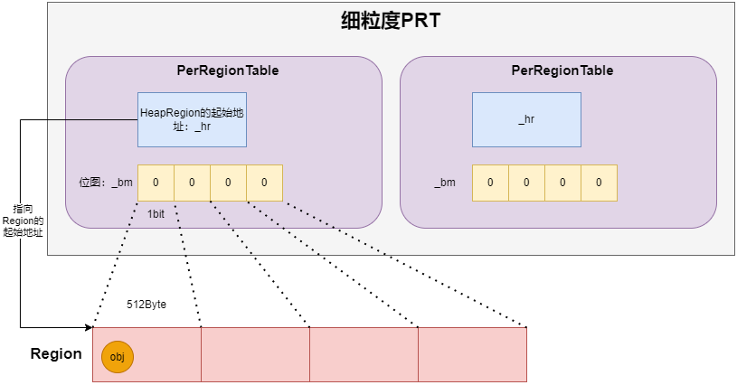

# 细粒度 PRT

细粒度 PRT 是一个的数组, 每个元素包含了一个 HeapRegion 的起始地址和一个位图, 这个位图描述这个 HeapRegion 的引用情况, 每一位对应 Region 的 512 字节, 所以它的大小为 HeapRegionSize%512, 这样可以使用更少的内存存储更多的引用关系。



细粒度 PRT 的定义: 

> jdk8u60-master\hotspot\src\share\vm\gc_implementation\g1\heapRegionRemSet.cpp

```cpp
class PerRegionTable: public CHeapObj<mtGC> {

  // HeapRegion的起始地址
  HeapRegion*     _hr;
  // 位图, 每一位对应region中的一个card, 每个card的大小是512字节
  // 0代表这个card中的对象没有引用其他region的对象, 1代表有引用
  BitMap          _bm;
  // 已存储的引用关系的数量
  jint            _occupied;

  PerRegionTable* _next;

  PerRegionTable* _prev;
  // ...
};
```

## 添加引用关系

> jdk8u60-master\hotspot\src\share\vm\gc_implementation\g1\heapRegionRemSet.cpp

```cpp
class PerRegionTable: public CHeapObj<mtGC> {
public:
  /**
   * 入口
   */
  void add_reference(OopOrNarrowOopStar from) {
    add_reference_work(from, true);
  }

protected:
  /**
   * par表示是否并发执行
   */
  void add_reference_work(OopOrNarrowOopStar from, bool par) {
    // HeapRegion* hr() const { return _hr; }
    HeapRegion* loc_hr = hr();
    // 判断from是否在loc_hr代表的region中
    if (loc_hr->is_in_reserved_raw(from)) {
      // 算from相对于loc_hr底部的偏移量
      size_t hw_offset = pointer_delta((HeapWord*)from, loc_hr->bottom());
      // 根据偏移量计算from的卡片索引
      CardIdx_t from_card = (CardIdx_t)
          hw_offset >> (CardTableModRefBS::card_shift - LogHeapWordSize);
      // 添加卡片
      add_card_work(from_card, par);
    }
  }

  void add_card_work(CardIdx_t from_card, bool par) {
    // 判断from_card位置是否已经有值
    if (!_bm.at(from_card)) {
      // 没值
      // 是否需要并行执行
      if (par) {
        // 保证原子性
        if (_bm.par_at_put(from_card, 1)) {
          // 保证原子性
          Atomic::inc(&_occupied);
        }
      } else {
        // 把位图中from_card索引的值设置为1, 表示存在引用关系
        _bm.at_put(from_card, 1);
        _occupied++;
      }
    }
  }
}
```
