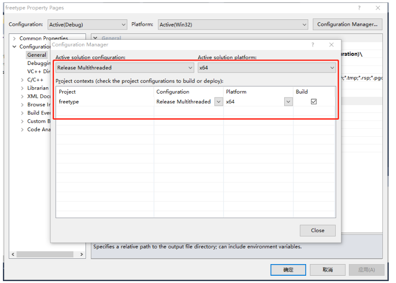
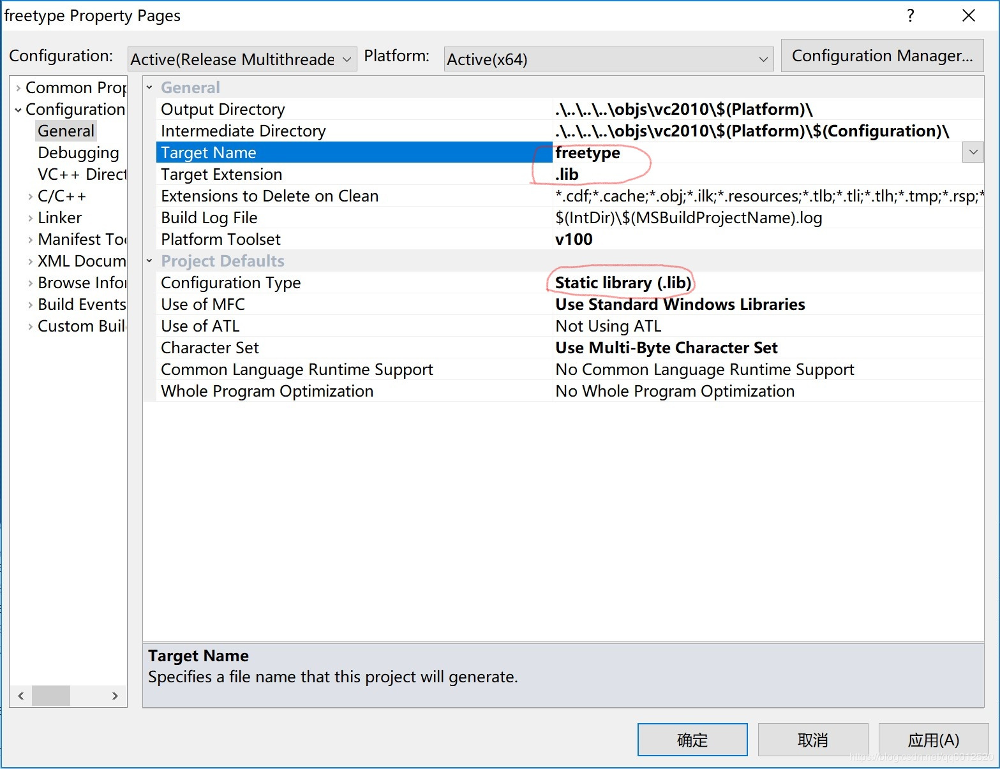
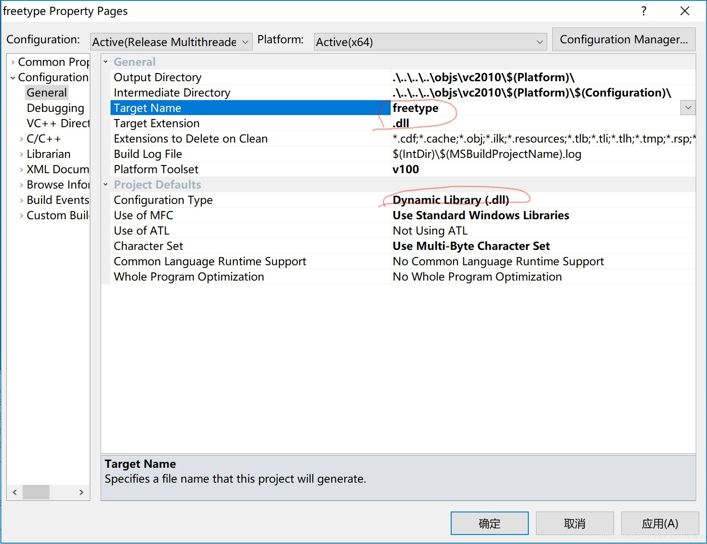
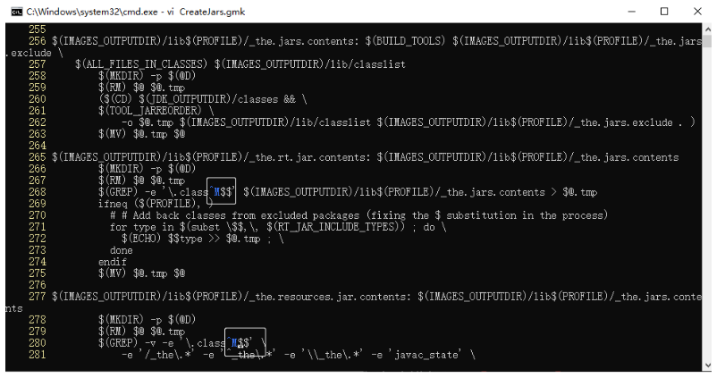

# windows 编译 OpenJDK

## 下载 VirtualBox

[VirtualBox-7.0.12-159484-Win.exe](https://download.virtualbox.org/virtualbox/7.0.12/VirtualBox-7.0.12-159484-Win.exe)

## 下载 windoss 7 镜像

[en_windows_7_ultimate_x64_dvd](https://archive.org/download/en_windows_7_ultimate_x64_dvd_202201/en_windows_7_ultimate_x64_dvd.iso)

## 下载 jdk8-b120

[jdk8-b120.tar.gz](https://github.com/openjdk/jdk/archive/refs/tags/jdk8-b120.tar.gz)

## 下载 vs2010

[en_visual_studio_2010_professional_x86_dvd_509727.iso](https://archive.org/download/en_visual_studio_2010_professional_x86_dvd_509727/en_visual_studio_2010_professional_x86_dvd_509727.iso)

## 下载 cygwin

[cygwin](https://www.cygwin.com/setup-x86_64.exe)

## 下载 jdk7

[javase7](https://www.oracle.com/technetwork/java/javase/downloads/java-archive-downloads-javase7-521261.html)

## 下载 freetype

[freetype-2.7.tar.gz](https://download.savannah.gnu.org/releases/freetype/freetype-2.7.tar.gz)

## 新建虚拟机

- 新建 -> 虚拟光盘选择 en_windows_7_ultimate_x64_dvd.iso
- 进入 win7 系统
- 设备 -> 安装增强功能
- 安装完成后重启

## 设置共享文件夹

- 设备 -> 共享粘贴板 -> 双向
- 设备 -> 共享文件夹 -> 共享文件夹... -> 选择共享文件夹路径(把源码所在的文件夹作为共享文件夹), 自动挂载, 固定分配 -> 确定

## 安装 vs2010

勾选安装 C++部分

## 安装 jdk7

- 安装 jdk7
- 添加环境变量 path：C:\Program Files\Java\jdk1.7.0_80\bin

## 安装 Cygwin

cmd 运行安装程序：

```sh
.\setup-x86_64 --site http://mirrors.163.com/cygwin/ --only-site
```

由于默认的安装只会安装一些必要的软件，所以安装过程中需要选择安装一些额外的包：

- binutils
- make
- m4
- cpio
- zip
- unzip
- procps-ng

## 编译 FreeType

将这个 freetype 编译成 freetype.lib 和 freeetype.dll：

运行 Visual Studio 2010，依次点击 File -> Open -> Project/Solution。

打开 freetype-2.7\builds\windows\vc2010\freetype.sln 文件。

右键项目选择 Properties。

点击右上角的 Configuration Manager。



设置编译成 freetype.lib：



右键项目选择 build。等待编译完成。

设置编译成 freetype.dll：



右键项目选择 build。等待编译完成。

在 freetype-2.7 目录下新建 lib 目录。

把 freetype-2.7\objs\vc2010\x64\ 目录下的 freetype.lib 和 freetype.dll 两个文件拷贝到 lib 目录下。

## 切换到 jdk 源码目录

打开 cygwin，切换到 jdk 源码目录：

```sh
cd /cygdrive/c/Users/Public/jdk-jdk8-b120
```

## 修改 generated-configure.sh

编辑：jdk 源码目录\common\autoconf\generated-configure.sh

搜索 `Your cygwin is too old`

注释掉整个 if:

```sh
#     if test "x$CYGWIN_VERSION_OLD" != x; then
#       { $as_echo "$as_me:${as_lineno-$LINENO}: Your cygwin is too old. You are running $CYGWIN_VERSION, but at least cygwin 1.7 is required. Please upgrade." >&5
# $as_echo "$as_me: Your cygwin is too old. You are running $CYGWIN_VERSION, but at least cygwin 1.7 is required. Please upgrade." >&6;}
#       as_fn_error $? "Cannot continue" "$LINENO" 5
#     fi
```

## 修改 CreateJars.gmk

```sh
vi jdk/make/CreateJars.gmk
```

键盘输入：268gg，跳转到 268 行。定位到 class$$ 的 s 和$之间。按 i 进入输入模式。在输入状态下，按 Ctrl + V, Ctrl + M，即可打出^M。保存退出。

一共有 2 个地方需要这样修改：



## 编译

```sh
./configure --with-freetype=/cygdrive/c/Users/Public/freetype-2.7/ --with-target-bits=64 --enable-debug
make all
```

## 验证

```sh
jdk-jdk8-b120\build\windows-x86_64-normal-server-fastdebug\jdk\bin\java -version
```
