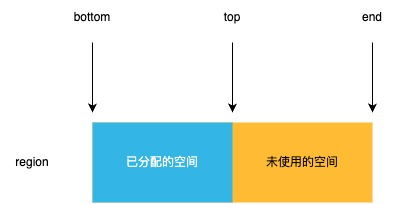

# CAS 分配

JVM 使用变量 `_alloc_region` 指向当前用来分配对象的 region, 但对象不一定总是分配到 `_alloc_region` 指向的 region 中。

在堆中分配对象时, 如果当前的 region 空间不够分配, JVM 会申请一个新的 region, 这样原来的 region 在被回收之前就不会再分配对象, 会造成空间的浪费, 所以如果原来的 region 空间还足够大(大于 MinTLABSize, 即至少还能在上面分配一个 TLAB), 它就会成为 retained alloc region(保留的用于分配对象的 region), 用来分配小一点的对象。

JVM 使用变量 `_retained_alloc_region` 指向 retained alloc region。一个 region 不再使用时, 就会和现有的 retained alloc region 比较, 如果它的容量更大, 就会取代旧的 retained alloc region, 使 `_retained_alloc_region` 指向自己。

在堆中分配时, JVM 会先尝试在 retained alloc region 中分配, 当 retained alloc region 不够分配当前对象时, 才会在 `_alloc_region` 指向的 region 中分配。

```cpp
// --- src/hotspot/share/gc/g1/g1Allocator.inline.hpp --- //

// 使用CAS分配对象的内存空间
inline HeapWord* G1Allocator::attempt_allocation(size_t min_word_size,
                                                 size_t desired_word_size,
                                                 size_t* actual_word_size) {
  // 如果开启了NUMA, 内存就会被分成若干个节点
  // JVM会优先在相同的节点中分配对象,
  // 后面的mutator_alloc_region函数会根据这个索引
  // 找到合适的region用来分配
  // 如果没有开启NUMA的话, 会返回0
  uint node_index = current_node_index();

  // 先试试看retained alloc region够不够分配这个对象
  HeapWord* result = mutator_alloc_region(node_index)->attempt_retained_allocation(min_word_size, desired_word_size, actual_word_size);
  if (result != nullptr) {
    return result;
  }

  // retained alloc region不够分配这个对象, 在当前region中分配
  return mutator_alloc_region(node_index)->attempt_allocation(min_word_size, desired_word_size, actual_word_size);
}
```

## 在 retained alloc region 中分配

```cpp
// --- src/hotspot/share/gc/g1/g1AllocRegion.inline.hpp --- //

inline HeapWord* MutatorAllocRegion::attempt_retained_allocation(size_t min_word_size,
                                                                 size_t desired_word_size,
                                                                 size_t* actual_word_size) {
  if (_retained_alloc_region != nullptr) {
    // 分配对象
    HeapWord* result = par_allocate(_retained_alloc_region, min_word_size, desired_word_size, actual_word_size);
    if (result != nullptr) {
      trace("alloc retained", min_word_size, desired_word_size, *actual_word_size, result);
      return result;
    }
  }
  return nullptr;
}
```

## 在当前 region 中分配

```cpp
// --- src/hotspot/share/gc/g1/g1AllocRegion.inline.hpp --- //

inline HeapWord* G1AllocRegion::attempt_allocation(size_t min_word_size,
                                                   size_t desired_word_size,
                                                   size_t* actual_word_size) {
  HeapRegion* alloc_region = _alloc_region;
  assert_alloc_region(alloc_region != nullptr, "not initialized properly");
  // 分配对象
  HeapWord* result = par_allocate(alloc_region, min_word_size, desired_word_size, actual_word_size);
  if (result != nullptr) {
    trace("alloc", min_word_size, desired_word_size, *actual_word_size, result);
    return result;
  }
  trace("alloc failed", min_word_size, desired_word_size);
  return nullptr;
}

```

## 使用 CAS 分配对象内存

和 tlab 类似, bottom 指针和 end 指针分别指向了一个 region 的起始位置和结束位置, top 指针指向已分配内存的边界, 在 region 中分配对象只需要向 end 方向移动 top 指针就可以了, 区别是 region 中需要考虑线程同步问题。



```cpp
// --- src/hotspot/share/gc/g1/g1AllocRegion.inline.hpp --- //

inline HeapWord* G1AllocRegion::par_allocate(HeapRegion* alloc_region,
                                             size_t min_word_size,
                                             size_t desired_word_size,
                                             size_t* actual_word_size) {
  assert(alloc_region != nullptr, "pre-condition");
  assert(!alloc_region->is_empty(), "pre-condition");

  return alloc_region->par_allocate(min_word_size, desired_word_size, actual_word_size);
}

inline HeapWord* HeapRegion::par_allocate(size_t min_word_size,
                                          size_t desired_word_size,
                                          size_t* actual_word_size) {
  return par_allocate_impl(min_word_size, desired_word_size, actual_word_size);
}

// --- src/hotspot/share/gc/g1/heapRegion.inline.hpp --- //

/**
 * 使用CAS分配对象内存
 */
inline HeapWord* HeapRegion::par_allocate_impl(size_t min_word_size,
                                               size_t desired_word_size,
                                               size_t* actual_size) {
  do {
    // top指针指向这个region的剩余空间的起始位置
    HeapWord* obj = top();
    // 计算这个region还有多大的空闲内存
    size_t available = pointer_delta(end(), obj);
    size_t want_to_allocate = MIN2(available, desired_word_size);
    // 判断够不够分配这个对象
    if (want_to_allocate >= min_word_size) {
      // 堆中也是使用指针碰撞分配内存, 分配对象内存时只需要移动top指针即可
      HeapWord* new_top = obj + want_to_allocate;
      // CAS操作
      // _top: 要修改的地址
      // obj: 当前值
      // new_top: 新值
      HeapWord* result = Atomic::cmpxchg(&_top, obj, new_top);
      // CAS操作如果成功会返回旧值, 如果失败会返回新值
      if (result == obj) {
        // CAS操作成功
        assert(is_object_aligned(obj) && is_object_aligned(new_top), "checking alignment");
        *actual_size = want_to_allocate;
        return obj;
      }
    } else {
      return nullptr;
    }
    // CAS操作失败, 等待下次循环重试
  } while (true);
}
```
