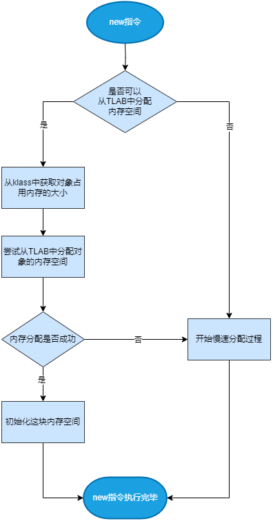

# 对象的分配

创建一个对象通常是 new, dup, invokespecial 三条指令一起出现:

1. new 指令会分配一块内存空间给新的对象使用, new 指令执行完成后会把新对象的引用放入操作数栈的栈顶给后续的 dup 指令使用
2. dup 指令会把栈顶的对象引用复制一份给后面的 invokespecial 指令使用
3. invokespecial 指令会调用 `<init>` 方法初始化对象的字段

new 指令的执行过程:



## C++ 解释器

hotspot 有两个解释器, 基于 C++ 的解释器和基于汇编的模板解释器, hotspot 默认使用比较快的模板解释器。

基于 C++ 的解释器更加清晰直观, 便于理解。

```cpp
////////////////////////////////////////////////////////////////////////////////
// jdk21-jdk-21-ga/src/hotspot/share/interpreter/zero/bytecodeInterpreter.cpp //
////////////////////////////////////////////////////////////////////////////////

CASE(_new): {
  u2 index = Bytes::get_Java_u2(pc+1);

  // 首先尝试从TLAB中分配内存空间
  //
  // 前提条件:
  //   - klass已经被初始化过
  //   - klass需要支持快速分配内存空间
  //   - 允许在TLAB上分配内存空间
  ConstantPool* constants = istate->method()->constants();
  // 判断是否允许在TLAB上分配内存空间,
  // 并且常量池中index索引上的是一个可以解析的klass对象
  if (UseTLAB && !constants->tag_at(index).is_unresolved_klass()) {
    // 从常量池中取出klass对象
    Klass* entry = constants->resolved_klass_at(index);
    InstanceKlass* ik = InstanceKlass::cast(entry);
    // 判断klass是否已经被初始化过,
    // 并且klass支持快速分配内存空间
    if (ik->is_initialized() && ik->can_be_fastpath_allocated()) {
      // 获取对象的大小
      // 一个类的对象有多大在编译时就已经确定
      size_t obj_size = ik->size_helper();
      // 尝试从TLAB中分配对象的内存空间
      HeapWord* result = THREAD->tlab().allocate(obj_size);
      if (result != nullptr) {
        // 把对象的内存空间用0填充:
        //   - 如果TLAB在创建时已经把自己的内存格式化成0, 这步就可以跳过
        //   - 在debug模式下, 这块内存空间会受ThreadLocalAllocBuffer::allocate影响,
        //     所以不管TLAB有没有格式化, 都要重新填充一遍
        if (DEBUG_ONLY(true ||) !ZeroTLAB) {
          size_t hdr_size = oopDesc::header_size();
          Copy::fill_to_words(result + hdr_size, obj_size - hdr_size, 0);
        }

        // 初始化 mark word
        oopDesc::set_mark(result, markWord::prototype());
        // 设置GC分代年龄
        oopDesc::set_klass_gap(result, 0);
        // 设置元数据指针
        oopDesc::release_set_klass(result, ik);

        oop obj = cast_to_oop(result);

        // 使用StoreStore屏障禁止重排序,
        // 防止把对象头还没初始化完成的对象入栈
        OrderAccess::storestore();
        // 把这个对象的引用放到操作数栈的栈顶给后续的dup指令使用
        SET_STACK_OBJECT(obj, 0);
        // 更新程序计数器, 此条new指令执行完毕, new指令总共3个字节, PC加3
        UPDATE_PC_AND_TOS_AND_CONTINUE(3, 1);
      }
    }
  }
  // 从TLAB中分配内存空间失败, 开始慢速分配
  CALL_VM(InterpreterRuntime::_new(THREAD, METHOD->constants(), index),
          handle_exception);
  // 使用StoreStore屏障禁止重排序,
  // 防止把对象头还没初始化完成的对象入栈
  OrderAccess::storestore();
  // InterpreterRuntime::_new中分配的对象会保存在vm_result中,
  // 将对象的引用取出, 并放到操作数栈的栈顶给后续的dup指令使用
  SET_STACK_OBJECT(THREAD->vm_result(), 0);
  // 清空vm_result
  THREAD->set_vm_result(nullptr);
  // 更新程序计数器
  UPDATE_PC_AND_TOS_AND_CONTINUE(3, 1);
}

//////////////////////////////////////////////////////////////
// jdk21-jdk-21-ga/src/hotspot/share/oops/instanceKlass.hpp //
//////////////////////////////////////////////////////////////

class InstanceKlass: public Klass {
  // 判断klass是否支持快速分配内存空间
  // _layout_helper在classFileParser.cpp中初始化
  // 它在下面几种情况时为false:
  //  - 这个类是抽象类或者接口
  //  - 这个类有不为空的finalize()方法
  //  - 这个类的大小超过了FastAllocateSizeLimit
  //  - 这个类是java.lang.Class, java.lang.Class不能直接分配内存空间
  bool can_be_fastpath_allocated() const {
    return !layout_helper_needs_slow_path(layout_helper());
  }
}
```
