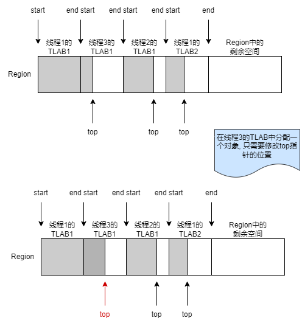

# 从 TLAB 中分配对象

new 字节码指令首先会尝试从TLAB中分配对象的内存空间。

Java 堆(region)是所有线程共享的, 为了避免每次分配对象时都要加锁, JVM 使用 TLAB 来优先分配对象, 只有当无法在 TLAB 中分配对象时, JVM 才需要加锁分配。

只有在为线程分配一个新的 TLAB 时, 才需要锁住 Java 堆, 而在 TLAB 中分配对象时, 是不需要加锁的, 所以对象在 TLAB 中的分配称为快速分配。

```cpp
// --- src/hotspot/share/runtime/thread.hpp --- //

// 每个线程都有一个自己的tlab
class Thread: public ThreadShadow {
 private:
  // tlab是在eden区中分配的
  ThreadLocalAllocBuffer _tlab; // Thread-local eden
}
```

TLAB 使用指针碰撞分配内存: 所有被使用过的内存都被放在一边, 空闲的内存被放在另一边, 中间放着一个指针作为分界点的指示器, 分配内存就仅仅是把指针向空闲空间方向挪动一段与对象大小相等的距离。

```cpp
// --- src/hotspot/share/gc/shared/threadLocalAllocBuffer.hpp --- //

// 3个指针在tlab中的定义
class ThreadLocalAllocBuffer: public CHeapObj<mtThread> {
private:
  HeapWord* _start; // address of TLAB
  HeapWord* _top; // address after last allocation
  HeapWord* _end;
}
```

图中灰色表示已分配对象的空间, 白色表示空闲的空间, start 指针和 end 指针分别指向了一个 tlab 的起始位置和结束位置, top 指针指向已分配内存的边界, 在 tlab 中分配对象只需要移动 top 指针就可以了:



当一个线程的 TLAB 满了(比如上图线程 1 的 TLAB1), 线程只要向 JVM 申请一个新的 TLAB 即可。因为 TLAB 只是 Eden 区的一块空闲内存, 线程不需要对满了的 TLAB 做额外的处理。

```cpp
// --- src/hotspot/share/gc/shared/threadLocalAllocBuffer.inline.hpp --- //

inline HeapWord* ThreadLocalAllocBuffer::allocate(size_t size) {
  // void invariants() const {
  //   assert(top() >= start() && top() <= end(), "invalid tlab");
  // }
  invariants();
  // TLAB的范围: _start ~ _end
  // 已分配的区域: _start ~ _top
  // 未分配的区域: _top ~ _end
  HeapWord* obj = top();
  // 判断TLAB剩余空间够不够分配这个对象
  if (pointer_delta(end(), obj) >= size) {
    // TLAB剩余空间大于这个对象所需的空间
#ifdef ASSERT
    // Skip mangling the space corresponding to the object header to
    // ensure that the returned space is not considered parsable by
    // any concurrent GC thread.
    size_t hdr_size = oopDesc::header_size();
    Copy::fill_to_words(obj + hdr_size, size - hdr_size, badHeapWordVal);
#endif // ASSERT
    // 移动_top指针, 增加这个对象大小
    set_top(obj + size);

    invariants();
    return obj;
  }
  return nullptr;
}

// --- src/hotspot/share/utilities/globalDefinitions.hpp --- //

inline size_t pointer_delta(const HeapWord* left, const HeapWord* right) {
  return pointer_delta(left, right, sizeof(HeapWord));
}

inline size_t pointer_delta(const volatile void* left,
                            const volatile void* right,
                            size_t element_size) {
  assert(left >= right, "avoid underflow - left: " PTR_FORMAT " right: " PTR_FORMAT, p2i(left), p2i(right));
  // 计算left和right之间有多少个HeapWord
  return (((uintptr_t) left) - ((uintptr_t) right)) / element_size;
}
```

## HeapWord

HeapWord 是 JVM 管理的堆内存的地址抽象。堆中的内存地址都需要通过 `HeapWord*` 指针进行表示, 例如申请内存起始地址的函数一般返回的都是 `HeapWord*`, 大小也是 HeapWordSize 的整数倍, 因为 Java 堆是按照一定内存大小对齐的。

`HeapWord*` 指针可以方便地以 HeapWord 为步长在地址中移动:

```cpp
int* p1 = &a;
// 向后移动1个int的大小(4字节)
p1 = p1 + 1;

HeapWord* p2 = &a;
// 向后移动1个HeapWord的大小
p2 = p2 + 1;
```
