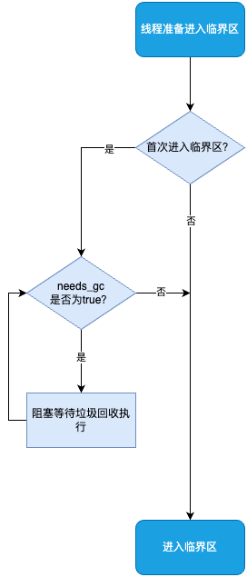
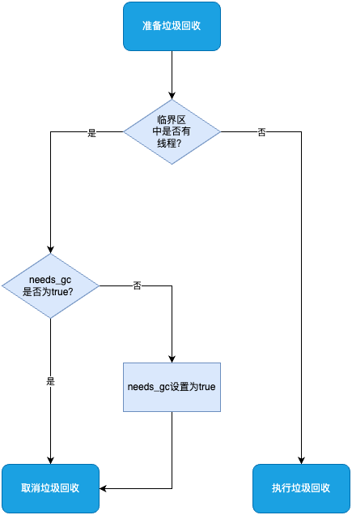
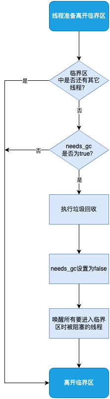

# GCLocker

GCLocker 是 JNI 线程访问临界区时的加锁机制, 它会影响到垃圾回收(GC)的执行。

临界区(Critical Section)是指在多线程环境下, 一段需要确保同一时刻只有一个线程能够访问的代码区域。每个线程都可以进入多个临界区, 线程类中有一个属性 `_jni_active_critical`, 用来记录当前线程进入的临界区个数, 如果 `_jni_active_critical > 0`, 说明该线程已经在临界区内。

临界区相关的方法:

```cpp
//////////////////////////////////////////////
// src/hotspot/share/runtime/javaThread.hpp //
//////////////////////////////////////////////

/**
 * 进入临界区
 */
void JavaThread::enter_critical() {
  _jni_active_critical++;
}

/**
 * 线程是否在临界区内
 */
bool in_critical() {
  return _jni_active_critical > 0;
}

/**
 * 线程是否只剩最后一个临界区没有退出了
 */
bool in_last_critical() {
  return _jni_active_critical == 1;
}

/**
 * 退出临界区
 */
void exit_critical() {
  _jni_active_critical--;
}
```

GCLocker 中两个重要的属性:

- `_jni_lock_count`: 已经进入临界区的线程数量
- `_needs_gc`: 是否需要执行 GC, 如果有线程在临界区内, 且此时需要执行 GC, GCLocker 会丢弃这次 GC 请求, 并等到所有线程都退出临界区后把这次 GC 补上

## 进入临界区

线程需要调用 GCLocker::lock_critical 方法进入临界区。



```cpp
/////////////////////////////////////////////////////
// src/hotspot/share/gc/shared/gcLocker.inline.hpp //
/////////////////////////////////////////////////////

void GCLocker::lock_critical(JavaThread* thread) {
  // 如果线程是首次进入临界区,
  // 那么它需要等待GC执行完成(如果有的话)
  // return _jni_active_critical > 0;
  if (!thread->in_critical()) {
    // 是否有被丢弃的GC请求
    // return _needs_gc;
    if (needs_gc()) {
      // 线程需要等待GC执行完成,
      // 再进入临界区
      jni_lock(thread);
      return;
    }
    increment_debug_jni_lock_count();
  }
  // 如果线程已经在临界区内, 本次可以直接进入
  // _jni_active_critical++;
  thread->enter_critical();
}

//////////////////////////////////////////////
// src/hotspot/share/gc/shared/gcLocker.cpp //
//////////////////////////////////////////////

void GCLocker::jni_lock(JavaThread* thread) {
  assert(!thread->in_critical(), "shouldn't currently be in a critical region");
  MonitorLocker ml(JNICritical_lock);
  // 如果有被丢弃的GC请求, 则阻塞线程
  while (needs_gc()) {
    // 至少有一个线程在临界区内, 当最后一个线程退出临界区后,
    // GCLocker会不上被丢弃的GC, 并_needs_gc设置为 false,
    // 然后唤醒所有被阻塞的线程
    ml.wait();
  }
  // 等GC结束后, 才允许当前线程进入临界区
  thread->enter_critical();
  // 进入临界区的线程数+1
  _jni_lock_count++;
  increment_debug_jni_lock_count();
}
```

## 垃圾回收

在 JVM 执行垃圾回收前, GCLocker 会先判断当前是否有线程在临界区内, 如果有, GCLocker 会丢弃这次 GC, 并把 `_needs_gc` 设置为 true, 等到所有线程都退出临界区后, 会把这次 GC 补上。



```cpp
//////////////////////////////////////////////
// src/hotspot/share/gc/shared/gcLocker.cpp //
//////////////////////////////////////////////

/**
 * Young GC/Mixed GC 和 Full GC 执行前, 都需要调用这个方法
 * 判断GC是否可以执行, 返回 true 表示不可执行
 */
bool GCLocker::check_active_before_gc() {
  assert(SafepointSynchronize::is_at_safepoint(), "only read at safepoint");
  // is_active() 方法会检查当前是否在安全点,
  // 且 _jni_lock_count 是否大于 0,
  // is_active() 返回 true 表示有线程在临界区,
  // 此时, GC不可执行
  // _needs_gc 为 false 表示这是第一个GC请求,
  // 后续的GC请求会被直接拒绝,
  // 直到所有线程都退出临界区
  if (is_active() && !_needs_gc) {
    verify_critical_count();
    // 记录下GC请求,
    // 等到所有线程都退出临界区后,
    // 会把这次GC补上
    _needs_gc = true;
    GCLockerTracer::start_gc_locker(_jni_lock_count);
    log_debug_jni("Setting _needs_gc.");
  }
  return is_active();
}
```

## 离开临界区

线程需要调用 GCLocker::unlock_critical 方法离开临界区。



```cpp
/////////////////////////////////////////////////////
// src/hotspot/share/gc/shared/gcLocker.inline.hpp //
/////////////////////////////////////////////////////

void GCLocker::unlock_critical(JavaThread* thread) {
  // 当前退出的临界区是线程进入的最后一个临界区
  if (thread->in_last_critical()) {
    // 判读是否需要补上GC
    if (needs_gc()) {
      jni_unlock(thread);
      return;
    }
    decrement_debug_jni_lock_count();
  }
  // 线程退出临界区
  thread->exit_critical();
}

//////////////////////////////////////////////
// src/hotspot/share/gc/shared/gcLocker.cpp //
//////////////////////////////////////////////

void GCLocker::jni_unlock(JavaThread* thread) {
  assert(thread->in_last_critical(), "should be exiting critical region");
  MutexLocker mu(JNICritical_lock);
  // 进入临界区的线程数-1
  _jni_lock_count--;
  decrement_debug_jni_lock_count();
  // 线程退出临界区
  thread->exit_critical();
  // 临界区中是否还有其它线程
  // is_active() 方法会检查 _jni_lock_count 是否大于 0
  if (needs_gc() && !is_active_internal()) {
    // 临界区中没有其它线程
    _total_collections = Universe::heap()->total_collections();
    GCLockerTracer::report_gc_locker();
    {
      MutexUnlocker munlock(JNICritical_lock);
      log_debug_jni("Performing GC after exiting critical section.");
      // 执行GC
      Universe::heap()->collect(GCCause::_gc_locker);
    }
    _needs_gc = false;
    // 唤醒被阻塞的其它线程
    JNICritical_lock->notify_all();
  }
}
```
