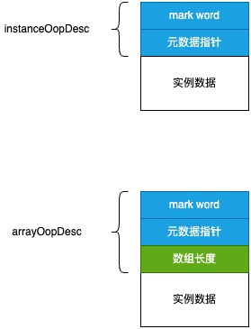

# oop

在 Java 应用程序运行过程中, 每创建一个 Java 对象, 在 JVM 内部也会相应地创建一个新的 oopDesc 对象来表示 Java 对象。

田于 HotSpot 内部将频緊便用 oopDesc 指针, 为了简化 oopDesc 类型的指针的使用, 在 HotSpot 内部定义了它们的别名: oop。

oop 在 JVM 中的层级:

```cpp
// --- src/hotspot/share/oops/oopsHierarchy.hpp --- //

// 用缩进表示继承关系, oopDesc是下面所有类的父类
typedef class oopDesc*                    oop; // 指向Java对象的指针
typedef class   instanceOopDesc*            instanceOop; // 普通Java对象
typedef class     stackChunkOopDesc*          stackChunkOop; // 栈块对象
typedef class   arrayOopDesc*               arrayOop; // 数组对象
typedef class     objArrayOopDesc*            objArrayOop; // 对象类型的数组
typedef class     typeArrayOopDesc*           typeArrayOop; // Java原始类型的一维数组
```

在虚拟机内部, 通过 instanceOopDesc 来表示一个常规的 Java 对象。对象在内存中的布局可以分为连续的两部分: instanceOopDesc 和实例数据。

其中, instanceOopDesc(或其它的 oopDesc)又被称为对象头, instanceOopDesc 对象头包括以下两部分信息:

1. Mark Word: instanceOopDesc 中的 `_mark` 变量, 存储对象运行时的信息, 如 hashCode, GC 分代年龄, 锁状态标志, 线程持有的锁, 偏向锁的线程 ID, 偏向时间戳等, `_mark` 的数据类型为 markOop, 占用内存大小与虚拟机位长一致, 比如在 64 位虚拟机上长度也为 64 位。
2. 元数据指针: 指向 Klass 对象的指针, Klass 对象包含了对象所属类型的元数据(meta data), 因此该字段称为元数据指针。虚拟机在运行时将频繁使用这个指针定位到位于方法区内的类型信息。JVM 参数 `-XX:UseCompressedOops` 可以使类元数据指针在 64 位 JVM 上使用 32 位指针存储, 以降低开销

```cpp
// --- src/hotspot/share/oops/oop.hpp --- //

class oopDesc {
    // Mark Word
    volatile markWord _mark;
    // 元数据指针
    union _metadata {
        // 未压缩的 Klass 指针
        Klass *_klass;
        // 压缩的 Klass 指针: typedef juint  narrowKlass;
        narrowKlass _compressed_klass;
    } _metadata;
};
```

对象头不一定只有这几个成员变量, oopDesc 的子类可以有自己的成员变量, 比如 instanceOopDesc 与 arrayOopDesc 都拥有继承自共同基类 oopDesc 的 mark word 和元数据指针。但 arrayOop 增加了一个描述数组长度的字段。


