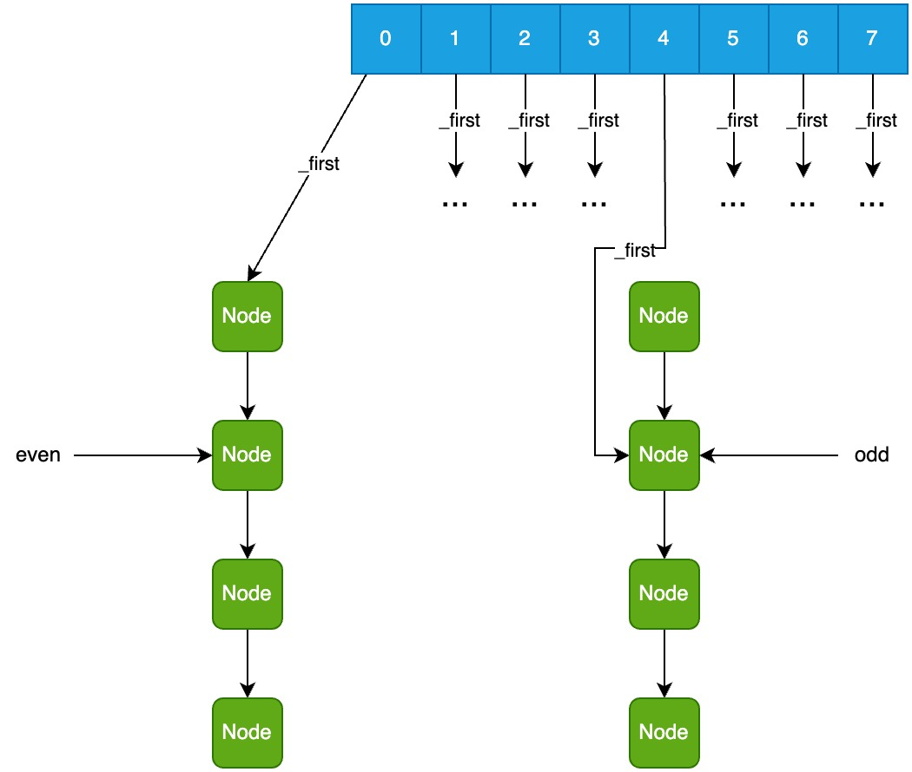

# 扩容

```cpp
// --- src/hotspot/share/utilities/concurrentHashTable.inline.hpp --- //

template<typename CONFIG, MEMFLAGS F>
inline bool ConcurrentHashTable<CONFIG, F>::
grow(Thread *thread, size_t size_limit_log2) {
    size_t tmp = size_limit_log2 == 0 ? _log2_size_limit : size_limit_log2;
    return internal_grow(thread, tmp);
}

template<typename CONFIG, MEMFLAGS F>
inline bool ConcurrentHashTable<CONFIG, F>::
internal_grow(Thread *thread, size_t log2_size) {
    // 分配一块新内存, 用_new_table指向
    if (!internal_grow_prolog(thread, log2_size)) {
        assert(_resize_lock_owner != thread, "Re-size lock held");
        return false;
    }
    assert(_resize_lock_owner == thread, "Should be locked by me");
    // 把原来的数据复制到_new_table指向的新内存
    internal_grow_range(thread, 0, _table->_size);
    // 用_table指向新内存, 并清理旧内存
    internal_grow_epilog(thread);
    assert(_resize_lock_owner != thread, "Re-size lock held");
    return true;
}
```

## 分配一块新内存

```cpp
// --- src/hotspot/share/utilities/concurrentHashTable.inline.hpp --- //

template<typename CONFIG, MEMFLAGS F>
inline bool ConcurrentHashTable<CONFIG, F>::
internal_grow_prolog(Thread *thread, size_t log2_size) {
    if (is_max_size_reached()) {
        // 已经达到最大容量, 不允许继续扩容
        return false;
    }
    if (!try_resize_lock(thread)) {
        // 其它线程正在调整容量, 或者正在进行的操作不允许调整容量
        return false;
    }
    if (is_max_size_reached() || _table->_log2_size >= log2_size) {
        unlock_resize_lock(thread);
        // 本函数只扩容不缩容
        return false;
    }

    // 创建临时table, 扩容为原来的2倍
    _new_table = new InternalTable(_table->_log2_size + 1);
    // 判断是否达到最大容量
    _size_limit_reached = _new_table->_log2_size == _log2_size_limit;

    return true;
}
```

## 把原来的数据复制到新内存

```cpp
// --- src/hotspot/share/utilities/concurrentHashTable.inline.hpp --- //

template<typename CONFIG, MEMFLAGS F>
inline void ConcurrentHashTable<CONFIG, F>::
internal_grow_range(Thread *thread, size_t start, size_t stop) {
    assert(stop <= _table->_size, "Outside backing array");
    assert(_new_table != nullptr, "Grow not proper setup before start");
    // even_index的最高位都是0
    // odd_index的最高位都是1
    // 比如新table长度为8
    // even_index:
    //     0 (000)
    //     1 (001)
    //     2 (010)
    //     3 (011)
    // odd_index:
    //     4 (100)
    //     5 (101)
    //     6 (110)
    //     7 (111)
    for (size_t even_index = start; even_index < stop; even_index++) {
        Bucket *bucket = _table->get_bucket(even_index);

        bucket->lock();

        // 例子:
        // _table->_size = 2, 扩容后 _new_table->_size = 4
        // _new_table: [x, x, x, x]
        // even_index = 0 时, odd_index = 2
        size_t odd_index = even_index + _table->_size;
        // 把旧table的值赋给新table
        _new_table->get_buckets()[even_index] = *bucket;
        _new_table->get_buckets()[odd_index] = *bucket;

        // 把bucket的锁转移到新table上
        // 旧table的bucket的状态改为redirect
        bucket->redirect();

        // 重新分配新table中的节点
        if (!unzip_bucket(thread, _table, _new_table, even_index, odd_index)) {
            DEBUG_ONLY(GlobalCounter::write_synchronize();)
        }

        _new_table->get_bucket(even_index)->unlock();
        _new_table->get_bucket(odd_index)->unlock();

        DEBUG_ONLY(
                bucket->release_assign_node_ptr(
                        _table->get_bucket(even_index)->first_ptr(), (Node *) POISON_PTR);
        )
    }
}

template<typename CONFIG, MEMFLAGS F>
inline bool ConcurrentHashTable<CONFIG, F>::
unzip_bucket(Thread *thread, InternalTable *old_table,
             InternalTable *new_table, size_t even_index, size_t odd_index) {
    // 把旧table中even_index索引位置的链表的所有节点
    // 分散到新table中even_index和odd_index索引的两个链表中
    // 新table:
    // 整理前:  [0, 1, 2, 3, 4, 5, 6, 7]
    //          ⭣           ⭣
    //          x            x
    //          x            x
    //          x            x
    //          x            x
    //
    // 整理后:  [0, 1, 2, 3, 4, 5, 6, 7]
    //          ⭣           ⭣
    //          x            x
    //          x            x

    Node *aux = old_table->get_bucket(even_index)->first();
    if (aux == nullptr) {
        return false;
    }
    Node *delete_me = nullptr;
    Node *const volatile *even = new_table->get_bucket(even_index)->first_ptr();
    Node *const volatile *odd = new_table->get_bucket(odd_index)->first_ptr();
    while (aux != nullptr) {
        bool dead_hash = false;
        // 获取hash
        size_t aux_hash = CONFIG::get_hash(*aux->value(), &dead_hash);
        Node *aux_next = aux->next();
        if (dead_hash) { // 节点不再使用
            delete_me = aux;
            // 删除这个节点
            new_table->get_bucket(odd_index)->release_assign_node_ptr(odd,
                                                                      aux_next);
            new_table->get_bucket(even_index)->release_assign_node_ptr(even,
                                                                       aux_next);
        } else {
            // 计算索引
            size_t aux_index = bucket_idx_hash(new_table, aux_hash);
            if (aux_index == even_index) {
                //             [0, 1, 2, 3, 4, 5, 6, 7]
                //              ⭣          ⭣
                //    even⭢    x           x    ⭠odd
                //              x           x
                //              x           x
                //              x           x
                //
                //             [0, 1, 2, 3, 4, 5, 6, 7]
                //              ⭣          ⭣
                //              x           x    ⭠odd
                //     even⭢   x           x
                //              x           x
                //              x

                // release_assign_node_ptr函数改的是odd指向的指针的地址
                // 相当于把odd和new_table->get_bucket(odd_index)->_first一起改了
                new_table->get_bucket(odd_index)->release_assign_node_ptr(odd,
                                                                          aux_next);
                // even指针后移一个节点
                even = aux->next_ptr();
            } else if (aux_index == odd_index) {
                //             [0, 1, 2, 3, 4, 5, 6, 7]
                //              ⭣          ⭣
                //    even⭢    x           x    ⭠odd
                //              x           x
                //              x           x
                //              x           x
                //
                //             [0, 1, 2, 3, 4, 5, 6, 7]
                //              ⭣          ⭣
                //     even⭢   x           x
                //              x           x    ⭠odd
                //              x           x
                //                          x

                new_table->get_bucket(even_index)->release_assign_node_ptr(even,
                                                                           aux_next);
                odd = aux->next_ptr();
            } else {
                fatal("aux_index does not match even or odd indices");
            }
        }
        aux = aux_next;

        write_synchonize_on_visible_epoch(thread);
        // 清理删除的节点的内存
        if (delete_me != nullptr) {
            Node::destroy_node(_context, delete_me);
            delete_me = nullptr;
        }
    }
    return true;
}
```

while 循环外:


aux_index == even_index:



## 发布新内存并清理旧内存

```cpp
// --- src/hotspot/share/utilities/concurrentHashTable.inline.hpp --- //

template<typename CONFIG, MEMFLAGS F>
inline void ConcurrentHashTable<CONFIG, F>::
internal_grow_epilog(Thread *thread) {
    assert(_resize_lock_owner == thread, "Should be locked");

    // 用_table指向新内存
    InternalTable *old_table = set_table_from_new();
    unlock_resize_lock(thread);
#ifdef ASSERT
    for (size_t i = 0; i < old_table->_size; i++) {
        assert(old_table->get_bucket(i++)->first() == POISON_PTR,
               "No poison found");
    }
#endif
    // 清理旧内存
    delete old_table;
}

template<typename CONFIG, MEMFLAGS F>
inline typename ConcurrentHashTable<CONFIG, F>::InternalTable *
ConcurrentHashTable<CONFIG, F>::
set_table_from_new() {
    InternalTable *old_table = _table;
    // 发布新内存, 以后的操作都在新内存上
    // _table = _new_table;
    Atomic::release_store(&_table, _new_table);
    // 等待所有旧读线程完成
    GlobalCounter::write_synchronize();
    // 重置_new_table指针
    _new_table = nullptr;
    DEBUG_ONLY(_new_table = (InternalTable *) POISON_PTR;)
    return old_table;
}
```
