# 停顿预测模型

停顿预测模型是根据历史数据来预测未来的数据, 比如根据暂停时间的历史记录计算下一次的暂停时间。G1 会利用平均值和标准差来预测未来的数据。

## 平均值

平均值就是所有数据之和除以数据点的个数, 以此表示数据集的平均大小:

<!--
\begin{eqnarray}
avg_{n} & = & \frac{x_{1} + x_{2} + ... + x_{n}}{n} \\
& = & \frac{1}{n} \sum_{i=1}^{n} x_{i}
\end{eqnarray}
-->

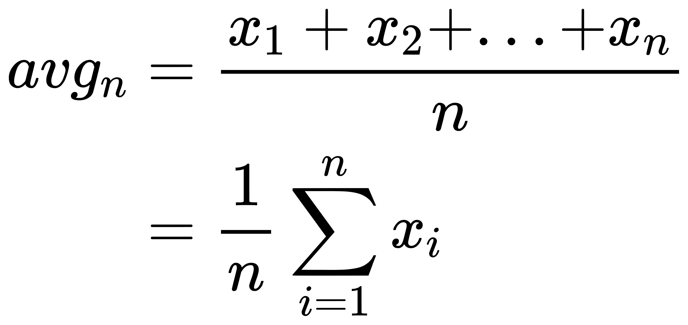

求平均值的公式可以做一下变形, 来避免大量的数相加导致溢出:

<!--
\begin{eqnarray}
avg_{n} & = & \frac{1}{n} \sum_{i=1}^{n} x_{i} \\
& = & \frac{1}{n} \left ( x_{n} + \sum_{i=1}^{n-1} x_{i} \right ) \\

由于 avg_{n-1} & = & \frac{1}{n-1} \sum_{i=1}^{n-1} x_{i} \\

可得 \sum_{i=1}^{n-1} x_{i} & = & (n-1) avg_{n-1} \\

带入得到 avg_{n} & = & \frac{1}{n} \left ( x_{n} + (n-1) avg_{n-1} \right ) \\
& = & avg_{n-1} + \frac{1}{n} (x_{n} - avg_{n-1}) \\
\end{eqnarray}
-->

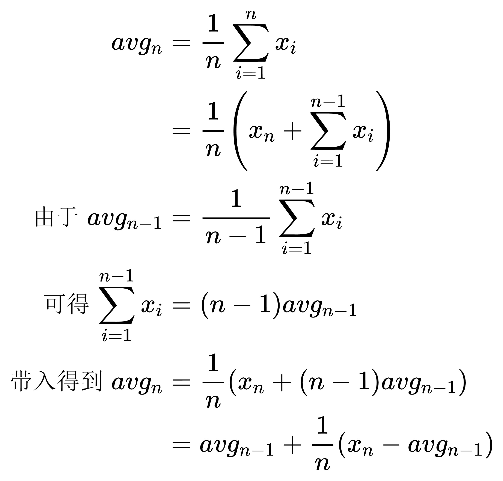

根据上面的公式, 可以得到另外两个有用的公式:

<!--
\begin{eqnarray}
x_{n} - avg_{n-1} & = & n(avg_{n} - avg_{n-1}) \\

x_{n} - avg_{n} & = & n(avg_{n} - avg_{n-1}) - avg_{n} + avg_{n-1} \\
& = & (n - 1) (avg_{n} - avg_{n-1})
\end{eqnarray}
-->

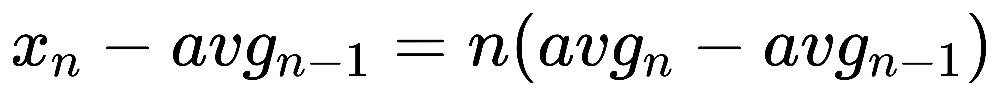

## 方差和标准差

如果想知道数据集中每项数据和平均值的差距, 只要通过各项的值减去平均值先算出差值, 然后将它们相加并除以总数就可以得到偏差:

<!--
\begin{eqnarray}
差值 & = & \frac{(x_{1} - avg_{n}) + (x_{2} - avg_{n}) + ... + (x_{n} - avg_{n})}{n} \\
& = & \frac{1}{n} \sum_{i=1}^{n} (x_{i} - avg_{n})
\end{eqnarray}
-->


由于减法结果中可能存在负数, 就会导致差值被抵消。为了避免负值带来的不利影响, 我们计算差值的平方(方差, Variance):

<!--
\begin{eqnarray}
var_{n} & = & \frac{(x_{1} - avg_{n})^{2}  + (x_{2} - avg_{n})^{2} + ... + (x_{n} - avg_{n})^{2}}{n} \\
& = & \frac{1}{n} \sum_{i=1}^{n} (x_{i} - avg_{n})^{2}
\end{eqnarray}
-->

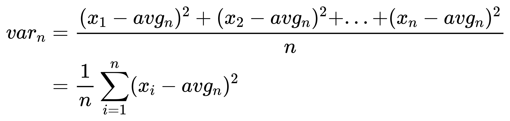

方差就是为了表示数据集中数据点的离散程度。

由于方差是通过平方求出来的, 所以还需要计算它的平方根, 称为标准差(Standard Deviation):

<!--
\begin{eqnarray}
sd_{n} & = & \sqrt{var_{n}}
\end{eqnarray}
-->

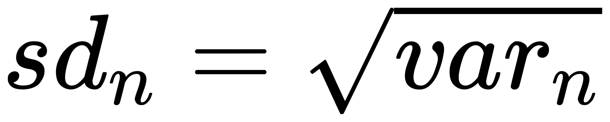

标准差越大, 代表数据集中大部分数值和其平均值之间差异越大。标准差越小, 代表这些数值越接近平均值。

求方差的公式需要先算出平均值, 可以做一下变形:

<!--
\begin{eqnarray}
var_{n} & = & \frac{1}{n} \sum_{i=1}^{n} (x_{i} - avg_{n})^{2} \\
& = & \frac{1}{n} \sum_{i=1}^{n} (x_{i}^{2} - 2x_{i}avg_{n} + avg_{n}^{2}) \\
& = & \frac{1}{n} \sum_{i=1}^{n} x_{i}^{2} - 2avg_{n} \frac{1}{n} \sum_{i=1}^{n} x_{i} + avg_{n}^{2}\frac{1}{n} \sum_{i=1}^{n} 1 \\
& = & \frac{1}{n} \sum_{i=1}^{n} x_{i}^{2} - 2avg_{n}avg_{n} + avg_{n}^{2}\frac{n}{n} \\
& = & \frac{1}{n} \sum_{i=1}^{n} x_{i}^{2} - avg_{n}^{2} \\
& = & \frac{1}{n} \sum_{i=1}^{n} x_{i}^{2} - \left ( \frac{1}{n} \sum_{i=1}^{n} x_{i} \right ) ^{2} \\
\end{eqnarray}
-->

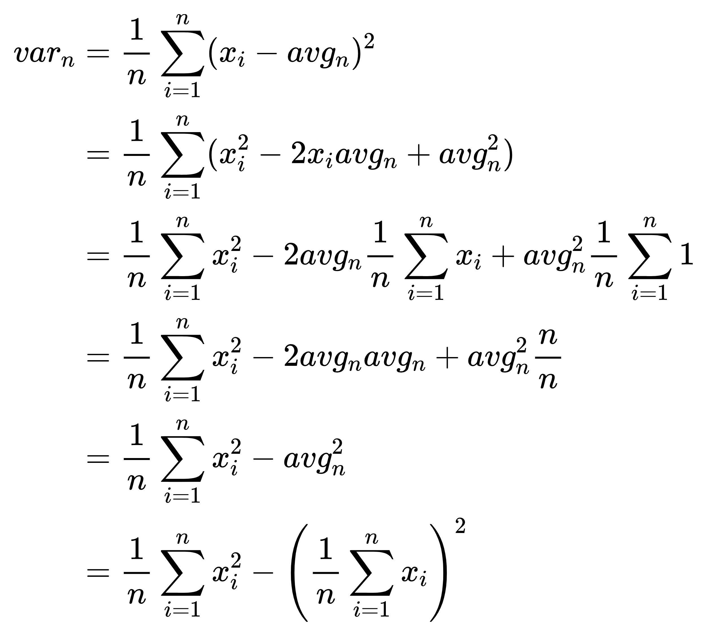

## 增量方差

<!--
\begin{eqnarray}
var_{n} & = & \frac{1}{n} \sum_{i=1}^{n} (x_{i} - avg_{n})^{2} \\
设 S_{n} & = & n \cdot var_{n} \\
& = & \sum_{i=1}^{n} (x_{i} - avg_{n})^{2} \\
& = & \sum_{i=1}^{n} x_{i}^{2} - \sum_{i=1}^{n} avg_{n}^{2} \\
& = & \sum_{i=1}^{n} x_{i}^{2} - n \cdot avg_{n}^{2} \\
\end{eqnarray}
-->

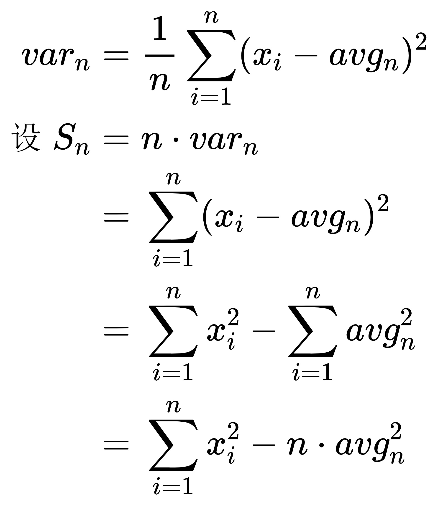

<!--
\begin{eqnarray}
S_{n} - S_{n-1} & = & \sum_{i=1}^{n} x_{i}^{2} - n \cdot avg_{n}^{2} - \sum_{i=1}^{n-1} x_{i}^{2} + (n - 1) \cdot avg_{n-1}^{2} \\
& = & x_{n}^{2} - n \cdot avg_{n}^{2} + (n - 1) \cdot avg_{n-1}^{2} \\
& = & x_{n}^{2} - n \cdot avg_{n}^{2} + n \cdot avg_{n-1}^{2} - avg_{n-1}^{2} \\
& = & x_{n}^{2} - avg_{n-1}^{2} + n(avg_{n-1}^{2} - avg_{n}^{2}) \\
& = & x_{n}^{2} - avg_{n-1}^{2} + n(avg_{n-1} - avg_{n})(avg_{n-1} + avg_{n}) \\

使用平均值中得到的公式: \\
x_{n} - avg_{n-1} & = & n(avg_{n} - avg_{n-1}) \\
得到: \\
S_{n} - S_{n-1} & = & x_{n}^{2} - avg_{n-1}^{2} + (avg_{n-1} - x_{n})(avg_{n-1} + avg_{n}) \\
& = & x_{n}^{2} - avg_{n-1}^{2} + avg_{n-1}^{2} - x_{n} avg_{n} - x_{n} avg_{n-1} + avg_{n} avg_{n-1} \\
& = & x_{n}^{2} - x_{n} avg_{n} - x_{n} avg_{n-1} + avg_{n} avg_{n-1} \\
& = & (x_{n} - avg_{n-1})(x_{n} - avg_{n}) \\
S_{n} & = & (x_{n} - avg_{n-1})(x_{n} - avg_{n}) + S_{n-1} \\
\end{eqnarray}
-->

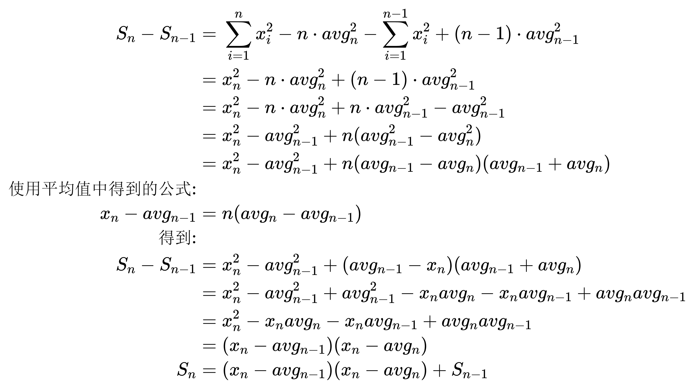

<!--
\begin{eqnarray}
var_{n} & = & \frac{S_{n}}{n} \\
sd_{n} & = & \sqrt{\frac{S_{n}}{n}} \\
& = & \sqrt{\frac{S_{n-1} + (x_{n} - avg_{n-1})(x_{n} - avg_{n})}{n}} \\
\end{eqnarray}
-->

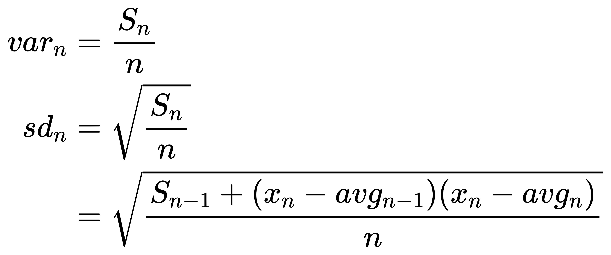

## 带权重的平均值

带权重的平均值定义如下(使用 w 表示权重):

<!--
\begin{eqnarray}
avg_{n} & = & \frac{\sum_{i=1}^{n} w_{i} x_{i}}{\sum_{i=1}^{n} w_{i}}  \\
\end{eqnarray}
-->

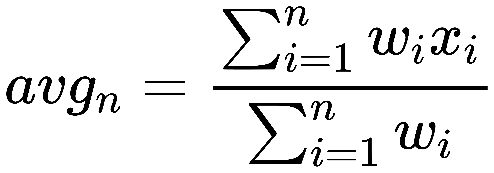

当每一项的权重都相同时, 它就会和普通的平均值相同:

<!--
\begin{eqnarray}
avg_{n} & = & \frac{\sum_{i=1}^{n} w x_{i}}{\sum_{i=1}^{n} w}  \\
& = & \frac{w \sum_{i=1}^{n} x_{i}}{n \cdot w}  \\
& = & \frac{1}{n} \sum_{i=1}^{n} x_{i}  \\
\end{eqnarray}
-->

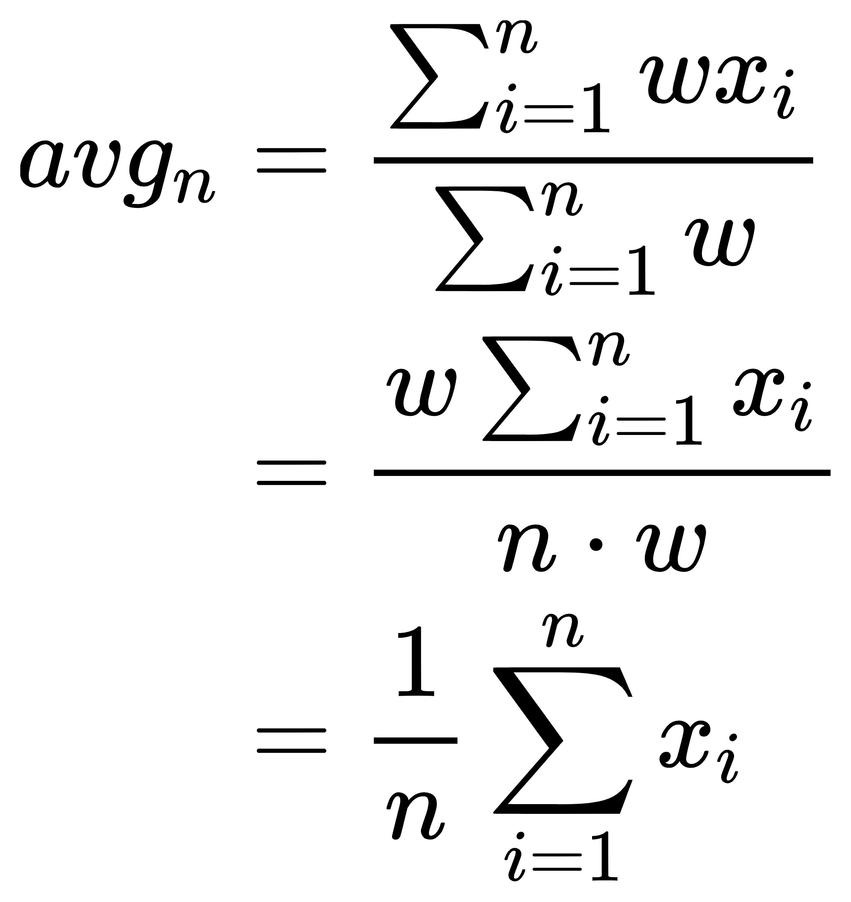

## 衰减平均值

## 衰减方差和衰减标准差

## 可信度

G1 会考虑某种程度的偏差, 几乎每次都会计算出安全的预测值。具体的计算方法如下:

<!--
\begin{eqnarray}
预测值 & = & davg + \left ( \frac{可信度}{100}\times dsd \right ) \\
\end{eqnarray}
-->

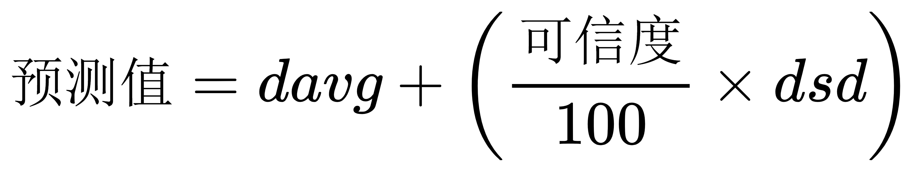

可信度表示通过衰减标准差求出来的波动范围的可信程度。例如当衰减标准差的值是 9 时, 如果可信度是 100%, 则表示将偏差范围设置在 ±9 以内。如果可信度为 50%, 则将偏差范围设置为原范围的一半, 即 ±4.5 以内。G1 中可信度的默认值为 50%。

将可信范围的偏差的最大值和衰减平均值（预测值）相加, 就求出了安全的预测值:

40 + (50 / 100 \* 9) = 44.5

如果以 A 的考试成绩为例, 那么 G1 会做出预测: A 下次的考试成绩为 44 分

```cpp
//////////////////////////////////////////////////////////
// src/hotspot/share/gc/g1/g1Policy.cpp //
//////////////////////////////////////////////////////////

void G1Policy::update_young_length_bounds() {
  assert(!Universe::is_fully_initialized() || SafepointSynchronize::is_at_safepoint(), "must be");
  bool for_young_only_phase = collector_state()->in_young_only_phase();
  // 根据历史GC数据预测pending_cards和rs_length的值
  update_young_length_bounds(_analytics->predict_pending_cards(for_young_only_phase),
                             _analytics->predict_rs_length(for_young_only_phase));
}

/////////////////////////////////////////////////////////////
// src/hotspot/share/gc/g1/g1Analytics.cpp //
/////////////////////////////////////////////////////////////

size_t G1Analytics::predict_pending_cards(bool for_young_only_phase) const {
  return predict_size(&_pending_cards_seq, for_young_only_phase);
}

size_t G1Analytics::predict_rs_length(bool for_young_only_phase) const {
  return predict_size(&_rs_length_seq, for_young_only_phase);
}

size_t G1Analytics::predict_size(G1PhaseDependentSeq const* seq, bool for_young_only_phase) const {
  return (size_t)predict_zero_bounded(seq, for_young_only_phase);
}

double G1Analytics::predict_zero_bounded(G1PhaseDependentSeq const* seq, bool for_young_only_phase) const {
  return MAX2(seq->predict(_predictor, for_young_only_phase), 0.0);
}

/////////////////////////////////////////////////////////////////////////////
// src/hotspot/share/gc/g1/g1AnalyticsSequences.inline.hpp //
/////////////////////////////////////////////////////////////////////////////

double G1PhaseDependentSeq::predict(const G1Predictions* predictor, bool use_young_only_phase_seq) const {
  if (use_young_only_phase_seq || !enough_samples_to_use_mixed_seq()) {
    // 预测下一次Young GC时pending_cards或rs_length的值
    return predictor->predict(&_young_only_seq);
  } else {
    // 预测下一次Mixed GC时pending_cards或rs_length的值
    return predictor->predict(&_mixed_seq);
  }
}
```

## 停顿预测模型

```cpp
///////////////////////////////////////////////////////////////
// src/hotspot/share/gc/g1/g1Predictions.hpp //
///////////////////////////////////////////////////////////////

class G1Predictions {
 private:
  // 估算抽样数据的标准差
  double stddev_estimate(TruncatedSeq const* seq) const {
    // dsd(): 衰减标准差
    double estimate = seq->dsd();
    // seq->num(): 抽样数据, seq中的元素数量
    int const samples = seq->num();
    // 抽样数据不足5个, 做单独处理
    if (samples < 5) {
      estimate = MAX2(seq->davg() * (5 - samples) / 2.0, estimate);
    }
    return estimate;
  }
 public:
  // 调用位置:
  // G1Policy::G1Policy(STWGCTimer* gc_timer) :
  //   _predictor(G1ConfidencePercent / 100.0),
  // }
  //
  // G1ConfidencePercent: 默认50
  // sigma默认0.5
  G1Predictions(double sigma) : _sigma(sigma) {
    assert(sigma >= 0.0, "Confidence must be larger than or equal to zero");
  }

  // 可信度系数
  double sigma() const {
    return _sigma;
  }

  double predict(TruncatedSeq const* seq) const {
    // davg(): 衰减平均值
    return seq->davg() + _sigma * stddev_estimate(seq);
  }
};
```

## 衰减平均值和衰减方差

```cpp
///////////////////////////////////////////////////////////////
// src/hotspot/share/utilities/numberSeq.cpp //
///////////////////////////////////////////////////////////////

/**
 * _num: 列表中元素的数量, 即列表长度
 * _davg: 衰减平均值
 * _dvariance: 衰减方差
 * _alpha: 默认值0.3
 */
AbsSeq::AbsSeq(double alpha) :
  _num(0), _sum(0.0), _sum_of_squares(0.0),
  _davg(0.0), _dvariance(0.0), _alpha(alpha) {
}

void AbsSeq::add(double val) {
  if (_num == 0) {
    // 如果添加元素之前, 队列为空,
    // 则添加这个元素之后, 队列只有1个元素,
    // 它的平均值就是这个元素的值, 方差是0
    _davg = val;
    _dvariance = 0.0;
  } else {
    // 计算平均值和方差
    // diff := x - mean
    // incr := alpha * diff
    // mean := mean + incr
    // variance := (1 - alpha) * (variance + diff * incr)
    // 计算公式来自这篇论文:
    // "Incremental calculation of weighted mean and variance" by Tony Finch
    // https://fanf2.user.srcf.net/hermes/doc/antiforgery/stats.pdf
    double diff = val - _davg;
    double incr = _alpha * diff;
    _davg += incr;
    _dvariance = (1.0 - _alpha) * (_dvariance + diff * incr);
  }
}
```

## 衰减标准差

```cpp
///////////////////////////////////////////////////////////////
// src/hotspot/share/utilities/numberSeq.cpp //
///////////////////////////////////////////////////////////////

double AbsSeq::dsd() const {
  double var = dvariance();
  guarantee( var >= 0.0, "variance should not be negative" );
  return sqrt(var);
}

double AbsSeq::dvariance() const {
  if (_num <= 1)
    return 0.0;

  double result = _dvariance;
  if (result < 0.0) {
    // 由于double的精度损失, _dvariance有可能小于0
    guarantee(-0.1 < result && result < 0.0,
               "if variance is negative, it should be very small");
    result = 0.0;
  }
  return result;
}
```
