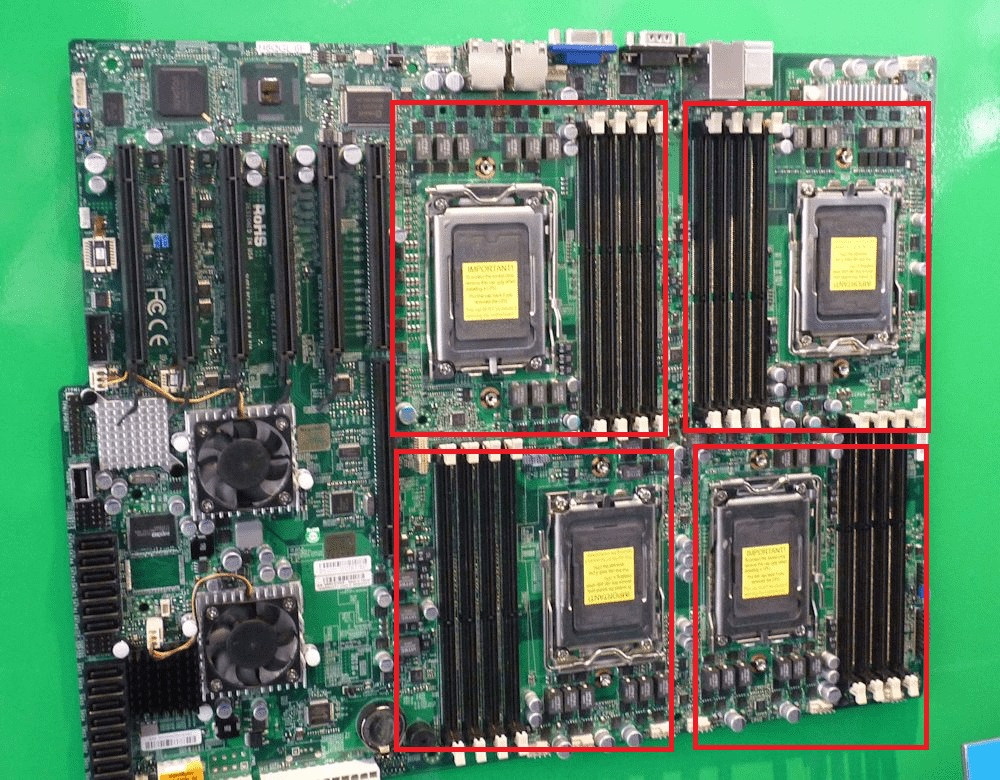

# NUMA

非统一内存访问架构(non-uniform memory access, NUMA), 是一种为多处理器的电脑设计的内存架构, 内存访问时间取决于内存相对于 CPU 的位置。

## SMP

对称多处理模型(Symmetric Multi-Processing, SMP)是指服务器中多个 CPU 对称工作, 无主次或从属关系的硬件架构。各 CPU 共享相同的物理内存, 每个 CPU 访问内存中的任何地址所需时间是相同的, 因此 SMP 也被称为一致存储器访问结构(UMA：Uniform Memory Access)。

由于每个 CPU 必须通过相同的内存总线访问相同的内存资源, 因此随着 CPU 数量的增加, 内存访问冲突将迅速增加, 最终会造成 CPU 资源的浪费, 使 CPU 性能的有效性大大降低。SMP 系统最好的情况是有 2-4 个 CPU, 适用于笔记本电脑和小型服务器等。

## NUMA

NUMA 服务器的基本特征是具有多个节点, 每个节点由多个 CPU 组成, 并且具有独立的本地内存。由于其节点可以通过 NUMA 互联模块进行连接和信息交互, 因此每个节点可以访问整个系统的内存。访问本地内存的速度将远远高于访问远程内存(系统内其它节点的内存)的速度。

## G1 的 NUMA 支持

现代的多插槽服务器越来越多的使用 NUMA 架构, 这表示内存到每个 socket(socket 就是主板上插 cpu 的槽) 的距离是不相等的, 内存到不同的 socket 之间的访问是有性能差异的, 访问的 socket 距离越远, 性能就会越差。ParallelGC 很多年前就已经支持 NUMA 了, 但 G1 直到 JDK 14 才支持 NUMA。

[JEP345](https://openjdk.org/jeps/345)在 JDK 14 的 G1 中增加了对 NUMA 的支持。在分配内存的过程中, 如果支持了 NUMA, G1 会优先在与当前线程所绑定的 NUMA 节点的空闲内存区域来分配内存空间。在新生代 region 中, 同一线程创建的对象会尽可能的分配到同一 NUMA 节点上, 因为是基于同一个线程创建的对象大部分是短存活并且高概率互相调用的。

如果要启用 NUMA, 可以在 JVM 参数中加上: -XX:+UseNUMA。
