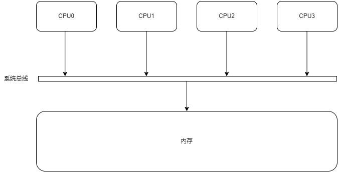
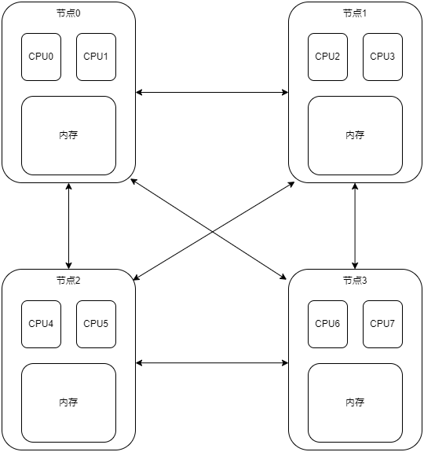

# NUMA

非统一内存访问架构(non-uniform memory access, NUMA), 是一种为多处理器的电脑设计的内存架构, 内存访问时间取决于内存相对于 CPU 的位置。

## SMP

对称多处理模型(Symmetric Multi-Processing, SMP)是指服务器中多个 CPU 对称工作, 无主次或从属关系的硬件架构。各 CPU 共享相同的物理内存, 每个 CPU 访问内存中的任何地址所需时间是相同的, 因此 SMP 也被称为一致存储器访问结构(UMA：Uniform Memory Access)。

由于每个 CPU 必须通过相同的内存总线访问相同的内存资源, 因此随着 CPU 数量的增加, 内存访问冲突将迅速增加, 最终会造成 CPU 资源的浪费, 使 CPU 性能的有效性大大降低。SMP 系统最好的情况是有 2-4 个 CPU, 适用于笔记本电脑和小型服务器等。

## NUMA

NUMA 服务器的基本特征是具有多个节点, 每个节点由多个 CPU 组成, 并且具有独立的本地内存。由于其节点可以通过 NUMA 互联模块进行连接和信息交互, 因此每个节点可以访问整个系统的内存。访问本地内存的速度将远远高于访问远程内存(系统内其它节点的内存)的速度。

## G1 的 NUMA 支持

现代的多插槽服务器越来越多的使用 NUMA 架构, 这表示内存到每个 socket(socket 就是主板上插 cpu 的槽) 的距离是不相等的, 内存到不同的 socket 之间的访问是有性能差异的, 访问的 socket 距离越远, 性能就会越差。ParallelGC 很多年前就已经支持 NUMA 了, 但 G1 直到 JDK 14 才支持 NUMA。

[JEP345](https://openjdk.org/jeps/345)在 JDK 14 的 G1 中增加了对 NUMA 的支持。

如果设置了 +XX:+UseNUMA 参数, 那么在 JVM 初始化时, G1 将会把 region 均匀地分布在所有的 NUMA 节点中。在 mutator 线程申请一个新对象的内存空间时, G1 可能需要分配一个新的 region。这个新的 region 会优先在当前线程绑定的 NUMA 节点中的空闲区域分配, 以便对象将分配在新生代的同一个 NUMA 节点上。如果在为 mutator 分配内存时, 在同一个 NUMA 节点上没有空闲区域, G1 将会触发垃圾回收。一个待评估的替代想法是按距离顺序搜索其他 NUMA 节点以获取空闲区域, 从最近的 NUMA 节点开始分配。

上面的分配策略只限于新生代 region, 因为基于同一个线程创建的对象大部分是存活时间短并且高概率互相调用的。老年代和大对象不使用这种策略。
