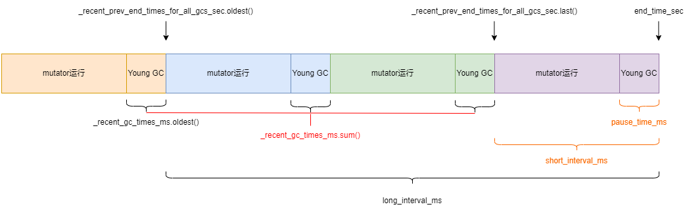

# 计算 pause_time_ratio



```cpp
//////////////////////////////////////////////////////////
// src/hotspot/share/gc/g1/g1Policy.cpp //
//////////////////////////////////////////////////////////

/**
 * GC结束后会记录相关的时间
 */
void G1Policy::record_pause(G1GCPauseType gc_type,
                            double start,
                            double end,
                            bool evacuation_failure) {
  // Manage the MMU tracker. For some reason it ignores Full GCs.
  if (gc_type != G1GCPauseType::FullGC) {
    _mmu_tracker->add_pause(start, end);
  }

  if (!evacuation_failure) {
    update_gc_pause_time_ratios(gc_type, start, end);
  }

  update_time_to_mixed_tracking(gc_type, start, end);
}

void G1Policy::update_gc_pause_time_ratios(G1GCPauseType gc_type, double start_time_sec, double end_time_sec) {

  double pause_time_sec = end_time_sec - start_time_sec;
  double pause_time_ms = pause_time_sec * 1000.0;
  // 记录GC暂停时间占程序执行总时间的比例, 用于堆空间扩容
  _analytics->compute_pause_time_ratios(end_time_sec, pause_time_ms);
  // 记录本次GC暂停的时间和结束的时间
  _analytics->update_recent_gc_times(end_time_sec, pause_time_ms);

  if (gc_type == G1GCPauseType::Cleanup || gc_type == G1GCPauseType::Remark) {
    _analytics->append_prev_collection_pause_end_ms(pause_time_ms);
  } else {
    _analytics->set_prev_collection_pause_end_ms(end_time_sec * 1000.0);
  }
}

/////////////////////////////////////////////////////////////
// src/hotspot/share/gc/g1/g1Analytics.cpp //
/////////////////////////////////////////////////////////////

void G1Analytics::compute_pause_time_ratios(double end_time_sec, double pause_time_ms) {
  // 计算_long_term_pause_time_ratio:
  // 截止到本次为止的GC暂停时间 : 从最早的一次GC结束到本次GC结束间隔的时间
  // 即总的GC暂停时间比例的平均值
  double long_interval_ms = (end_time_sec - oldest_known_gc_end_time_sec()) * 1000.0;
  // long_interval_ms是不包含在这之前的程序运行时间的
  // 所以也需要把最早的一次GC暂停时间排除
  double gc_pause_time_ms = _recent_gc_times_ms.sum() - _recent_gc_times_ms.oldest() + pause_time_ms;
  _long_term_pause_time_ratio = gc_pause_time_ms / long_interval_ms;
  _long_term_pause_time_ratio = clamp(_long_term_pause_time_ratio, 0.0, 1.0);
  // 计算_short_term_pause_time_ratio:
  // 本次GC暂停时间 : 从上一次GC结束到本次GC结束间隔的时间
  // 即本次的GC暂停时间比例
  double short_interval_ms = (end_time_sec - most_recent_gc_end_time_sec()) * 1000.0;
  _short_term_pause_time_ratio = pause_time_ms / short_interval_ms;
  _short_term_pause_time_ratio = clamp(_short_term_pause_time_ratio, 0.0, 1.0);
}

void G1Analytics::update_recent_gc_times(double end_time_sec,
                                         double pause_time_ms) {
  // 队列, 默认长度10, 用于记录每一次GC暂停的时间
  _recent_gc_times_ms.add(pause_time_ms);
  // 队列, 默认长度10, 用于记录每一次GC结束的时间
  _recent_prev_end_times_for_all_gcs_sec.add(end_time_sec);
}

double G1Analytics::oldest_known_gc_end_time_sec() const {
  // 取出最早的一次GC结束的时间
  return _recent_prev_end_times_for_all_gcs_sec.oldest();
}

double G1Analytics::most_recent_gc_end_time_sec() const {
  // 取出最新一次GC结束的时间
  return _recent_prev_end_times_for_all_gcs_sec.last();
}
```

## 队列添加元素

```cpp
TruncatedSeq::TruncatedSeq(int length, double alpha):
  AbsSeq(alpha), _length(length), _next(0) {
  _sequence = NEW_C_HEAP_ARRAY(double, _length, mtInternal);
  for (int i = 0; i < _length; ++i)
    _sequence[i] = 0.0;
}

void TruncatedSeq::add(double val) {
  AbsSeq::add(val);

  // get the oldest value in the sequence...
  double old_val = _sequence[_next];
  // ...remove it from the sum and sum of squares
  _sum -= old_val;
  _sum_of_squares -= old_val * old_val;

  // ...and update them with the new value
  _sum += val;
  _sum_of_squares += val * val;

  // now replace the old value with the new one
  _sequence[_next] = val;
  _next = (_next + 1) % _length;

  // only increase it if the buffer is not full
  if (_num < _length)
    ++_num;

  guarantee( variance() > -1.0, "variance should be >= 0" );
}
```