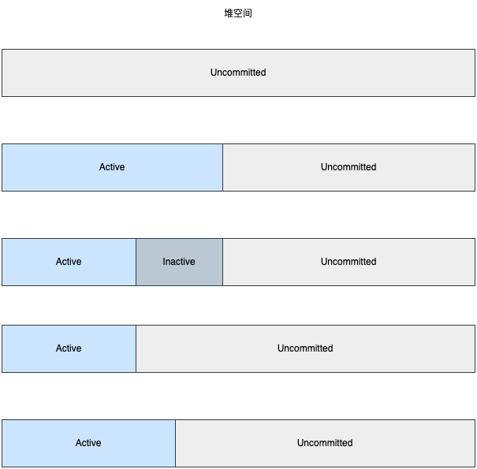

# region 的 3 种状态

G1 可使用的堆大小取决于 JVM 参数 MaxHeapSize, 但是 G1 不会一开始就把所有堆都分配成 region, 而是根据需要才分配, 没有分配成 region 的内存处于 Uncommitted 状态, Uncommitted 状态的内存不可以使用。已经分配成 region 的内存处于 Commited 状态, Commited 状态又分为 Active 状态和 Inactive 状态, 只有处于 Active 状态的 region 才可以用于分配对象。

G1 使用 HeapRegionManager 对象管理堆空间, 它使用字段 \_committed_map 记录堆中属于 Committed 状态的 region。如果不需要那么多的 region, G1 也会重新把一些 region 变回 Uncommitted 状态。

region 的 3 种状态:

1. Uncommitted: 未分配的内存
2. Active: 准备分配对象的 region
3. Inactive: 准备转换成 Uncommit 状态的 region

3 种状态之间的转换:

- Uncommitted -> Active
- Active -> Inactive
- Inactive -> Active
- Inactive -> Uncommitted



```cpp
///////////////////////////////////////////////////
// src/hotspot/share/gc/g1/heapRegionManager.hpp //
///////////////////////////////////////////////////

class HeapRegionManager: public CHeapObj<mtGC> {
  // 记录当前处于committed状态的region
  G1CommittedRegionMap _committed_map;
}

//////////////////////////////////////////////////////
// src/hotspot/share/gc/g1/g1CommittedRegionMap.hpp //
//////////////////////////////////////////////////////

class G1CommittedRegionMap : public CHeapObj<mtGC> {
  // 使用位图标记region的状态, true表示Active, false表示Inactive

  // 位图, 每一位指向一个Active状态的region
  // true表示Active, false表示Inactive
  CHeapBitMap _active;
  // 位图, 每一位指向一个Inactive状态的region
  // true表示Inactive, false表示Active
  CHeapBitMap _inactive;

  // Active状态的region个数
  uint _num_active;

  // Inactive状态的region个数
  uint _num_inactive;
}
```
