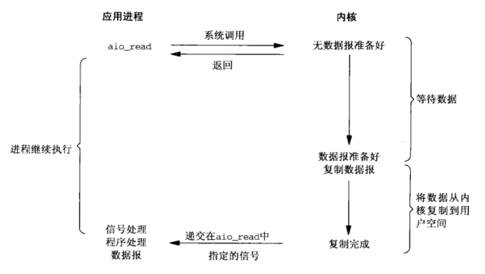

# 异步 IO(Asynchronous I/O)

异步 I/O 模型在等待数据准备好和将数据从内核拷贝到进程中这两个阶段都不会阻塞。异步 I/O 会让内核在整个操作(包括将数据从内核复制到用户的缓冲区)完成后通知用户。

它和信号驱动 I/O 的区别是, 信号驱动 I/O 通知用户何时可以启动一个 I/O 操作, 而异步 I/O 模型是由内核通知用户 I/O 操作何时完成。

以 aio_read 系统调用为例, 流程如下:

1. 当用户线程发起了系统调用, 立刻就可以开始去做其他的事, 用户线程不阻塞
2. 内核开始准备数据, 等到数据准备好了, 内核就会将数据从内核缓冲区复制到用户缓冲区
3. 复制完成后, 内核会给用户线程发送一个信号, 告诉用户线程 IO 操作完成了
4. 用户线程直接读取用户缓冲区的数据, 完成后续的业务操作

## 优点

异步 I/O 模型有着突出的优点, 用户线程在发起异步 I/O 操作之后, 立即可以做其他操作, 不会对用户线程产生任何阻塞, 效率更高。那么在一段进程的执行过程中, 这样的异步数据读取就可以使服务器处理更多更大量的服务请求, 即更适用于高并发量的并发服务器。

## 缺点

但是异步 I/O 出现较晚, 在 Linux 内核 2.6 之后才引入, 同时使用异步 I/O 编写程序, 程序的代码复杂度较高, 调试难度大。

## 应用场景

异步的 I/O 模型非常适合于高并发度的服务器, 同时处理大量的客户端请求需要内核进行的异步操作。对于 I/O 操作, 使用异步操作比使用线程+同步 I/O 操作更合适, 因为 I/O 操作不仅包括了直接的文件、网络的读写, 还包括数据库操作、Web Service、HttpRequest 等跨进程的调用。
