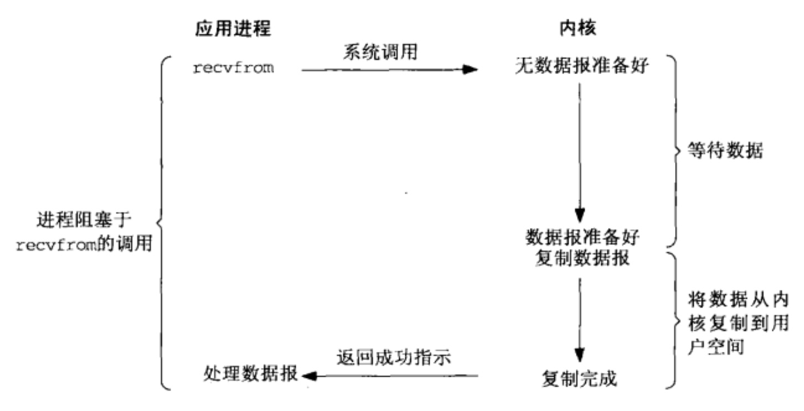

# 同步阻塞 IO(Blocking I/O)

阻塞 I/O 模型是最简单的 I/O 模型。在默认情况下, 所有套接字都是阻塞的。应用进程使用 read 或者 recvfrom 系统调用后, 如果内核没有数据准备好, 那么会一直阻塞等待数据。直到数据到达且被复制到应用进程的缓冲区（用户空间）才继续执行下面的处理。

以 socket 的 recvfrom 系统调用为例, 流程如下:

1. 应用程序发起系统调用开始, 用户线程就进入阻塞状态
2. 当内核收到系统调用, 就开始准备数据。一开始数据可能还没有到达内核缓冲区, 这个时候内核就要等待
3. 内核一直等到完整的数据到达, 才会将数据从内核缓冲区复制到进程缓冲区, 然后内核返回结果
4. 直到内核返回后, 用户线程才会解除阻塞的状态, 继续执行

## 优点

简单易用, 易于调试, 容易定位错误。另外, 等待的过程中占用的系统资源微乎其微, 等待阻塞时, 虽然本进程不能进行其他操作, 但是操作系统可以调度别的进程执行, 就不会有大量资源浪费。

## 缺点

在希望处理大量套接字, 同时接收大量多客户端数据时, 这个时候就比较困难了。因为阻塞 I/O 模型会在两个阶段（等待数据和数据从内核拷贝到用户空间）都阻塞起来, 所以这时候如果使用多线程技术, 为需要处理的每一个套接字都分配一个读线程、处理线程和用于同步的信号量, 这样显然会增大系统开销。

## 应用场景

阻塞 I/O 模型适用于简单的 C/S 模型程序, 易于调试, 容易定位错误的程序。同时将阻塞 I/O 应用模型加以改进, 使用多线程（多进程）处理小规模的服务请求, 是比较合适的。对于简单的服务器应用（请求不多, 客户端连接数不多）, 这种模型是最为快速地实现功能的方式。
