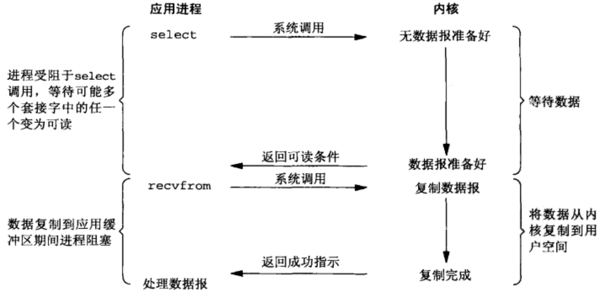

# IO 多路复用(I/O Multiplexing)

非阻塞 IO 的缺点是每次发起系统调用，只能检查一个文件描述符是否就绪。当文件描述符很多时，需要创建很多线程。

IO 多路复用可以通过一次系统调用，检查多个文件描述符的状态。

在 linux 中，有 3 种系统调用可以让内核监测文件描述符，分别是: select, poll, epoll。

当用户线程调用 select 时，那么此时整个进程会被阻塞，同时内核会监视 select 中传入的所有文件描述符，当任意一个 fd 的数据准备好了，select 就会返回, 然后进程可以遍历集合中就绪的 fd，进行系统调用(比如 recvfrom)，数据就会开始从内核拷贝到用户空间。

以 socket 的 recvfrom 系统调用为例, 流程如下:

Java 的 NIO 技术, 使用的就是 IO 多路复用模型。在 Linux 系统上使用的是 epoll 系统调用。

## 优缺点

I/O 多路复用和阻塞 I/O 相比，并不显得有什么优势，实际上由于 select 使用两个系统调用而非单个系统调用，还会稍显劣势。不过它的真正优点在于能够等待多个描述符就绪，与之前在阻塞 I/O 中需要通过多线程来实现的一种模式相比，它在一个线程（进程）中就能监视多个文件描述符，系统的资源占用大大减少。等待的文件描述符只要其中任一进入读就绪或者写就绪，select 函数就可以返回。

相比非阻塞 I/O 模型，在多路复用 IO 模型中，只需要使用一个线程就可以管理多个 socket，系统不需要建立新的进程或者线程，也不必维护这些线程和进程，所以它也是很大程度上减少了资源占用。另外，多路复用 IO 是比非阻塞 IO 模型的效率高的，因为在非阻塞 IO 中，不断地询问 socket 状态是通过用户线程去进行的，而在多路复用 IO 中，轮询每个 socket 状态是内核在进行的，这个效率要比用户线程要高的多。

但是在只处理连接数较小的场合，使用 select 的服务器不一定比多线程 + 阻塞 I/O 效率高，可能延迟更大，因为单个连接处理需要 2 次系统调用，占用时间会有增加。

## 应用场景

- 当一个客户端需要同时处理多个文件描述符的输入输出时（比如 socket）
- 当程序需要同时进行多个套接字的操作时
- 当一个 TCP 服务器要同时处理预监听的网络连接套接字和已经连接好的套接字时
- 当一个服务器同时使用 TCP 和 UDP 协议时
- 当一个服务器同时需要使用多种服务并且每种服务可能使用不同的协议时（比如端口监视守护进程 inetd）

## select
