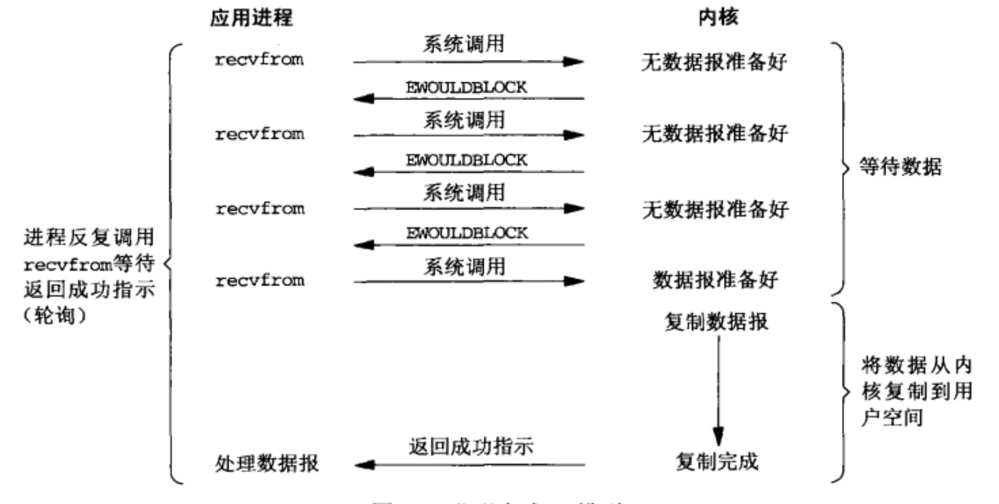

# 同步非阻塞 IO(Non-Blocking I/O)

以 socket 的 recvfrom 系统调用为例, 流程如下:

1. 用户线程调用 recvfrom 时设置非阻塞操作的标志(MSG_DONTWAIT), 这样在内核数据没有准备好时, 会立即返回而不是阻塞线程。
2. 所以, 为了最终读取到数据, 用户线程需要不断地发起 recvfrom 系统调用, 即轮询（Polling）
3. 当内核数据到达后, 用户线程发起的 recvfrom 系统调用才会使用户线程阻塞。内核开始复制数据到用户缓冲区, 然后内核返回结果
4. 用户线程读到数据后, 才会解除阻塞状态, 继续执行

注意: 同步非阻塞 I/O 虽然简称为 NIO, 但它和 Java 中的 NIO 不是一个东西。

## 优点

不会阻塞在内核的等待数据的过程，每次发起的 I/O 请求可以立即返回，不用阻塞等待。在数据量收发不均，等待时间随机性极强的情况下比较常用。

## 缺点

用户线程需要不断轮询，进程不断占用 CPU 进行系统调用，会导致 CPU 占用率很高，而使系统资源利用率过低。

## 应用场景

直接使用非阻塞 I/O 的模式并不常见，只会在专门提供某一功能的特定系统中使用。而一般情况下，非阻塞方式都是和其他 I/O 模型相结合来组合使用。
