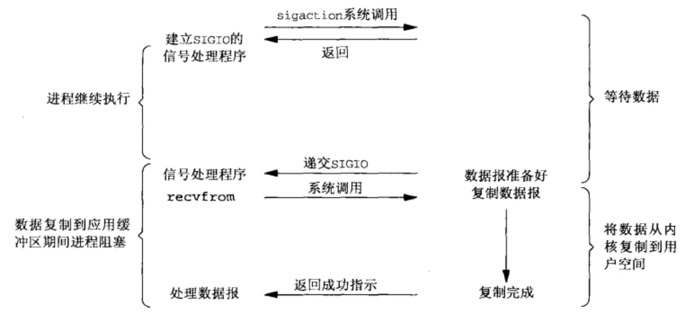

# 实时信号驱动 IO(Realtime Signal Driven IO, rtsig)

当用户线程发起一个 I/O 请求操作, 会给对应的 socket 注册一个信号函数, 然后用户线程会继续执行, 当内核数据就绪时会发送一个信号给用户线程, 用户线程接收到信号之后, 便在信号函数中调用 I/O 读写操作(recvfrom)来进行实际的 I/O 操作。

以 socket 的 recvfrom 系统调用为例, 流程如下:

1. 先开启信号驱动 I/O 功能, 并使用 sigaction 系统调用绑定信号处理函数, 该系统调用立即返回
2. 之后当数据报准备好之后内核为该进程产生 SIGIO 信号, 再在信号处理函数中使用系统调用 recvfrom 把数据复制到用户空间

## 优点

在等待数据报到达期间进程不被阻塞, 主循环可以继续执行, 只要等待来自信号处理函数的通知即可。用户线程可以在数据未到达的过程中做其他操作和进行其他处理, 提升进程下的资源利用率。

## 缺点

信号驱动 I/O 没有完全做到异步, 在第二阶段依然会延迟在等待数据从内核空间复制到用户空间上。

信号驱动 I/O 对于处理 UDP 套接字来说有用, 收到 SIGIO 信号意味着到达一个数据报, 或者返回一个异步错误。

但是, 对于 TCP 而言, 信号驱动的 I/O 方式近乎无用, 因为触发 SIGIO 的条件为数众多(监听套接字上某个连接请求已经完成, 某个断连请求已经发起, 某个断连请求已经完成等等), 应用程序需要消耗很大资源来判断是哪个状态触发的 SIGIO。

## 应用场景

信号驱动 I/O 模型的一个非常典型的应用是 NTP 服务器, 即 Network Time Protocol 网络时间服务器。它使用 UDP, 这个服务器的主循环用来接收从客户端发送过来的数据包, 然后再发送请求。对于这个服务器来说, 记录下收到每一个数据包的具体时间是很重要的。
