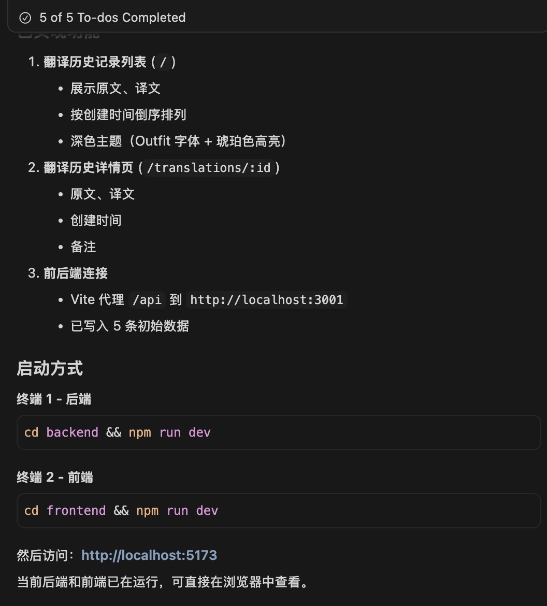
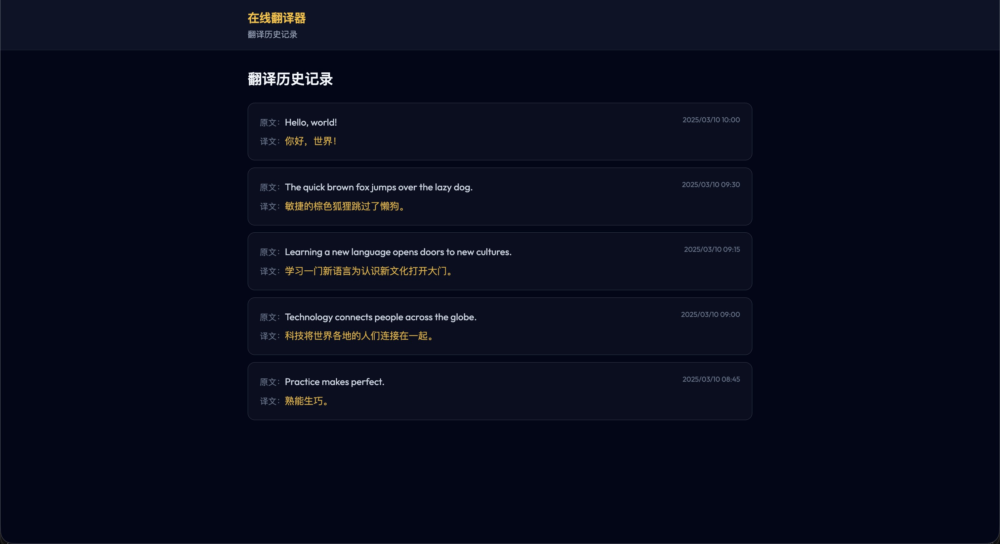
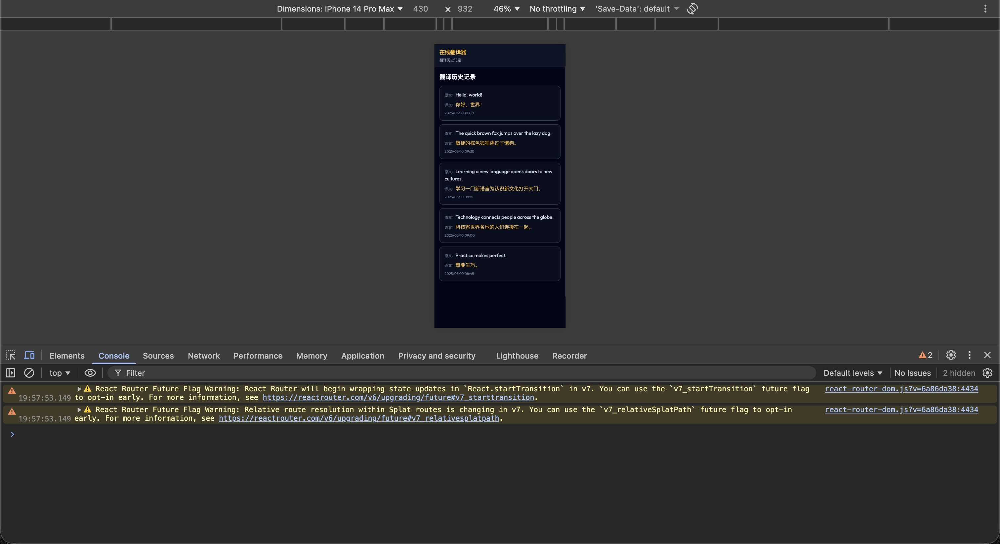
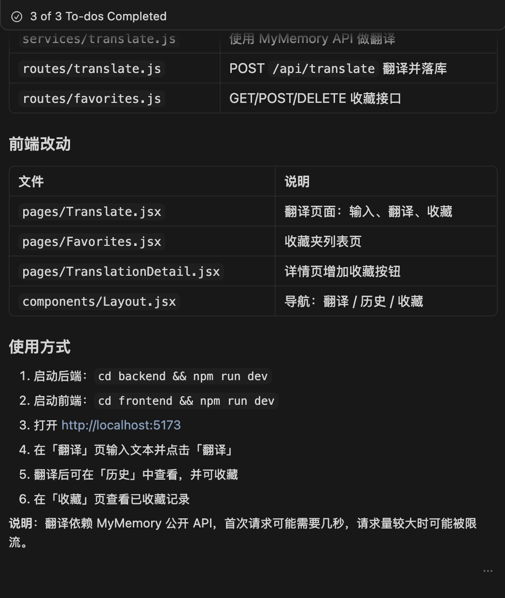

# 在线翻译器

## 1. 初始化项目

对 cursor 说：

```markdown
请帮我搭建一个完整的“在线翻译器”的前端和后端。
主要功能需要包含：

1. 翻译历史记录列表展示 (需要展示原文、译文，按创建时间倒序排列)
2. 翻译历史记录详情页（展示原文、译文、创建时间、备注）

技术栈选择：

- 后端：Node.js + Express.js
- 数据库：sqlite
- 前端：React.js (使用 Vite 快速构建)
- CSS 框架：Tailwind CSS (用于快速样式化)

请将所有代码组织在项目根目录下的相应文件夹中 (后端: /backend, 前端：/frontend)。
所有数据库模型定义在 /backend/models 文件夹下。
所有 API 路由定义在 /backend/routes 文件夹下。
请确保前后端连接正常，并生成初始的几条模拟数据。
```

cursor 输出：



效果：



## 2. 适配手机屏幕

```markdown
前端页面适配一下手机屏幕
```

效果：



## 3. 实现翻译页面

```markdown
增加一个翻译页面，用户输入原文后，点击“翻译”按钮展示对应的翻译。并把这条翻译记录下来，在翻译历史记录列表中会展示这条新的记录（要求：历史记录落库，即使浏览器刷新后，记录也还在）。
页面上同时有一个“收藏”按钮，点击后把这条记录添加到收藏夹中（收藏夹也要落库）。
```

cursor 输出：



ai 会自己找一个免费的翻译接口集成进去。

## 4. 修复报错

点击页面上的翻译按钮后，控制台出现了报错，右键“Copy console”复制报错信息，让 cursor 修复：

```
修复一下报错：20:47:35.393 Translate.jsx:19 POST http://localhost:5173/api/translate 404 (Not Found)
handleTranslate @ Translate.jsx:19
callCallback2 @ chunk-XPR23Y44.js?v=36b358ed:3672
invokeGuardedCallbackDev @ chunk-XPR23Y44.js?v=36b358ed:3697
invokeGuardedCallback @ chunk-XPR23Y44.js?v=36b358ed:3731
invokeGuardedCallbackAndCatchFirstError @ chunk-XPR23Y44.js?v=36b358ed:3734
executeDispatch @ chunk-XPR23Y44.js?v=36b358ed:7012
processDispatchQueueItemsInOrder @ chunk-XPR23Y44.js?v=36b358ed:7032
processDispatchQueue @ chunk-XPR23Y44.js?v=36b358ed:7041
dispatchEventsForPlugins @ chunk-XPR23Y44.js?v=36b358ed:7049
(anonymous) @ chunk-XPR23Y44.js?v=36b358ed:7172
batchedUpdates$1 @ chunk-XPR23Y44.js?v=36b358ed:18911
batchedUpdates @ chunk-XPR23Y44.js?v=36b358ed:3577
dispatchEventForPluginEventSystem @ chunk-XPR23Y44.js?v=36b358ed:7171
dispatchEventWithEnableCapturePhaseSelectiveHydrationWithoutDiscreteEventReplay @ chunk-XPR23Y44.js?v=36b358ed:5476
dispatchEvent @ chunk-XPR23Y44.js?v=36b358ed:5470
dispatchDiscreteEvent @ chunk-XPR23Y44.js?v=36b358ed:5447
```

ai 说修复了，但是再点一下翻译还是报错，重复上面步骤：

```
还是报错，修复一下：
20:52:22.029 Translate.jsx:18  POST http://localhost:3001/api/translate 404 (Not Found)
handleTranslate @ Translate.jsx:18
callCallback2 @ chunk-XPR23Y44.js?v=36b358ed:3672
invokeGuardedCallbackDev @ chunk-XPR23Y44.js?v=36b358ed:3697
invokeGuardedCallback @ chunk-XPR23Y44.js?v=36b358ed:3731
invokeGuardedCallbackAndCatchFirstError @ chunk-XPR23Y44.js?v=36b358ed:3734
executeDispatch @ chunk-XPR23Y44.js?v=36b358ed:7012
processDispatchQueueItemsInOrder @ chunk-XPR23Y44.js?v=36b358ed:7032
processDispatchQueue @ chunk-XPR23Y44.js?v=36b358ed:7041
dispatchEventsForPlugins @ chunk-XPR23Y44.js?v=36b358ed:7049
(anonymous) @ chunk-XPR23Y44.js?v=36b358ed:7172
batchedUpdates$1 @ chunk-XPR23Y44.js?v=36b358ed:18911
batchedUpdates @ chunk-XPR23Y44.js?v=36b358ed:3577
dispatchEventForPluginEventSystem @ chunk-XPR23Y44.js?v=36b358ed:7171
dispatchEventWithEnableCapturePhaseSelectiveHydrationWithoutDiscreteEventReplay @ chunk-XPR23Y44.js?v=36b358ed:5476
dispatchEvent @ chunk-XPR23Y44.js?v=36b358ed:5470
dispatchDiscreteEvent @ chunk-XPR23Y44.js?v=36b358ed:5447
```

这次需要重启后端，但是启动时端口占用了，直接让 ai 修复：

```
启动直接报错了，修复一下：

> translator-backend@1.0.0 dev
> node --watch server.js

(node:22731) ExperimentalWarning: Watch mode is an experimental feature and might change at any time
(Use `node --trace-warnings ...` to show where the warning was created)
node:events:496
      throw er; // Unhandled 'error' event
      ^

Error: listen EADDRINUSE: address already in use :::3001
    at Server.setupListenHandle [as _listen2] (node:net:1897:16)
    at listenInCluster (node:net:1945:12)
    at Server.listen (node:net:2037:7)
    at Function.listen (/Users/walter/walter/projects-fe/translator/backend/node_modules/express/lib/application.js:635:24)
    at file:///Users/walter/walter/projects-fe/translator/backend/server.js:53:5
    at ModuleJob.run (node:internal/modules/esm/module_job:222:25)
    at async ModuleLoader.import (node:internal/modules/esm/loader:323:24)
    at async loadESM (node:internal/process/esm_loader:28:7)
    at async handleMainPromise (node:internal/modules/run_main:113:12)
Emitted 'error' event on Server instance at:
    at emitErrorNT (node:net:1924:8)
    at process.processTicksAndRejections (node:internal/process/task_queues:82:21) {
  code: 'EADDRINUSE',
  errno: -48,
  syscall: 'listen',
  address: '::',
  port: 3001
}

Node.js v20.12.2
Failed running 'server.js'
```

这次终于修复了。

## 5. 问题优化

```markdown
修复下列问题：

1. 在收藏夹中的原文，如果再次翻译，需要在结果中显示已收藏，目前还是未收藏的状态
2. 在收藏夹列表中点击记录，虽然能够进入详情，但上面的导航会切换到“历史”
```

继续：

```markdown
修复下列问题：

1. 同一个原文查询两次后，在收藏夹中会展示成两条
```

```markdown
增加下列功能：

1. 用户注册和登录功能（使用jwt）
2. 收藏夹和历史记录改为和每个用户相关联，不同的用户会看到不同的收藏夹和历史记录
```
