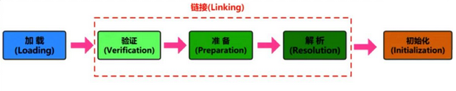
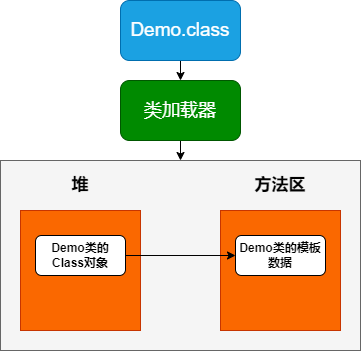

# 类的加载

所谓加载，简而言之就是将 Java 类的字节码文件加载到机器内存中，并在内存中构建出 Java 类的原型——类模板对象。

所谓类模板对象，其实就是 Java 类在 JVM 内存中的一个快照，JVM 将从字节码文件中解析出的常量池、类字段、类方法等信息存储到模板中，这样 JVM 在运行期便能通过类模板而获取 Java 类中的任意信息，能够对 Java 类的成员变量进行遍历，也能进行 Java 方法的调用。

# 类加载过程



# Loading (加载)

在加载类时，Java 虚拟机必须完成以下3件事情：

- 通过类的全名，获取类的二进制数据流
- 解析类的二进制数据流为方法区内的数据结构(Java 类模板)
- 创建 java.lang.Class 类的实例，表示该类型。作为方法区这个类的访问入口

.class 文件的获取方式

- 通过文件系统读入一个 .class 后缀的文件(最常见)
- 读入 jar、zip 等归档数据包，提取类文件
- 事先存放在数据库中的类的二进制数据
- 通过网络进行加载
- 在运行时生成一段 Class 的二进制信息等 (动态代理)

### 类模板和 Class 对象

类模板的位置: 加载的类在 JVM 中会存储在方法区

Class 实例的位置: JVM 将 .class 文件加载至方法区后，会在堆中创建一个 java.lang.Class 对象，用来封装类位于方法区内的数据结构，该 Class 对象是在加载类的过程中创建的，每个类都对应有一个 Class 类型的对象



# Linking (链接)

当类加载到系统后，就开始链接操作。

## Verification (验证)

验证是链接操作的第一步，它的目的是保证加载的字节码是合法、合理并符合规范的。

验证的内容则涵盖了类数据信息的格式验证、语义检查、字节码验证，以及符号引用验证等。

其中格式验证会和加载阶段一起执行。验证通过之后，类加载器才会成功将类的二进制数据信息加载到方法区中。格式验证之外的验证操作将会在方法区中进行。

- 格式验证：文件是否以 0xCAFEBABE 开头，主版本和副版本号是否在当前 Java 虚拟机的支持范围内，数据中每一个项是否都拥有正确的长度等
- 语义检查：在语义上不符合规范的，虚拟机不会给予验证通过
- 字节码验证：验证过程中最为复杂的一个过程。它试图通过对字节码流的分析，判断字节码是否可以被正确地执行
- 符号引用验证：Class 文件在其常量池会通过字符串记录自己将要使用的其他类或者方法。因此，在验证阶段，虚拟机就会检查这些类或者方法确实是存在的，并且当前类有权限访问这些数据，如果一个需要使用类无法在系统中找到，则会抛出 NoClassDefFoundError，如果一个方法无法被找到，则会抛出 NoSuchMethdError
- 符号引用验证在 Resolution (解析)环节才会执行

## Preparation (准备)

准备阶段只为类的静态变量分配内存，并将其赋值为初始值。此处的初始值并不是用户定义的值，而是 JVM 内部为各类型变量定义的初始值。

特殊情况：使用 static + final 修饰，且是不涉及到方法或构造器调用的基本数据类型或String类型的显式赋值，会在准备阶段进行显式赋值

例：

```java
public class LinkingTest {
    // 准备阶段赋值: 0
    private static int num = 100;
    // 准备阶段赋值: 100
    public static final int num1 = 100;
    // 准备阶段赋值: "helloworld0"
    public static final String s0 = "helloworld0";
    // 准备阶段赋值: null，由于使用了构造器所以不在准备阶段显式赋值
    public static final String s1 = new String("helloworld1"); 
}
```

## Resolution (解析)

解析阶段将常量池中的符号引用转为直接引用。

符号引用以一组符号来描述所引用的目标。在编译时，Java 类并不知道所引用的类的实际内存地址，因此只能使用符号引用来代替。

如下字节码文件中的常量池：
```
Constant pool:
   #1 = Methodref          #4.#16         // java/lang/Object."<init>":()V
   #2 = Methodref          #3.#17         // com/jvm/classloading/B.b2:(II)I
   #3 = Class              #18            // com/jvm/classloading/B
   #4 = Class              #19            // java/lang/Object
   #5 = Utf8               <init>
   #6 = Utf8               ()V
   #7 = Utf8               Code
   #8 = Utf8               LineNumberTable
   #9 = Utf8               main
  #10 = Utf8               ([Ljava/lang/String;)V
  #11 = Utf8               b1
  #12 = Utf8               (II)I
  #13 = Utf8               b2
  #14 = Utf8               SourceFile
  #15 = Utf8               B.java
  #16 = NameAndType        #5:#6          // "<init>":()V
  #17 = NameAndType        #13:#12        // b2:(II)I
  #18 = Utf8               com/jvm/classloading/B
  #19 = Utf8               java/lang/Object
```

# Initialization (初始化)

初始化阶段执行类的初始化方法：`<clinit>()` 方法，为类的静态变量赋予正确的初始值。

`<clinit>()` 方法仅能由 Java 编译器生成并由 JVM 调用，程序开发者无法自定义和调用该方法。它是编译器自动收集类变量的赋值语句以及 static 代码块合并而来。

例：

```java
public class InitializationTest2 {
    // 在初始化阶段<clinit>()中赋值
    public static int a = 1;
    // 在链接阶段的准备环节赋值
    public static final int INT_CONSTANT = 10;
    // 在初始化阶段<clinit>()中赋值
    public static final Integer CONSTANT1 = Integer.valueOf(100);
    // 在初始化阶段<clinit>()中赋值
    public static Integer CONSTANT2 = Integer.valueOf(1000);
    // 在链接阶段的准备环节赋值
    public static final String s0 = "helloworld0";
    // 在初始化阶段<clinit>()中赋值
    public static final String s1 = new String("helloworld1");
}
```

虚拟机会保证一个类的 `<clinit>()` 方法在多线程环境中被正确地加锁、同步，如果多个线程同时去初始化一个类，那么只会有一个线程去执行这个类的 `<clinit>()` 方法，其他线程都需要阻塞等待，直到活动线程执行 `<clinit>()` 方法完毕。如果之前的线程成功加载了类，则等在队列中的线程就没有机会再执行 `<clinit>()` 方法了，当需要使用这个类时，虚拟机会直接返回给它已经准备好的信息。

当初始化子类时，如果发现其父类还没有进行过初始化，则需要先触发其父类的初始化。
