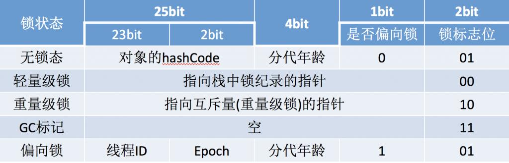
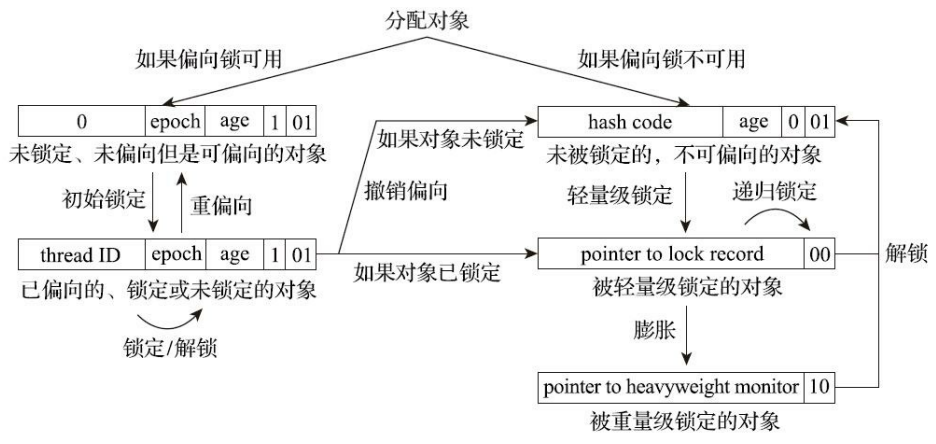

# 锁优化

在Java中，锁优化是指通过各种技术手段来提高多线程并发执行时锁的性能和效率。

# 自旋锁与自适应自旋

提到了互斥同步对性能最大的影响是阻塞的实现，挂起线程和恢复线程的操作都需要转入内核态中完成，这些操作给Java虚拟机的并发性能带来了很大的压力。而在许多应用上，共享数据的锁定状态只会持续很短的一段时间，为了这段时间去挂起和恢复线程并不值得。

如果物理机器有一个以上的处理器，能让两个或以上的线程同时并行执行，就可以让后面请求锁的那个线程稍等一会，但不放弃处理器的执行时间，看看持有锁的线程是否很快就会释放锁。让线程等待，只须让线程执行一个忙循环(自旋)，这项技术就是自旋锁。

自旋锁在JDK 6中默认开启。自旋等待本身虽然避免了线程切换的开销，但它是要占用处理器时间的，所以如果锁被占用的时间很短，自旋等待的效果就会非常好，反之如果锁被占用的时间很长，那么自旋的线程只会白白消耗处理器资源，而不会做任何有价值的工作，这就会带来性能的浪费。因此自旋等待的时间必须有一定的限度，如果自旋超过了限定的次数仍然没有成功获得锁，就应当使用传统的方式去挂起线程。

在JDK 6中对自旋锁的优化，引入了自适应的自旋。自适应意味着自旋的时间不再是固定的了，而是由前一次在同一个锁上的自旋时间及锁的拥有者的状态来决定的。如果在同一个锁对象上，自旋等待刚刚成功获得过锁，并且持有锁的线程正在运行中，那么虚拟机就会认为这次自旋也很有可能再次成功，进而允许自旋等待持续相对更长的时间，比如持续100次忙循环。另一方面，如果对于某个锁，自旋很少成功获得过锁，那在以后要获取这个锁时将有可能直接省略掉自旋过程，以避免浪费处理器资源。随着程序运行时间的增长及性能监控信息的不断完善，虚拟机对程序锁的状况预测就会越来越精准。

# 锁消除

锁消除是指虚拟机即时编译器在运行时，对一些代码要求同步，但是对被检测到不可能存在共享数据竞争的锁进行消除。

锁消除的主要判定依据来源于逃逸分析的数据支持，如果判断到一段代码中，在堆上的所有数据都不会逃逸出去被其他线程访问到，那就可以把它们当作栈上数据对待，认为它们是线程私有的，同步加锁自然就无须再进行。

# 锁粗化

当一段代码中存在多个连续的加锁和解锁操作时，编译器会将这些操作合并为一个更大的锁范围，减少锁的粒度，提高性能。

# 轻量级锁

轻量级锁是JDK 6时加入的新型锁机制，它的轻量级是相对于使用操作系统互斥量来实现的传统锁而言的，因此传统的锁机制就被称为重量级锁。如果没有竞争，轻量级锁便通过CAS操作成功避免了使用互斥量的开销。但如果确实存在锁竞争，除了互斥量的本身开销外，还额外发生了CAS操作的开销。因此在有竞争的情况下，轻量级锁反而会比传统的重量级锁更慢。

HotSpot虚拟机的对象头分为两部分，第一部分用于存储对象自身的运行时数据，如哈希码(HashCode)、GC分代年龄(Generational GC Age)等。这部分数据的长度在32位和64位的Java虚拟机中分别会占用32个或64个比特，称为MarkWord。这部分是实现轻量级锁和偏向锁的关键：

## 轻量级锁的工作过程

在代码即将进入同步块的时候，如果此同步对象没有被锁定(锁标志位为01状态)，虚拟机首先将在当前线程的栈帧中建立一个名为锁记录(Lock Record)的空间，用于存储锁对象目前的Mark Word的拷贝(官方为这份拷贝加了一个Displaced前缀，即Displaced Mark Word)。

然后，虚拟机将使用CAS操作尝试把对象的Mark Word更新为指向Lock Record的指针。如果这个更新动作成功了，即代表该线程拥有了这个对象的锁，并且对象Mark Word的锁标志位将转变为00，表示此对象处于轻量级锁定状态。

如果这个更新操作失败了，那就意味着至少存在一条线程与当前线程竞争获取该对象的锁。虚拟机首先会检查对象的Mark Word是否指向当前线程的栈帧，如果是，说明当前线程已经拥有了这个对象的锁，那直接进入同步块继续执行就可以了，否则就说明这个锁对象已经被其他线程抢占了。如果出现两条以上的线程争用同一个锁的情况，那轻量级锁就不再有效，必须要膨胀为重量级锁，锁标志的状态值变为10，此时Mark Word中存储的就是指向重量级锁(互斥量)的指针，后面等待锁的线程也必须进入阻塞状态。

轻量级锁的解锁过程也同样是通过CAS操作来进行的，如果对象的Mark Word仍然指向线程的锁记录，那就用CAS操作把对象当前的Mark Word和线程中复制的DisplacedMark Word替换回来。假如能够成功替换，那整个同步过程就顺利完成了。如果替换失败，则说明有其他线程尝试过获取该锁，就要在释放锁的同时，唤醒被挂起的线程。

# 偏向锁

偏向锁也是JDK 6中引入的一项锁优化措施，它的目的是消除数据在无竞争情况下的同步操作，进一步提高程序的运行性能。它的意思是这个锁会偏向于第一个获得它的线程，如果在接下来的执行过程中，该锁一直没有被其他的线程获取，则持有偏向锁的线程将永远不需要再进行同步。

假设当前虚拟机启用了偏向锁，那么当锁对象第一次被线程获取的时候，虚拟机将会把对象头中的标志位设置为01、把偏向模式(是否偏向锁)设置为1，表示进入偏向模式。同时使用CAS操作把获取到这个锁的线程的ID记录在对象的Mark Word之中。如果CAS操作成功，持有偏向锁的线程以后每次进入这个锁相关的同步块时，虚拟机都可以不再进行任何同步操作(加锁、解锁及对Mark Word的更新操作
等)。

一旦出现另外一个线程去尝试获取这个锁的情况，偏向模式就马上宣告结束。根据锁对象目前是否处于被锁定的状态决定是否撤销偏向(偏向模式设置为0)，撤销后标志位恢复到未锁定(标志位为01)或轻量级锁定(标志位为00)的状态，后续的同步操作就按照上面介绍的轻量级锁那样去执行。

当对象进入偏向状态的时候，Mark Word大部分的空间都用于存储持有锁的线程ID了，这部分空间占用了原有存储对象哈希码的位置。

在Java语言里面一个对象如果计算过哈希码，就应该一直保持该值不变，否则很多依赖对象哈希码的API都可能存在出错风险。而作为绝大多数对象哈希码来源的Object::hashCode()方法，返回的是对象的一致性哈希码(Identity Hash Code)，这个值是能强制保证不变的，它通过在对象头中存储计算结果来保证第一次计算之后，再次调用该方法取到的哈希码值永远不会再发生改变。

因此，当一个对象已经计算过一致性哈希码后，它就再也无法进入偏向锁状态了。而当一个对象当前正处于偏向锁状态，又收到需要计算其一致性哈希码请求时，它的偏向状态会被立即撤销，并且锁会膨胀为重量级锁。在重量级锁的实现中，对象头指向了重量级锁的位置，代表重量级锁的ObjectMonitor类里有字段可以记录非加锁状态下的Mark Word，其中自然可以存储原来的哈希码。
