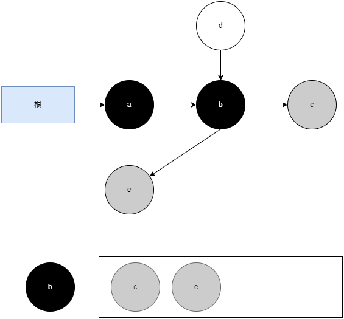

# CMS收集器

CMS(Concurrent Mark Sweep)收集器是一种以获取最短回收停顿时间为目标的老年代收集器。目前很大一部分的Java应用集中在互联网网站或者基于浏览器的B/S系统的服务端上，这类应用通常都会较为关注服务的响应速度，希望系统停顿时间尽可能短，以给用户带来良好的交互体验。CMS收集器就非常符合这类应用的需求。

CMS收集器是基于标记-清除算法实现的，它的运作过程分为四个步骤：

1. 初始标记(CMS initial mark)，需要暂停用户线程
2. 并发标记(CMS concurrent mark)
3. 重新标记(CMS remark)，需要暂停用户线程
4. 并发清除(CMS concurrent sweep)

初始标记仅仅只是标记一下GC Roots能直接关联到的对象，速度很快。并发标记阶段就是从GC Roots的直接关联对象开始遍历整个对象图的过程，这个过程耗时较长但是不需要停顿用户线程，可以与垃圾收集线程一起并发运行。而重新标记阶段则是为了修正并发标记期间，因用户程序继续运作而导致标记产生变动的那一部分对象的标记记录，这个阶段的停顿时间通常会比初始标记阶段稍长一些，但也远比并发标记阶段的时间短。并发清除阶段清理删除掉标记阶段判断的已经死亡的对象，由于不需要移动存活对象，所以这个阶段也是可以与用户线程同时并发的。

在并发标记的过程中，因为标记期间应用线程还在继续执行，对象间的引用可能发生变化，多标和漏标的情况就有可能发生。

## 浮动垃圾

在并发标记过程中，用户线程也在运行，会出现某个对象被标记为非垃圾对象后，指向它的引用才消失的情况，这部分本应该回收但是没有回收到的内存，被称为浮动垃圾(Floating Garbage)。浮动垃圾并不会影响垃圾回收的正确性，只是需要等到下一轮垃圾回收中才被清除。

## 三色标记

三色标记(Three-color Marking)是Java虚拟机中一种常用的用于实现并发标记-清除(Concurrent Mark and Sweep)算法的技术。

在三色标记算法中，对象被标记为三个不同的颜色：白色、灰色和黑色。

1. 白色：表示对象尚未被垃圾收集器扫描过。在刚刚开始的阶段，所有的对象都是白色的，若在分析结束的阶段，仍然是白色的对象，即代表不可达
2. 灰色：表示对象已经被垃圾收集器扫描过，但这个对象上至少存在一个引用还没有被扫描过
3. 黑色：表示对象已经被垃圾收集器扫描过，且这个对象的所有引用都已经扫描过。

垃圾回收器从GC Root开始，将其标记为灰色，并将其放入待处理队列中。然后，它从待处理队列中取出对象，将其标记为黑色，并扫描其引用的所有对象。如果发现新的未被扫描的对象，将其标记为灰色并放入待处理队列中。这个过程一直重复，直到待处理队列为空。

### 三色标记过程

1. 从GC Root开始，将其标记为灰色，并将其放入待处理队列中：

2. 从待处理队列中取出GC Root，将其标记为黑色，并找到其引用的对象a，把a标记为灰色，并放入待处理队列中：

3. 从待处理队列中取出a，将其标记为黑色，并找到其引用的对象b，把b标记为灰色，并放入待处理队列中：

4. 从待处理队列中取出b，将其标记为黑色，并找到其引用的对象c和e，把c和e标记为灰色，并放入待处理队列中：

5. 从待处理队列中取出c，将其标记为黑色，c没有引用的对象。继续从队列中取出e，将其标记为黑色，e也没有引用的对象，此时队列为空，标记过程结束：

### 漏标

## CMS收集器的缺点

在并发阶段，它虽然不会导致用户线程停顿，但却会因为占用了一部分处理器资源而导致应用程序变慢，降低总吞吐量。CMS默认启动的回收线程数是`(处理器核心数量
+3)/4`，如果处理器核心数在四个或以上，并发回收时垃圾收集线程只占用不超过25%的
处理器运算资源，并且会随着处理器核心数量的增加而下降。但是当处理器核心数量不足四个时，CMS对用户程序的影响就可能变得很大。如果应用本来的处理器负载就很高，还要分出一半的运算能力去执行收集器线程，就可能导致用户程序的执行速度忽然大幅降低。

在CMS的并发标记和并发清理阶段，用户线程是还在继续运行的，程序在运行自然就还会伴随有新的垃圾对象不断产生，但这一部分垃圾对象是出现在标记过程结束以后，CMS无法在当次收集中处理掉它们，只好留待下一次垃圾收集时再清理掉。这一部分垃圾称为浮动垃圾。同样也是由于在垃圾收集阶段用户线程还需要持续运行，那就还需要预留足够内存空间提供给用户线程使用，因此CMS收集器不能像其他收集器那样等待到老年代几乎完全被填满了再进行收集，必须预留一部分空间供并发收集时的程序运作使用。

还有，CMS是一款基于标记-清除算法实现的收集器，这意味着收集结束时会有大量空间碎片产生。空间碎片过多时，将会给大对象分配带来很大麻烦，往往会出现老年代还有很多剩余空间，但就是无法找到足够大的连续空间来分配当前对象，而不得不提前触发一次Full GC进行内存碎片的合并整理的情况。
