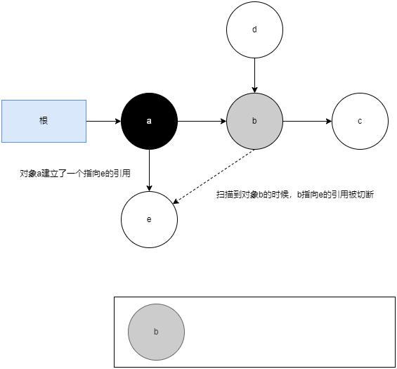
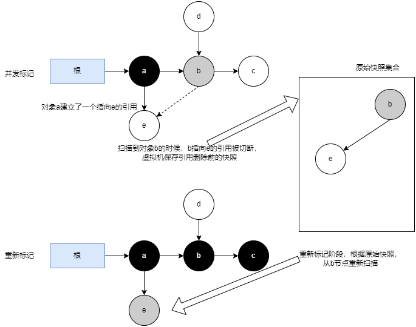

# CMS收集器

CMS(Concurrent Mark Sweep)收集器是一种以获取最短回收停顿时间为目标的老年代收集器。目前很大一部分的Java应用集中在互联网网站或者基于浏览器的B/S系统的服务端上，这类应用通常都会较为关注服务的响应速度，希望系统停顿时间尽可能短，以给用户带来良好的交互体验。CMS收集器就非常符合这类应用的需求。

CMS收集器是基于标记-清除算法实现的，它的运作过程分为四个步骤：

1. 初始标记(CMS initial mark)：只标记GC Roots。需要暂停用户线程，但速度很快
2. 并发标记(CMS concurrent mark)：从GC Roots开始遍历整个对象图的过程。这个过程耗时较长但是不需要暂停用户线程，可以与垃圾收集线程一起并发运行
3. 重新标记(CMS remark)：修正并发标记期间，因用户程序继续运作而导致标记产生变动的那一部分对象的标记记录。这个阶段也会暂停用户线程，停顿时间通常会比初始标记阶段稍长一些，但也远比并发标记阶段的时间短
4. 并发清除(CMS concurrent sweep)：清理掉标记阶段判定为垃圾的对象。由于标记-清除算法不需要移动存活对象，所以这个阶段也不需要暂停用户线程

在并发标记的过程中，因为标记期间应用线程还在继续执行，对象间的引用可能发生变化，多标和漏标的情况就有可能发生。

对象图(JVM Object Graph)：是指在Java虚拟机运行时，Java程序中的对象之间的关系图，它展示了Java程序中创建的对象以及它们之间的引用关系。

## 浮动垃圾

在并发标记过程中，用户线程也在运行，会出现某个对象被标记为非垃圾对象后，指向它的引用才消失的情况，这部分本应该回收但是没有被回收的对象，被称为浮动垃圾(Floating Garbage)。浮动垃圾并不会影响垃圾回收的正确性，只是需要等到下一轮垃圾回收时才被清除。

## 三色标记

三色标记(Three-color Marking)是Java虚拟机中一种常用的用于实现并发的标记-清除(Concurrent Mark and Sweep)算法的技术。

在三色标记算法中，对象被标记为三个不同的颜色：白色、灰色和黑色。

1. 白色：表示对象尚未被垃圾收集器扫描过。在刚刚开始的阶段，所有的对象都是白色的，若在分析结束的阶段，仍然是白色的对象，即代表不可达
2. 灰色：表示对象已经被垃圾收集器扫描过，但这个对象上至少存在一个引用还没有被扫描过
3. 黑色：表示对象已经被垃圾收集器扫描过，且这个对象的所有引用都已经扫描过。

垃圾回收器从GC Root开始，将其标记为灰色，并将其放入待处理队列中。然后，它从待处理队列中取出对象，将其标记为黑色，并扫描其引用的所有对象。如果发现新的未被扫描的对象，将其标记为灰色并放入待处理队列中。这个过程一直重复，直到待处理队列为空。

### 三色标记过程

1. 从GC Root开始，将其标记为灰色，并将其放入待处理队列中：

2. 从待处理队列中取出GC Root，将其标记为黑色，并找到其引用的对象a，把a标记为灰色，并放入待处理队列中：

3. 从待处理队列中取出a，将其标记为黑色，并找到其引用的对象b，把b标记为灰色，并放入待处理队列中：

4. 从待处理队列中取出b，将其标记为黑色，并找到其引用的对象c和e，把c和e标记为灰色，并放入待处理队列中：

5. 从待处理队列中取出c，将其标记为黑色，c没有引用的对象。继续从队列中取出e，将其标记为黑色，e也没有引用的对象，此时队列为空，标记过程结束：

### 漏标

如果用户线程在标记进行时并发修改了引用关系，就可能导致漏标。比如正在扫描对象b的时候，b指向e的引用被切断了，e又与已扫描过的黑色对象a建立了引用关系。但是，垃圾收集器不会再次扫描黑色对象，所以e就会一直是白色对象，在扫描结束后会被当做垃圾清理掉，导致程序运行出错。

## 解决漏标问题

JVM实现了两种解决方案：增量更新(Incremental Update)和原始快照(Snapshot At The Beginning，SATB)。CMS使用的是增量更新方案，G1收集器使用的是原始快照方案。

### 增量更新

在黑色对象新增了一个指向白色对象的引用时，就将这个引用记录到一个集合中，在并发标记结束后，进入重新标记阶段，重新标记过程会暂停所有用户线程，此时将记录的引用关系中的黑色对象为根，重新扫描一次，这次扫描，白色对象就会变成黑色对象或者灰色对象，不会被当做垃圾清理掉。

### 原始快照

当扫描到灰色对象的引用删除时，会将这个引用删除前的状态保存成一个快照，然后放到集合里。等到重新标记阶段，将记录的引用关系中的灰色对象为根，重新扫描一次，由于保存的是删除前的快照，这样就可以扫描到白色对象了，将这些白色对象全部标记为黑色对象。但是如果灰色对象删除引用后，并没有黑色对象与这个白色对象建立新的引用，这个对象就会成为浮动垃圾。

无论是对引用关系记录的插入还是删除，虚拟机的记录操作都是通过写屏障实现的。

## CMS收集器的缺点

1. 在并发阶段，它虽然不会导致用户线程停顿，但却会因为占用了一部分处理器资源而导致应用程序变慢，降低总吞吐量。CMS默认启动的回收线程数是(处理器核心数量+3)/4，如果处理器核心数在四个或以上，并发回收时垃圾收集线程只占用不超过25%的处理器运算资源，并且会随着处理器核心数量的增加而下降。但是当处理器核心数量不足四个时，CMS对用户程序的影响就可能变得很大。如果应用本来的处理器负载就很高，还要分出一半的运算能力去执行收集器线程，就可能导致用户程序的执行速度忽然大幅降低
2. 在CMS的并发标记和并发清理阶段，用户线程是还在继续运行的，程序在运行自然就还会伴随有新的垃圾对象不断产生，但这一部分垃圾对象是出现在标记过程结束以后，CMS无法在当次收集中处理掉它们，只好留待下一次垃圾收集时再清理掉。这一部分垃圾称为浮动垃圾。同样也是由于在垃圾收集阶段用户线程还需要持续运行，那就还需要预留足够内存空间提供给用户线程使用，因此CMS收集器不能像其他收集器那样等待到老年代几乎完全被填满了再进行收集，必须预留一部分空间供并发收集时的程序运作使用
3. CMS是一款基于标记-清除算法实现的收集器，这意味着收集结束时会有大量空间碎片产生。空间碎片过多时，将会给大对象分配带来很大麻烦，往往会出现老年代还有很多剩余空间，但就是无法找到足够大的连续空间来分配当前对象，而不得不提前触发一次Full GC进行内存碎片的合并整理的情况
