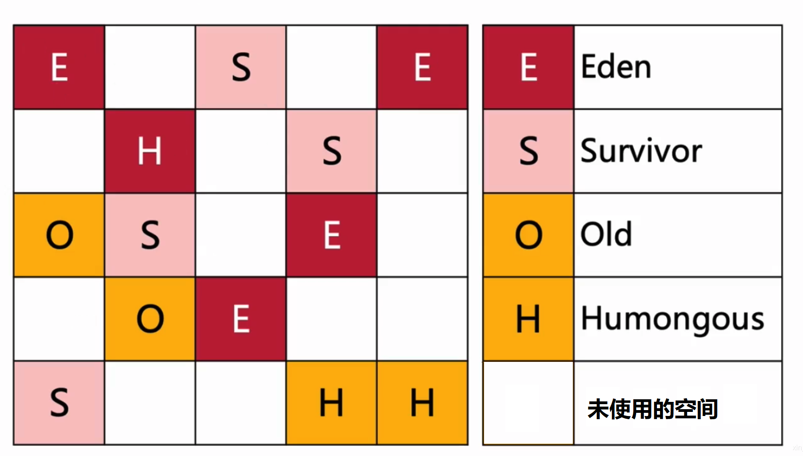

# GarbageFirst收集器

JDK 9发布时，Garbage First(简称G1)收集器取代Parallel Scavenge加Parallel Old组合，成为服务端模式下的默认垃圾收集器，并且不再推荐使用CMS收集器。

在G1收集器中，堆不再分成新生代和老年代，而是把连续的Java堆划分为多个大小相等的独立区域(Region)。每一个Region都可以根据需要，作为新生代空间，或者老年代空间，收集器对作为不同空间的Region采用不同的策略去处理。在逻辑上，所有的新生代Region合起来就是新生代，所有的老年代Region合起来就是老年代。这样划分之后，G1不必每次都去收集整个堆空间，而是每次只处理一部分Region。

Region中还有一类特殊的Humongous区域，专门用来存储大对象。G1认为只要大小超过了一个Region容量一半的对象即可判定为大对象。如果一个大对象超过了一个Region容量，G1会使用n个连续的Humongous区域存储它，G1的大多数行为都把Humongous Region作为老年代的一部分来看待。

## 记忆集

G1使用记忆集避免全堆作为GC Roots扫描，每个Region都维护有自己的记忆集，这些记忆集会记录下别的Region指向自己的指针，并标记这些指针分别在哪些卡页的范围之内。G1的记忆集在存储结构的本质上是一种哈希表，Key是别的Region的起始地址，Value是一个集合，里面存储的是卡表的索引。由于Region数量比传统收集器的分代数量更多，因此G1收集器要比其他的传统垃圾收集器有着更高的内存占用，G1至少要耗费大约相当于Java堆容量10%至20%的额外内存来维持收集器工作。

## G1收集器参数

- -XX:+UseG1GC：启用G1收集器
- -XX:+InitiatingHeapOccupancyPercent：设置G1收集器的堆空间占用阈值。当堆空间占用达到或超过该阈值时，G1收集器会启动一次并发的垃圾回收。该参数的默认值为45%，即当堆空间占用达到45%时，G1收集器会触发一次并发的垃圾回收
- -XX:MaxGCPauseMills：G1每次执行回收操作的期望暂停时间，单位是毫秒，默认是200毫秒，G1会尽量保证控制在这个范围内

## 与CMS对比

与CMS的标记-清除算法不同，G1从整体来看是基于标记-整理算法实现的，但从局部(两个Region之间)上看又是基于标记-复制算法实现，所以G1运行期间不会产生内存空间碎片，有利于程序长时间运行，在程序为大对象分配内存时不容易因无法找到连续内存空间而提前触发下一次GC。

比起CMS，G1的适用对象被限定为搭载多核处理器、拥有大容量内存的机器。就内存占用来说，虽然G1和CMS都使用卡表来处理跨代指针，但G1的卡表实现更为复杂，而且堆中每个Region都必须有一份卡表，这导致G1的记忆集会占整个堆容量的更多内存空间。相比起来CMS的卡表就相当简单，只有一份，而且只需要处理老年代到新生代的引用。

在执行负载的角度上，两个收集器都使用到写屏障，CMS用写后屏障来更新维护卡表，而G1除了使用写后屏障来进行卡表维护操作外，为了实现原始快照搜索(SATB)算法，还需要使用写前屏障来跟踪并发时的指针变化情况。相比起增量更新算法，原始快照搜索能够减少并发标记和重新标记阶段的消耗，避免CMS那样在最终标记阶段停顿时间过长的缺点，但是在用户程序运行过程中会产生由跟踪引用变化带来的额外负担。由于G1对写屏障的复杂操作要比CMS消耗更多的运算资源，所以CMS的写屏障实现是直接的同步操作，而G1就需要将其实现为类似于消息队列的结构，把写前屏障和写后屏障中要做的事情都放到队列里，然后再异步处理。

## G1的执行过程

1. 并发标记（concurrent marking）：并发标记会针对Region内所有的存活对象进行标记
2. 转移（evacuation）：转移负责释放堆中死亡对象所占的内存空间
