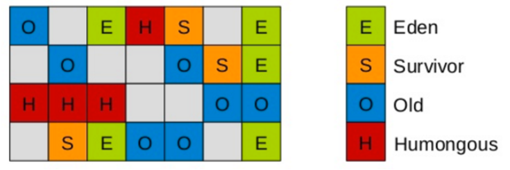

# GarbageFirst收集器

JDK 9发布时，Garbage First(简称G1)收集器取代Parallel Scavenge加Parallel Old组合，成为服务端模式下的默认垃圾收集器，并且不再推荐使用CMS收集器。

在G1收集器中，堆不再分成新生代和老年代，而是把连续的Java堆划分为多个大小相等的独立区域(Region)。每一个Region都可以根据需要，作为新生代的Eden空间、Survivor空间，或者老年代空间，收集器对作为不同空间的Region采用不同的策略去处理。在逻辑上，所有的Eden空间和Survivor空间合起来就是新生代，所有的老年代空间拼在一起就是老年代。这样划分之后，G1不必每次都去收集整个堆空间，而是每次只处理一部分Region，称为此次GC的回收集(collection set)。

Region中还有一类特殊的Humongous区域，专门用来存储大对象。G1认为只要大小超过了一个Region容量一半的对象即可判定为大对象。如果一个大对象超过了一个Region容量，G1会使用n个连续的Humongous区域存储它，G1的大多数行为都把Humongous Region作为老年代的一部分来看待。

G1收集器会跟踪各个Region里面的垃圾堆积的价值大小，价值即回收所获得的空间大小以及回收所需时间的比值，然后在后台维护一个优先级列表，每次根据用户期望的收集停顿时间，优先处理回收价值收益最大的那些Region，这也就是Garbage First名字的由来。

## 记忆集

G1使用记忆集避免全堆作为GC Roots扫描，每个Region都维护有自己的记忆集，这些记忆集会记录下别的Region指向自己的指针，并标记这些指针分别在哪些卡页的范围之内。G1的记忆集在存储结构的本质上是一种哈希表，Key是别的Region的起始地址，Value是一个集合，里面存储的是卡表的索引。由于Region数量比传统收集器的分代数量更多，因此G1收集器要比其他的传统垃圾收集器有着更高的内存占用，G1至少要耗费大约相当于Java堆容量10%至20%的额外内存来维持收集器工作。

## 解决漏标问题

对于并发标记阶段的漏标问题，G1使用了原始快照(SATB)算法来解决。对于在并发标记时，用户线程可能会创建对象的情况，G1为每一个Region设计了两个名为TAMS(Top at Mark Start)的指针，把Region中的一部分空间划分出来用于并发标记过程中的新对象分配，并发标记时新分配的对象地址都必须要在这两个指针的范围内，G1收集器默认在这个地址内的对象是存活的，不纳入回收范围。与CMS类似，如果内存回收的速度赶不上内存分配的速度，G1收集器也要被迫冻结用户线程执行，导致Full GC。

## G1收集器参数

- -XX:+UseG1GC：启用G1收集器
- -XX:+InitiatingHeapOccupancyPercent：设置G1收集器的堆空间占用阈值。当堆空间占用达到或超过该阈值时，G1收集器会启动一次并发的垃圾回收。该参数的默认值为45%，即当堆空间占用达到45%时，G1收集器会触发一次并发的垃圾回收
- -XX:MaxGCPauseMills：G1每次执行回收操作的期望暂停时间，单位是毫秒，默认是200毫秒，G1会尽量保证控制在这个范围内

## G1收集器的回收过程

1. 初始标记(Initial Marking)：只标记GC Roots，并且修改TAMS指针的值，让下一阶段用户线程并发运行时，能正确地在可用的Region中分配新对象。这个阶段需要停顿线程，但耗时很短
2. 并发标记(Concurrent Marking)：和CMS的并发标记类似，从GC Root开始扫描整个堆里的对象图，找出要回收的对象。这阶段耗时较长，但不需要暂停用户线程
3. 最终标记(Final Marking)：和CMS的重新标记类似，修正并发标记期间，因用户程序继续运作而导致标记产生变动的那一部分对象的标记记录。这个阶段也会暂停用户线程
4. 筛选回收(Live Data Counting and Evacuation)：更新Region的统计数据，对各个Region的回收价值和成本进行排序，根据用户所指定的停顿时间来制定回收计划，可以自由选择任意多个Region构成回收集，然后把决定回收的那一部分Region中存活的对象复制到空的Region中，再清理掉整个旧Region的全部空间。这里的操作涉及存活对象的移动，必须暂停用户线程，由多条收集器线程并行完成

设置不同的期望停顿时间，可使得G1在不同应用场景中取得关注吞吐量和关注延迟之间的最佳平衡。不过，G1是要冻结用户线程来复制对象的，它默认的停顿目标为两百毫秒，如果把停顿时间调得非常低，很可能由于停顿目标时间太短，导致每次选出来的回收集只占堆内存很小的一部分，收集器收集的速度逐渐跟不上分配器分配的速度，导致垃圾慢慢堆积，最终占满堆引发Full GC反而降低性能，所以通常把期望停顿时间设置为一两百毫秒或者两三百毫秒会是比较合理的。

## 与CMS对比

与CMS的标记-清除算法不同，G1从整体来看是基于标记-整理算法实现的，但从局部(两个Region之间)上看又是基于标记-复制算法实现，所以G1运行期间不会产生内存空间碎片，有利于程序长时间运行，在程序为大对象分配内存时不容易因无法找到连续内存空间而提前触发下一次收集。

比起CMS，在用户程序运行过程中，G1无论是为了垃圾收集产生的内存占用还是程序运行时的额外执行负载都要比CMS要高。就内存占用来说，虽然G1和CMS都使用卡表来处理跨代指针，但G1的卡表实现更为复杂，而且堆中每个Region都必须有一份卡表，这导致G1的记忆集会占整个堆容量的更多内存空间。相比起来CMS的卡表就相当简单，只有一份，而且只需要处理老年代到新生代的引用，由于新生代的对象具有朝生夕灭的不稳定性，引用变化频繁，能省下这个区域的维护开销是很划算的。

在执行负载的角度上，两个收集器都使用到写屏障，CMS用写后屏障来更新维护卡表，而G1除了使用写后屏障来进行卡表维护操作外，为了实现原始快照搜索(SATB)算法，还需要使用写前屏障来跟踪并发时的指针变化情况。相比起增量更新算法，原始快照搜索能够减少并发标记和重新标记阶段的消耗，避免CMS那样在最终标记阶段停顿时间过长的缺点，但是在用户程序运行过程中会产生由跟踪引用变化带来的额外负担。由于G1对写屏障的复杂操作要比CMS消耗更多的运算资源，所以CMS的写屏障实现是直接的同步操作，而G1就需要将其实现为类似于消息队列的结构，把写前屏障和写后屏障中要做的事情都放到队列里，然后再异步处理。

## G1的执行过程

1. 并发标记（concurrent marking）：并发标记会针对Region内所有的存活对象进行标记
2. 转移（evacuation）：转移负责释放堆中死亡对象所占的内存空间
