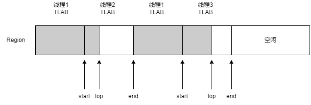

# TLAB

线程本地分配缓冲区(Thread Local Allocation Buffer，TLAB)产生的目的就是为了进行内存快速分配。从JVM堆空间分配对象时，必须锁定整个堆，以便不会被其他线程中断和影响。为了解决这个问题，TLAB通过为每个线程分配一个缓冲区来避免和减少使用锁。

> jdk8u60-master\hotspot\src\share\vm\gc_interface\collectedHeap.inline.hpp

```cpp
HeapWord* CollectedHeap::allocate_from_tlab(KlassHandle klass, Thread* thread, size_t size) {
  assert(UseTLAB, "should use UseTLAB");
  // 在TLAB中快速分配
  HeapWord* obj = thread->tlab().allocate(size);
  if (obj != NULL) {
    return obj;
  }
  // 在TLAB中分配失败，开始TLAB慢速分配
  return allocate_from_tlab_slow(klass, thread, size);
}
```

## TLAB快速分配

TLAB是Eden中的一块内存，不同线程的TLAB都位于Eden区，所有的TLAB内存对所有的线程都是可见的，只不过每个线程有一个TLAB的数据结构，用于保存待分配内存区间的起始地址（start）和结束地址（end），在分配的时候只在这个区间做分配，从而达到无锁分配。另外，虽然TLAB在分配对象空间的时候是无锁分配，但是TLAB空间本身在分配的时候还是需要锁的，G1中使用CAS来分配TLAB空间，一个Region中可能存在多个TLAB，但是一个TLAB是不能跨Region的。

JVM使用指针碰撞的方法在TLAB中分配对象，在TLAB中保存一个top指针用于标记当前已分配和未分配的空间的分界点，如果剩余空间(end-top)大于待分配的对象大小，则直接分配，并将top的新值修改为top+对象的大小。



> jdk8u60-master\hotspot\src\share\vm\memory\threadLocalAllocBuffer.inline.hpp
```cpp
// 在TLAB中快速分配
// size时待分配对象的大小
inline HeapWord* ThreadLocalAllocBuffer::allocate(size_t size) {
  // 校验top指针是否在start和end的范围内
  invariants();
  // 获得_top指针位置
  HeapWord* obj = top();
  // 判断TLAB当前剩余的空间是否大于等于待分配对象需要的空间大小
  if (pointer_delta(end(), obj) >= size) {
    // 将top的新值修改为top+对象的大小
    set_top(obj + size);
    // 校验设置后的top指针是否在start和end的范围内
    invariants();
    return obj;
  }
  return NULL;
}
```

## TLAB慢速分配

当待分配对象大于TLAB中的剩余空间时，就会导致TLAB分配失败，开始TLAB慢速分配。

虚拟机内部会维护一个叫做refill_waste_limit的值，当TLAB剩余空间大于refill_waste_limit时，说明TLAB剩余的空间还能满足很多对象的分配，此时会选择在堆中分配这个比较大的对象。若TLAB剩余空间小于refill_waste_limit时，则会废弃当前TLAB，新建一个新的TLAB来分配对象。refill_waste_limit的值可以使用参数-XX:TLABRefillWasteFraction来调整，默认值为64，表示1/64的TLAB空间可以浪费，成为内存碎片。老的TLAB不用处理，在垃圾回收的时候，垃圾收集器不会特殊处理TLAB，而是把Eden空间当作一个整体来回收里面的对象。在垃圾回收结束之后，每个Java线程又会重新从Eden分配自己的TLAB。

JVM还提供了一个参数-XX:TLABWasteIncrement，默认值为4个字，用于动态增加这个refill_waste_limit的值。默认情况下，TLAB大小和refill_waste_limit都会在运行时不断调整，使系统的运行状态达到最优。在动态调整的过程中，也不能无限制变更，所以JVM提供了-XX:MinTLABSize，默认值2K，用于控制TLAB的最小值，对于G1来说，由于大对象都不在新生代，所以TLAB也不能分配大对象，Region大小的一半就会被认定为大对象，所以TLAB肯定不会超过Region大小的一半。可以使用-XX:-ResizeTLAB禁止自动调整TLAB的大小。-XX:+PrintTLAB可以跟踪TLAB的使用情况。

TLAB慢速分配具体有以下两种情况：

1. 如果TLAB的剩余空间过小，那么就对老TLAB进行填充一个dummy对象(没有任何实际的功能，只是用来填充)，然后去申请一个新的TLAB
2. 如果TLAB的剩余空间并不小，那么就更新refill_waste_limit的值，然后不使用TLAB进行分配，直接返回NULL，让JVM去堆中分配

> jdk8u60-master\hotspot\src\share\vm\gc_interface\collectedHeap.cpp

```cpp
HeapWord* CollectedHeap::allocate_from_tlab_slow(KlassHandle klass, Thread* thread, size_t size) {

  // 判断TLAB的剩余空间是否可以丢弃，如果剩余空间大于refill_waste_limit就保留
  if (thread->tlab().free() > thread->tlab().refill_waste_limit()) {
    // 根据-XX:TLABWasteIncrement增大refill_waste_limit
    thread->tlab().record_slow_allocation(size);
    // 返回NULL，让JVM去非TLAB的堆中分配
    return NULL;
  }

  // 为了避免内存碎片化，新分配的TLAB会比之前分配的更小，compute_size()方法计算新的TLAB的大小
  size_t new_tlab_size = thread->tlab().compute_size(size);
  // 分配前先清理老的TLAB
  thread->tlab().clear_before_allocation();
  // compute_size()方法返回0说明Eden空间不足
  if (new_tlab_size == 0) {
    return NULL;
  }

  // 分配一个新的TLAB
  HeapWord* obj = Universe::heap()->allocate_new_tlab(new_tlab_size);
  // 分配失败，返回NULL
  if (obj == NULL) {
    return NULL;
  }

  AllocTracer::send_allocation_in_new_tlab_event(klass, new_tlab_size * HeapWordSize, size * HeapWordSize);

  if (ZeroTLAB) {
    // 如果启用了-XX:ZeroTLAB参数，则将对象所有字段置零值
    Copy::zero_to_words(obj, new_tlab_size);
  }
  // 分配对象，并设置top、start和end指针
  thread->tlab().fill(obj, obj + size, new_tlab_size);
  return obj;
}
```

## 初始化TLAB的大小

如果TLAB过小，那么TLAB则不能存储更多的对象，所以可能需要不断地重新分配新的TLAB。但是如果TLAB过大，则可能导致内存碎片问题。可以使用参数-XX:TLABSize设置TLAB的大小，默认值是0，JVM会推断这个值多大更合适。参数-XX:TLABWasteTargetPercent用于设置TLAB可占用的Eden空间的百分比，默认值1%，推断方式为：TLABSize=Eden*2*TLABWasteTargetPercent/线程个数。

> jdk8u60-master\hotspot\src\share\vm\memory\threadLocalAllocBuffer.cpp

```cpp
// 初始化TLAB
void ThreadLocalAllocBuffer::initialize() {
  initialize(NULL,                    // start
             NULL,                    // top
             NULL);                   // end

  // 设置TLAB的大小
  set_desired_size(initial_desired_size());
  // 确保主线程的TLAB在正确的时间和位置被初始化
  if (Universe::heap() != NULL) {
    size_t capacity   = Universe::heap()->tlab_capacity(myThread()) / HeapWordSize;
    double alloc_frac = desired_size() * target_refills() / (double) capacity;
    _allocation_fraction.sample(alloc_frac);
  }
  // 设置refill_waste_limit的大小
  set_refill_waste_limit(initial_refill_waste_limit());
  // 初始化统计数据
  initialize_statistics();
}

// 设置TLAB的大小
size_t ThreadLocalAllocBuffer::initial_desired_size() {
  size_t init_sz = 0;

  if (TLABSize > 0) {
    // 使用参数-XX:TLABSize手动设置TLAB的大小
    init_sz = TLABSize / HeapWordSize;
  } else if (global_stats() != NULL) {
    // JVM自己推断TLAB的大小
    unsigned nof_threads = global_stats()->allocating_threads_avg();
    // tlab_capacity()方法返回Eden空间所占的字节数
    // HeapWordSize表示每个堆内存的字长所占用的字节数
    // nof_threads是线程个数(平均值)
    // _target_refills = 100 / (2 * TLABWasteTargetPercent)
    init_sz  = (Universe::heap()->tlab_capacity(myThread()) / HeapWordSize) /
                      (nof_threads * target_refills());
    // 对齐
    init_sz = align_object_size(init_sz);
  }
  init_sz = MIN2(MAX2(init_sz, min_size()), max_size());
  return init_sz;
}
```
