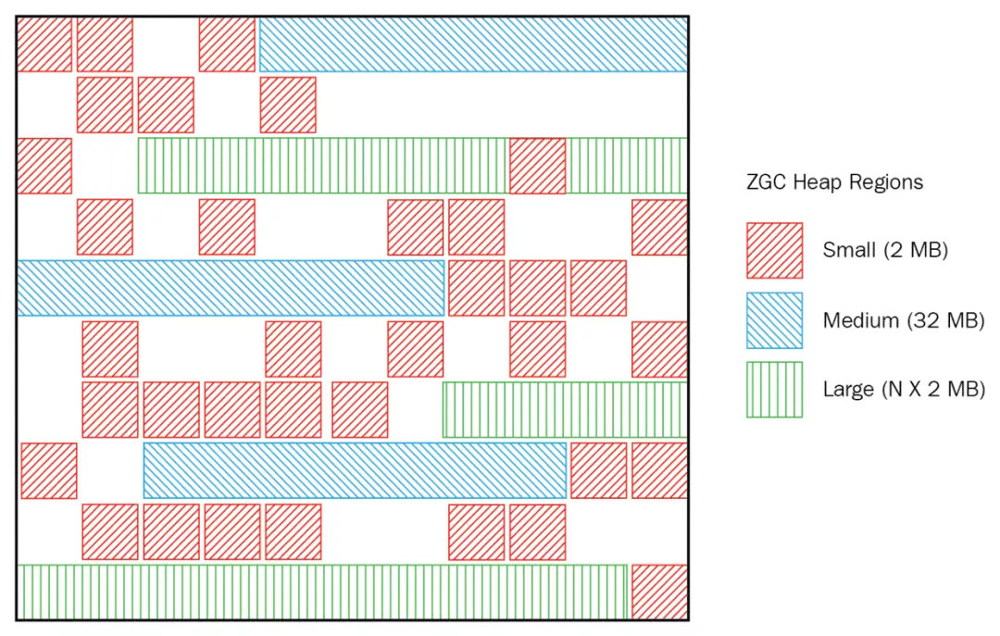

# ZGC收集器

ZGC(Z Garbage Collector)是一款在JDK 11中新加入的由Oracle公司研发的具有实验性质的低延迟垃圾收集器。ZGC的设计目标是在尽可能对吞吐量影响不太大的前提下，实现在任意堆内存大小下都可以把垃圾收集的停顿时间限制在十毫秒以内的低延迟。

## 内存布局

ZGC也采用基于Region的堆内存布局，但不同的是，ZGC的Region可以动态创建和销毁，以及动态的容量。在x64硬件平台下，ZGC的Region可以具有大、中、小三类容量：

- 小型Region(Small Region)：容量固定为2MB，用于放置小于256KB的小对象
- 中型Region(Medium Region)：容量固定为32MB，用于放置大于等于256KB但小于4MB的对象
- 大型Region(Large Region)：容量不固定，可以动态变化，但必须为2MB的整数倍，用于放置4MB或以上的大对象。每个大型Region中只会存放一个大对象，虽然名字叫作大型Region，但它的实际容量完全有可能小于中型Region，最小容量可低至4MB。大型Region在ZGC的实现中是不会被重分配的，因为复制一个大对象的代价非常高昂

## 染色指针

三色标记本质上与对象无关，仅仅与引用有关，它通过引用关系判断对象是否存活。HotSpot虚拟机的几种收集器有不同的标记实现方案，有的把标记直接记录在
对象头上(如Serial收集器)，有的把标记记录在与对象相互独立的数据结构上(如G1使用了一种相当于堆内存的1/64大小的，称为BitMap的结构来记录标记信息)，而ZGC的染色指针(Colored Pointer)直接把标记信息记在引用对象的指针上，无需进行对象访问就可以获得标记信息，提高了垃圾收集的效率。

当前版本的AMD64架构规定了只用48位地址(可以支持256TB的内存)，当前完全够用，为了节省地址转换的开销，指针的高16位暂时保留。在可用的48位中，ZGC的染色指针将其高4位提取出来存储四个标志信息。通过这些标志位，虚拟机可以直接从指针中看到其引用对象的三色标记状态、是否进入了重分配集(即被移动过)、是否只能通过finalize()方法才能被访问到。由于这些标志位进一步压缩了原本就只有46位的地址空间，导致ZGC能够管理的内存不可以超过16TB。

Finalizable标识表示对象是否只能通过finalize()方法访问到，Remapped、Marked0和Marked1用作三色标记。

