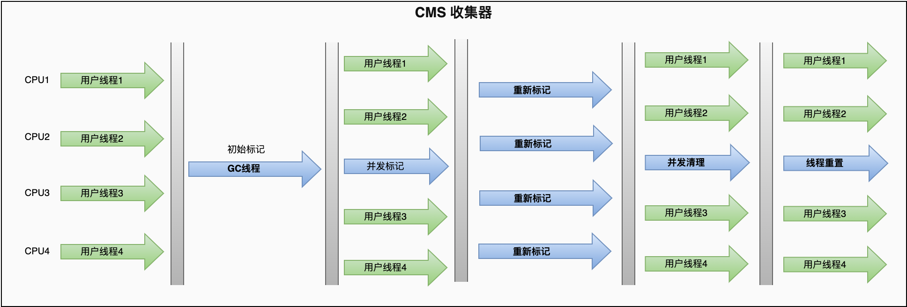
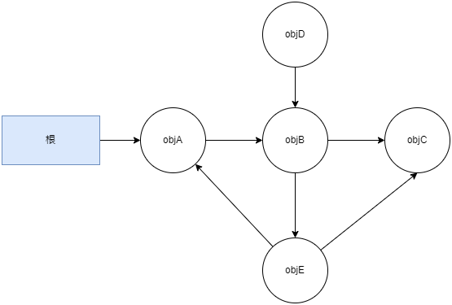

# ParNew 和 CMS

ParNew 是 Serial 的多线程并行版本, 它使用多条线程进行 GC, GC 时也需要暂停用户线程, 除此之外其余都与 Serial 完全一致。除了 Serial 外, 目前只有它能与 CMS 配合工作。

CMS(Concurrent Mark Sweep)是一种以获取最短回收停顿时间为目标的老年代回收器。目前 Java 主要用于服务端, 这类应用通常都会较为关注服务的响应速度, 希望系统停顿时间尽可能短, 以给用户带来良好的交互体验。CMS 就非常符合这类应用的需求。

CMS 是基于标记-清除算法实现的, 它的运作过程分为四个步骤:

1. 初始标记(initial mark): 只标记根集合直接引用的对象。需要暂停用户线程, 但速度很快
2. 并发标记(concurrent mark): 从根集合开始遍历整个对象图的过程。这个过程耗时较长但是不需要暂停用户线程, 用户线程可以与垃圾回收线程一起并发运行
3. 重新标记(remark): 修正并发标记期间, 因用户程序继续运行而导致标记产生变动的那一部分对象的标记记录。这个阶段也会暂停用户线程, 停顿时间通常会比初始标记阶段稍长一些, 但也远比并发标记阶段的时间短
4. 并发清除(concurrent sweep): 清理掉标记阶段判定为垃圾的对象。由于标记-清除算法不需要移动存活对象, 所以这个阶段也不需要暂停用户线程

对象图(JVM Object Graph): JVM 运行时, 对象之间的引用关系形成的数据结构是一种有向图, 遍历对象的过程就是图的遍历过程。

## CMS 的缺点

1. 在并发阶段, 它虽然不会导致用户线程停顿, 但却会因为占用了一部分处理器资源而导致应用程序变慢, 降低总吞吐量。CMS 默认启动的回收线程数是(处理器核心数量+3)/4, 如果处理器核心数在四个或以上, 并发回收时垃圾收集线程只占用不超过 25%的处理器运算资源, 并且会随着处理器核心数量的增加而下降。但是当处理器核心数量不足四个时, CMS 对用户程序的影响就可能变得很大。如果应用本来的处理器负载就很高, 还要分出一半的运算能力去执行收集器线程, 就可能导致用户程序的执行速度忽然大幅降低
2. 在 CMS 的并发标记和并发清理阶段, 用户线程是还在继续运行的, 程序在运行自然就还会伴随有新的垃圾对象不断产生, 但这一部分垃圾对象是出现在标记过程结束以后, CMS 无法在当次收集中处理掉它们, 只好留待下一次垃圾收集时再清理掉。这一部分垃圾称为浮动垃圾。同样也是由于在垃圾收集阶段用户线程还需要持续运行, 那就还需要预留足够内存空间提供给用户线程使用, 因此 CMS 收集器不能像其他收集器那样等待到老年代几乎完全被填满了再进行收集, 必须预留一部分空间供并发收集时的程序运作使用
3. CMS 是基于标记-清除算法实现的, 这意味着收集结束时会有大量空间碎片产生。空间碎片过多时, 将会给大对象分配带来很大麻烦, 往往会出现老年代还有很多剩余空间, 但就是无法找到足够大的连续空间来分配当前对象, 而不得不提前触发一次 Full GC 进行内存碎片的合并整理的情况
