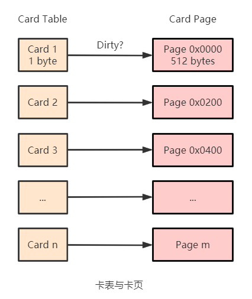

# 记忆集与卡表

为解决对象跨代引用所带来的问题, 垃圾回收器在新生代中建立了名为记忆集的数据结构, 用来避免把整个老年代都加入根集合。

记忆集(Remembered Set, RSet)用于记录从非收集区域指向收集区域的指针集合。但是如果记录每个跨代引用的对象, 会占用很大的空间, 而在 GC 时只需要找出存在跨代引用的一块内存区域, 并不需要具体到某个对象。那么在实现 RSet 的时候, 便可以选择更大的记录粒度来降低存储和维护成本。

可供选择的记录精度:

- 字长精度: 每个记录精确到一个机器字长, 该字包含跨代指针
- 对象精度: 每个记录精确到一个对象, 该对象里存在含有跨代指针的字段
- 卡精度: 每个记录精确到一块内存区域, 该区域内存在含有跨代指针的对象

卡表(Card Table)使用卡精度去实现记忆集。HotSpot 使用一个字节数组实现卡表, 字节数组的元素称为卡片(Card), 每一个元素都对应着内存区域中一块特定大小的内存块, 这个内存块被称作卡页(Card Page)。一般来说, 卡页大小都是以 2 的 N 次幂的字节数, HotSpot 中使用的卡页是 2 的 9 次幂, 即 512 字节。

一个卡页的内存中通常包含不止一个对象, 只要卡页内有一个对象的字段存在着跨代指针, 那就将对应的卡片标识为 1, 称为这个元素变脏(Dirty), 没有则标识为 0。比如老年代中有对象引用了新生代中的对象, 那么只需要把卡表中这个对象所在的卡页所对应的 card 设置为 dirty 即可。在 GC 发生时, 只要筛选出卡表中变脏的元素, 就能轻易得出哪些卡页中包含跨代指针, 把它们加入根集合中一并扫描。

