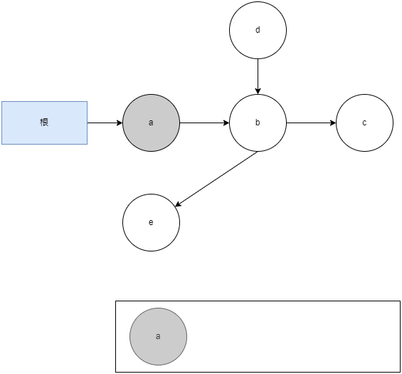
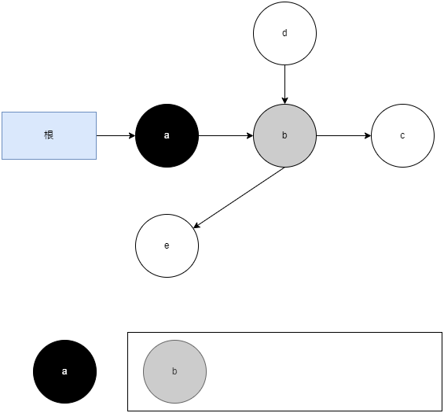
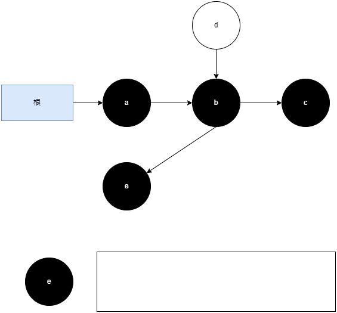

# 三色标记

三色标记(Three-color Marking)是 JVM 中一种常用的用于实现并发标记-清除(Concurrent Mark and Sweep)算法的技术。

在三色标记算法中, 对象被标记为三个不同的颜色: 白色、灰色和黑色。

1. 白色: 表示对象尚未被垃圾回收器扫描过。在刚刚开始的阶段, 所有的对象都是白色的, 若在标记结束后, 仍然是白色, 即代表这个对象可以回收
2. 灰色: 表示对象已经被垃圾回收器扫描过, 但这个对象上至少存在一个引用还没有被扫描过
3. 黑色: 表示对象已经被垃圾回收器扫描过, 且这个对象的所有引用都已经被扫描过

## 三色标记过程

垃圾回收器从根集合开始, 将其标记为灰色, 并将其放入待处理队列中。然后, 它从待处理队列中取出对象, 将其标记为黑色, 并扫描其引用的所有对象。如果发现新的未被扫描的对象, 将其标记为灰色并放入待处理队列中。这个过程一直重复, 直到待处理队列为空。

1. 从根集合开始, 将其直接引用的对象 a 标记为灰色, 并将 a 放入待处理队列中
   
2. 从待处理队列中取出 a, 并标记为黑色, 然后找到 a 引用的对象 b, 把 b 标记为灰色, 并放入待处理队列中
   
3. 从待处理队列中取出 b, 并标记为黑色, 然后找到 b 引用的对象 c 和 e, 把 c 和 e 标记为灰色, 并放入待处理队列中
   
4. 从待处理队列中取出 c, 并标记为黑色, c 没有引用的对象。继续从队列中取出 e, 并标记为黑色, e 也没有引用的对象, 此时队列为空, 并发标记过程结束
   
