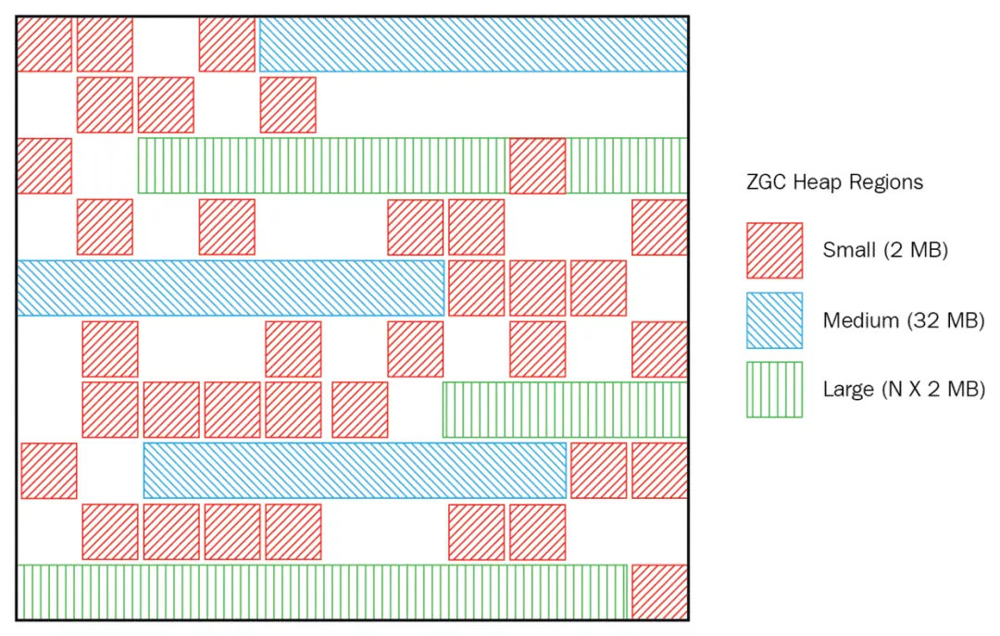
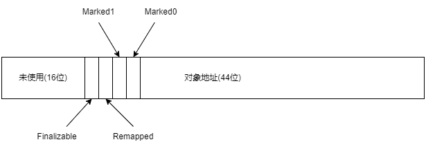

# ZGC 收集器

ZGC(Z Garbage Collector)是一款在 JDK 11 中新加入的由 Oracle 公司研发的低延迟垃圾回收器。ZGC 的设计目标是在尽可能对吞吐量影响不太大的前提下, 实现在任意堆内存大小下都可以把垃圾收集的停顿时间限制在十毫秒以内的低延迟。

## 内存布局

ZGC 也采用基于 Region 的堆内存布局, 但不同的是, ZGC 的 Region 可以动态创建和销毁, 以及动态的容量。在 x64 硬件平台下, ZGC 的 Region 可以具有大、中、小三类容量: 

- 小型 Region(Small Region): 容量固定为 2MB, 用于放置小于 256KB 的小对象
- 中型 Region(Medium Region): 容量固定为 32MB, 用于放置大于等于 256KB 但小于 4MB 的对象
- 大型 Region(Large Region): 容量不固定, 可以动态变化, 但必须为 2MB 的整数倍, 用于放置 4MB 或以上的大对象。每个大型 Region 中只会存放一个大对象, 虽然名字叫作大型 Region, 但它的实际容量完全有可能小于中型 Region, 最小容量可低至 4MB。大型 Region 在 ZGC 的实现中是不会被重分配的, 因为复制一个大对象的代价非常高昂

## 染色指针

三色标记本质上与对象无关, 仅仅与引用有关, 它通过引用关系判断对象是否存活。HotSpot 虚拟机的几种收集器有不同的标记实现方案, 有的把标记直接记录在
对象头上(如 Serial 收集器), 有的把标记记录在与对象相互独立的数据结构上(如 G1 使用了一种相当于堆内存的 1/64 大小的, 称为 BitMap 的结构来记录标记信息), 而 ZGC 的染色指针(Colored Pointer)直接把标记信息记在引用对象的指针上, 无需进行对象访问就可以获得标记信息, 提高了垃圾收集的效率。

当前版本的 AMD64 架构规定了只使用 64 位地址中的低 48 位(可以支持 256TB 的内存, 当前完全够用), 为了节省地址转换的开销, 指针的高 16 位暂时保留。在可用的 48 位中, ZGC 的染色指针将其高 4 位提取出来存储四个标志信息。通过这些标志位, 虚拟机可以直接从指针中看到其引用对象的三色标记状态、是否进入了重分配集(即被移动过)、是否只能通过 finalize()方法才能被访问到。由于这些标志位进一步压缩了原本就只有 48 位的地址空间, 导致 ZGC 能够管理的内存不可以超过 16TB。

Finalizable 标识表示对象是否只能通过 finalize()方法访问到, Remapped、Marked0 和 Marked1 用作三色标记。

## 染色指针的优势

1. 染色指针可以实现一旦某个 Region 的存活对象被移走之后, 这个 Region 立即就能够被释放和重用, 而不必等待整个堆中所有指向该 Region 的引用都被修正后才能清理
2. 染色指针可以大幅减少在垃圾收集过程中内存屏障的使用数量, 设置内存屏障, 尤其是写屏障的目的通常是为了记录对象引用的变动情况, 将这些信息直接维护在指针中, 就可以省去一些专门的记录操作。到目前为止 ZGC 都并未使用任何写屏障, 只使用了读屏障
3. 由于 Linux 下的 64 位指针还有前 16 位并未使用, 染色指针可以作为一种可扩展的存储结构用来记录更多与对象标记、重定位过程相关的数据, 以便日后进一步提高性能

## AMD64 架构实现染色指针

在远古时代的 x86 计算机系统里面, 所有进程都是共用同一块物理内存空间的, 这样会导致不同进程之间的内存无法相互隔离, 当一个进程污染了别的进程内存后, 就只能对整个系统进行复位后才能得以恢复。

为了解决这个问题, 从 Intel 80386 处理器开始, 提供了保护模式用于隔离进程。在保护模式下, 386 处理器的全部 32 条地址寻址线都有效, 进程可访问最高 4GB 的内存空间, 但此时已不同于之前实模式下的物理内存寻址了, 处理器会使用分页管理机制把线性地址空间(在虚拟内存管理中, 进程所使用的地址空间的逻辑视图)和物理地址空间分别划分为大小相同的块, 这样的内存块被称为页(Page)。通过在线性虚拟空间的页与物理地址空间的页之间建立的映射表, 分页管理机制会进行线性地址到物理地址空间的映射, 完成线性地址到物理地址的转换。

Linux/x86-64 平台上的 ZGC 使用了多重映射(Multi-Mapping)将多个不同的虚拟内存地址映射到同一个物理内存地址上, 把染色指针中的标志位看作是地址的分段符, 那只要将这些不同的地址段都映射到同一个物理内存空间, 经过多重映射转换后, 就可以使用染色指针正常进行寻址了。

## ZGC 的运作过程

ZGC 的运作过程大致可划分为四个大的阶段, 全部四个阶段都是可以并发执行的, 在两个阶段中间会存在短暂的停顿小阶段。

1. 并发标记(Concurrent Mark): 与 G1 一样, 并发标记是遍历对象图做可达性分析的阶段, 前后也要经过类似于 G1 的初始标记、最终标记的短暂停顿, 而且这些停顿阶段所做的事情在目标上也是相类似的。与 G1 不同的是, ZGC 的标记是在指针上而不是在对象上进行的, 标记阶段会更新染色指针中的 Marked0、Marked1 标志位
2. 并发预备重分配(Concurrent Prepare for Relocate): 这个阶段需要根据特定的查询条件统计得出本次收集过程要清理哪些 Region, 将这些 Region 组成重分配集(Relocation Set)。ZGC 划分 Region 的目的并非为了像 G1 那样做收益优先的增量回收。相反, ZGC 每次回收都会扫描所有的 Region, 用范围更大的扫描成本换取省去 G1 中记忆集的维护成本。ZGC 的重分配集只是决定了里面的存活对象会被重新复制到其他的 Region 中, 里面的 Region 会被释放
3. 并发重分配(Concurrent Relocate): 重分配是 ZGC 执行过程中的核心阶段, 这个过程要把重分配集中的存活对象复制到新的 Region 上, 并为重分配集中的每个 Region 维护一个转发表(Forward Table), 记录从旧对象到新对象的转向关系。由于使用了染色指针, ZGC 收集器能仅从引用上就明确得知一个对象是否处于重分配集之中, 如果用户线程此时并发访问了位于重分配集中的对象, 这次
   访问将会被预置的内存屏障所截获, 然后立即根据 Region 上的转发表记录将访问转发到新复制的对象上, 并同时修正更新该引用的值, 使其直接指向新对象, ZGC 将这种行为称为指针的自愈(SelfHealing)能力。这样就只有第一次访问旧对象会陷入转发, 也就是只慢一次。由于染色指针的存在, 一旦重分配集中某个 Region 的存活对象都复制完毕后, 这个 Region 就可以立即释放用于新对象的分配配(保留转发表), 哪怕堆中还有很多指向这个对象的未更新指针也没有关系, 这些旧指针一旦被使用, 它们都是可以自愈的
4. 并发重映射(Concurrent Remap): 重映射所做的就是修正整个堆中指向重分配集中旧对象的所有引用。ZGC 的并发重映射并不是一个必须要迫切去完成的任务, 即使是旧引用, 它也是可以自愈的, 最多只是第一次使用时多一次转发和修正操作。重映射清理这些旧引用的主要目的是为了不变慢, 还有清理结束后可以释放转发表。因此, ZGC 把并发重映射阶段要做的工作, 合并到了下一次垃圾收集的并发标记阶段里去完成, 反正它们都是要遍历所有对象的, 这样合并就节省了一次遍历对象图的开销。一旦所有指针都被修正之后, 原来记录新旧对象关系的转发表就可以释放掉了

## 与其他收集器比较

G1 需要通过写屏障来维护记忆集, 才能处理跨代指针, 得以实现 Region 的增量回收。记忆集要占用大量的内存空间, 写屏障也对正常程序运行造成额外负担。ZGC 没有使用记忆集, 它甚至连分代都没有, 连像 CMS 中那样只记录新生代和老年代间引用的卡表也不需要, 因而完全没有用到写屏障, 所以给用户线程带来的运行负担也要小得多。可是, ZGC 的这种选择也限制了它能承受的对象分配速率不会太高。当 ZGC 对一个很大的堆做一次完整的并发收集时, 如果应用的对象分配速率很高, 将创造大量的新对象, 这些新对象很难进入当次收集的标记范围, 通常就只能全部当作存活对象来看待, 这就产生了大量的浮动垃圾。如果这种高速分配持续维持的话, 每一次完整的并发收集周期都会很长, 回收到的内存空间持续小于期间并发产生的浮动垃圾所占的空间, 堆中剩余可腾挪的空间就越来越小了。目前唯一的办法就是尽可能地增加堆容量大小, 获得更多喘息的时间。但是若要从根本上提升 ZGC 能够应对的对象分配速率, 还是需要引入分代收集, 让新生对象都在一个专门的区域中创建, 然后专门针对这个区域进行更频繁、更快的收集。

ZGC 还有一个优点是支持 NUMA-Aware 的内存分配。NUMA(NonUniform Memory Access, 非统一内存访问架构)是一种为多处理器或者多核处理器的计算机所设计的内存架构。由于摩尔定律逐渐失效, 现代处理器因频率发展受限转而向多核方向发展, 以前原本在北桥芯片中的内存控制器也被集成到了处理器内核中, 这样每个处理器核心所在的裸晶(DIE)都有属于自己内存管理器所管理的内存, 如果要访问被其他处理器核心管理的内存, 就必须通过 InterConnect 通道来完成, 这要比访问处理器的本地内存慢得多。在 NUMA 架构下, ZGC 收集器会优先尝试在请求线程当前所处的处理器的本地内存上分配对象, 以保证高效内存访问。在 ZGC 之前的收集器就只有针对吞吐量设计的 Parallel Scavenge 支持 NUMA 内存分配。
