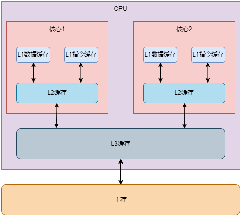
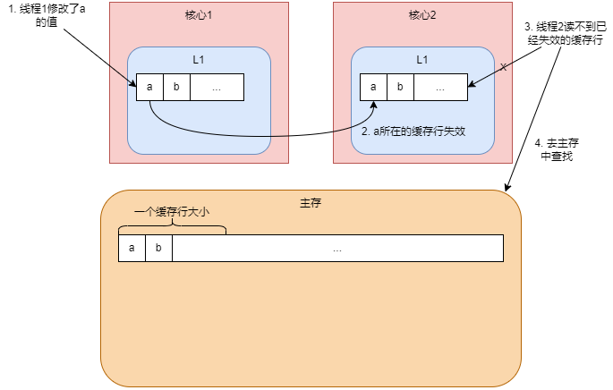

# 写屏障

当有其他分代区域中对象引用了本区域对象时，其对应的卡表元素就会变脏。解释执行时，虚拟机负责每条字节码指令的执行，可以在赋值操作时更新卡表。但在编译执行时，经过即时编译后的代码已经是纯粹的机器指令流，这就必须找到一个在机器码层面的手段，把维护卡表的动作放到每一个赋值操作之中。

在HotSpot虚拟机里是通过写屏障(Write Barrier)技术维护卡表状态的。写屏障可以看作在虚拟机层面对引用类型字段赋值这个动作的AOP切面，在引用对象赋值时会产生一个环绕(Around)通知，供程序执行额外的动作，也就是说赋值的前后都在写屏障的覆盖范畴内。在赋值前的部分的写屏障叫作写前屏障(Pre-Write Barrier)，在赋值后的则叫作写后屏障(Post-Write Barrier)。直至G1收集器出现之前，其他收集器都只用到了写后屏障。

```c++
// 写后屏障更新卡表
void oop_field_store(oop* field, oop new_value) {
    // 引用字段赋值操作
    *field = new_value;
    // 写后屏障，在这里完成卡表状态更新
    post_write_barrier(field, new_value);
}
```

应用写屏障后，虚拟机就会为所有赋值操作生成相应的指令，一旦收集器在写屏障中增加了更新卡表操作，无论更新的是不是老年代对新生代对象的引用，每次只要对引用进行更新，就会产生额外的开销，不过这个开销与Minor GC时扫描整个老年代的代价相比还是低得多的。

## 伪共享

除了写屏障的开销外，卡表在高并发场景下还存在伪共享(False Sharing)问题。

CPU的运算速度远快于主内存，为了解决这个问题，一般会在CPU与主内存之间添加一级或者多级高速缓存。按照数据读取顺序和与CPU结合的紧密程度，CPU缓存可以分为一级缓存(L1)、二级缓存(L2)和三级缓存(L3)。每一级缓存中所储存的全部数据都是下一级缓存的一部分。越靠近CPU的缓存越快也越小，L1和L2只能被一个单独的CPU核心使用，L3被所有CPU核心共享。当CPU执行运算的时候，它先去L1查找所需的数据，再去L2，然后是L3，最后如果这些缓存中都没有，所需的数据就要去主内存拿。



CPU缓存是以缓存行(Cache Line)为单位存储的，缓存行是CPU和主存之间数据传输的最小单位，每个缓存行的大小通常是64字节。当CPU访问某个变量时，首先会去看缓存内是否有该变量，如果有则直接从中获取，否则就去主内存中获取该变量，然后把该变量所在内存区域的一个缓存行大小的内存都复制到缓存中。由于存放到缓存行的是一块内存区域而不是单个变量，所以可能会把多个连续的变量存放到一个缓存行中。

当多线程修改互相独立的变量时，如果这些变量恰好共享同一个缓存行，就会彼此影响而导致性能降低，这就是伪共享问题。比如一个缓存行中有a和b两个变量，当线程1要修改变量a时，首先会修改核心1的一级缓存变量a所在的缓存行。这时由于a的值改变了，为了保证数据一致，核心2中a所在的缓存行也会失效，如果线程2被分配了核心2，那么当它读取(或写入)变量b时，发现这个缓存行已经失效了，需要从主内存中重新加载。这样就出现了一个问题，b和a完全不相干，却每次因为a的更新而从主内存重新读取，导致程序性能降低。



假设处理器的缓存行大小为64字节，由于一个卡表元素占1个字节，64个卡表元素将共享同一个缓存行。这64个卡表元素对应的卡页总的内存为32KB(64×512字节)，如果不同线程更新的对象正好处于这32KB的内存区域内，就会导致更新卡表时正好写入同一个缓存行而影响性能。为了解决这个问题，JDK 7加入一个参数-XX:+UseCondCardMark来控制是否进行有条件的写屏障，开启时会先判断卡表元素是否已经被标记为Dirty，如果是就不再重复进行标记了。

### 字节填充

在JDK 8之前，可以通过创建一个对象时使用填充字段填充该对象所在的缓存行，这样就避免了将多个对象存放在同一个缓存行中(栈中的变量是线程独享的，所以不存在伪共享问题)：

```java
public class MyLongpublic {
    public volatile long value;
    public long p1, p2, p3, p4, p5;
}

MyLongpublic[] longs = new MyLongpublic[N];
```

一个缓存行有64字节，一个long类型是8个字节，填充5个long之后，一共就是48个字节。而Java对象头在64位系统下占用16个字节，这样填充5个long型即可填满64字节，也就是一个缓存行。虽然解决了伪共享问题，但是这种填充的方式也浪费了缓存资源，明明只有8个字节的大小，却使用了64个字节缓存空间。

### @Contented注解

JDK 8及之后的版本提供了@Contented注解，加上这个注解的类会自动补齐缓存行，需要注意的是此注解默认是无效的，需要设置jvm参数 -XX:-RestrictContended 才会生效。
