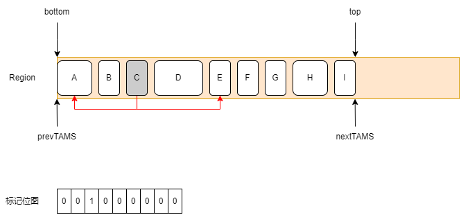
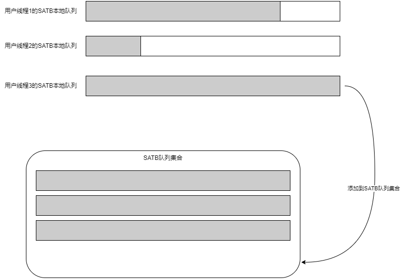
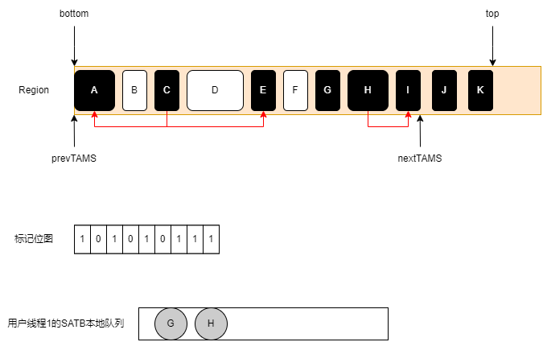
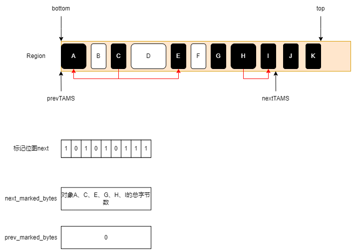
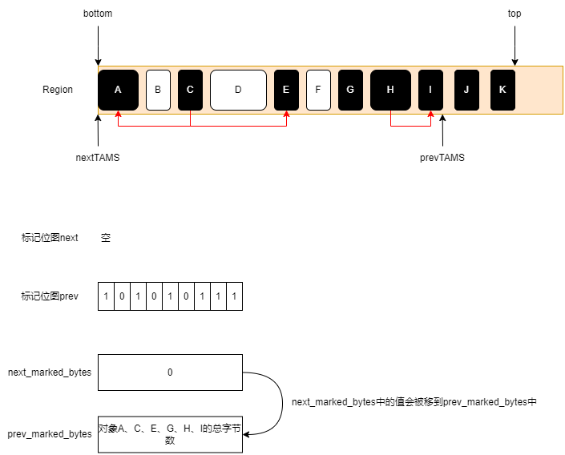

# 并发标记

并发标记过程包括以下 5 个步骤：

1. 初始标记阶段：暂停用户线程的运行，标记可由GC Root直接引用的对象
2. 并发标记阶段：和用户线程并发进行，标记在初始标记阶段中标记的对象所引用的对象
3. 最终标记阶段：暂停用户线程的运行，扫描并发标记阶段中没有被标记的对象，修正并发标记阶段中漏标的情况
4. 存活对象计数：和用户线程并发进行，对每个Region中被标记的对象进行计数
5. 收尾工作：暂停用户线程的运行，进行一些收尾工作，并为下次标记做准备

## 初始标记阶段

并发标记并不是直接在对象上添加标记，而是在标记位图上添加标记。每个Region都带有两个标记位图：next和prev。next是本次标记的标记位图，而prev是上次标记的标记位图，保存了上次标记的结果。

在初始标记阶段，GC线程首先会创建标记位图next。标记位图中每个比特都对应着关联Region内的一个对象,假设Region中有9个对象，那么next中就有9个比特，每个比特的值都为0，表示对象都还没有被标记。这些处理都是和用户线程并发进行的。等所有Region的标记位图都创建完成之后，就可以开始进行GC Roots扫描了。为了防止在扫描的过程中GC Roots被修改，在这个过程中用户线程是暂停执行的。

top和bottom表示Region中的已分配的空间的范围。nextTAMS(Top At Marking Start，标记开始时的top)指向的就是标记开始时top所在的位置。


如果一个对象本身被标记了，但其子对象并没有被扫描，就把这个对象用灰色表示。对象C引用了子对象A和E，但是因为初始标记阶段不会扫描子对象，所以对象C被表示为灰色。



完成GC Roots扫描后，用户线程会再次开启执行，GC 处理也会进入下一阶段。

## 并发标记阶段

在并发标记阶段，GC 线程继续扫描在初始标记阶段被标记过的对象，完成对大部分存活对象的标记。

并发标记阶段GC线程和用户线程是并发执行的。由于用户线程在执行过程中可能会改变对象之间的引用关系，所以如果只采用一般的标记方法，可能会发生漏标。G1使用写屏障技术来记录对象间引用关系的变化。

除了改变对象之间的引用关系，用户线程也可能会创建对象。对于这种情况，G1会把nextTAMS和top两个指针范围内的对象都作为存活对象看待。

原始快照(Snapshot At The Beginning，SATB)是一种将并发标记阶段开始时对象间的引用关系，以逻辑快照的形式进行保存的手段。如果在并发标记的过程中对象的字段上发生了写操作，就必须记录下被改写之前的引用关系。G1G通过写屏障实现这个功能。写屏障的伪代码：

```c++
/**
 * field 表示对象中被修改的字段
 * newobj 表示要引用的新对象
 */
void satb_write_barrier(field, newobj) {
    // 判断是否处于并发标记阶段
    if (gc_phase == GC_CONCURRENT_MARK) {
        // 保存字段修改前的引用关系
        oldobj = *field;
        if (oldobj != NULL) {
            // 把修改前的引用关系添加到线程本地队列
            enqueue(current_thread.stab_local_queue, oldobj);
        }
        // 实际的字段赋值操作
        *field = newobj;
    }
}
```

stab_local_queue 是每个用户线程各自持有的线程本地队列。SATB本地队列在装满(默认大小为1KB)之后，会被添加到全局的SATB队列集合中，随后这个用户线程会创建一个新的本地队列继续存储SATB。被添加到SATB本地队列的对象，如果是白色对象，会被转为灰色对象。



GC 线程会定期检查SATB队列集合的大小。如果发现其中有队列，则会对队列中的全部对象进行标记和扫描。由于写屏障并不检查目标对象是否被标记，因此队列中可能存在已经被标记的对象，这些已经被标记的对象不会再次被标记和扫描。扫描 SATB队列集合的处理优先级比并发标记的线程优先级更高。

并发标记阶段结束后，对象C的子对象A和E被涂成了黑色。在并发标记执行期间新创建的对象J和K会在nextTAMS外分配空间，并直接被涂成了黑色。


处理完待标记对象之后，就会进入最终标记阶段。

## 最终标记阶段

最终标记阶段需要暂停用户线程的运行。因为未装满的SATB本地队列不会被添加到SATB队列集合中，所以在并发标记阶段结束后，各个线程的SATB本地队列中可能仍然存在待扫描的对象。最终标记阶段会扫描这些残留的SATB本地队列。

因为SATB本地队列中存在对象G和H的引用，所以扫描后，对象G和H，以及对象H的子对象I都会变成黑色。



最终标记阶段结束后，所有的存活对象都已被标记。因此，此时所有不带标记
的对象都可以判定为死亡对象。

## 存活对象计数

这个步骤会扫描各个Region的标记位图next，统计Region内存活对象的字节数，然后将其存入Region中的next_marked_bytes中。

prev_marked_bytes中存放了上次标记结束时存活对象的字节数。如果在此之前未曾进行过标记，那么prev_marked_bytes中存放的是初始值是0。



## 收尾工作

在此期间GC线程会逐个扫描每个Region，将标记位图next中的并发标记结果移动到标记位图prev中，再对并发标记中使用过的标记值进行重置，为下次并发标记做好准备。此外，还会对没有存活对象的Region进行清空。

在扫描过程中还会计算每个Region的转移效率，并按照该效率对Region进行降序排序。转移效率指的就是转移1个字节所需的时间。Region的转移效率可以通过公式"Region内死亡对象的字节数➗转移整个Region所需时间"来计算。一般来说死亡对象越多，转移效率就越高。死亡对象多就意味着存活对象少，存活对象越少，转移所需的时间就越少，所以转移效率就会越高。

prevTAMS会被移到nextTAMS先前的位置，nextTAMS会移动到bottom的位置，nextTAMS会在下次并发标记开始时，移动到top的最新位置。next_marked_bytes中的值会被移到prev_marked_bytes中。


