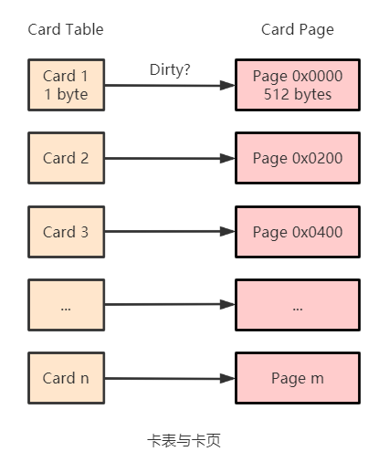

# 记忆集与卡表

为解决对象跨代引用所带来的问题，垃圾收集器在新生代中建立了名为记忆集的数据结构，用以避免把整个老年代加入 GC Roots 的扫描范围。

记忆集(Remembered Set)用于记录从非收集区域指向收集区域的指针集合。最简单的实现可以用一个数组来记录非收集区域中所有含跨代引用的对象，这种实现方案的空间占用和维护成本都相当高。而在垃圾收集的场景中，收集器只需要找出存在跨代引用的一块内存区域，并不需要具体到某个对象。那么在实现记忆集的时候，便可以选择更大的记录粒度来节省记忆集的存储和维护成本。

可供选择的记录精度：

- 字长精度：每个记录精确到一个机器字长，该字包含跨代指针
- 对象精度：每个记录精确到一个对象，该对象里有字段含有跨代指针
- 卡精度：每个记录精确到一块内存区域，该区域内有对象含有跨代指针

卡表(Card Table)使用卡精度去实现记忆集。HotSpot 虚拟机使用一个字节数组实现卡表，字节数组的每一个元素都对应着其标识的内存区域中一块特定大小的内存块，这个内存块被称作卡页(Card Page)。一般来说，卡页大小都是以 2 的 N 次幂的字节数，HotSpot 中使用的卡页是 2 的 9 次幂，即 512 字节。那如果卡表标识内存区域的起始地址是 0x0000 的话，数组的第 0、1、2 号元素，分别对应了地址范围为 0x0000 ～ 0x01FF、0x0200 ～ 0x03FF、0x0400 ～ 0x05FF 的卡页内存块。

一个卡页的内存中通常包含不止一个对象，只要卡页内有一个对象的字段存在着跨代指针，那就将对应卡表的数组元素的值标识为 1，称为这个元素变脏(Dirty)，没有则标识为 0。在垃圾收集发生时，只要筛选出卡表中变脏的元素，就能轻易得出哪些卡页内存块中包含跨代指针，把它们加入 GC Roots 中一并扫描。

