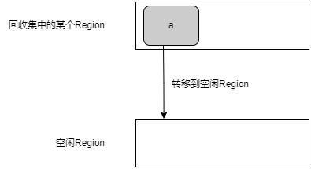

# 转移

通过转移，所选Region内的所有存活对象都会被转移到空闲Region。这样一来，被转移的Region内就只剩下死亡对象。重置之后，该Region就会成为空闲Region，能够再次利用。


## 记忆集

SATB队列集合主要用来记录标记过程中对象之间引用关系的变化，而不同Region之间的引用关系则使用记忆集来记录。记忆集中记录了来自其他Region的引用，因此在转移时即使不扫描所有Region内的对象，也可以查到它被其他Region引用的情况，从而简化单个Region的转移处理。

### 卡表

G1是通过卡表来实现记忆集的。卡表是由元素大小为1B的数组实现的，卡表里的元素称为卡片。一个卡片对应着堆中的一段内存空间，这段内存空间被称作卡页。在当前的JDK中，这个大小被定为512B。因此，当堆的大小是1GB时，可以计算出卡表的大小就是2MB。一个卡页的内存中通常包含不止一个对象，只要卡页内有一个对象的字段存在着跨代指针，那么就将对应卡片称为脏卡片。

堆中的对象所对应的卡片在卡表中的索引值可以通过公式快速计算出来：(对象的地址 － 堆的头部地址) ／ 512。


### 转移专用记忆集

每个Region中都有一个转移专用的记忆集，它是通过哈希表实现的。哈希表的key是其他Region的地址，value是key指向的Region中的卡片索引集合。

Region间对象的引用关系是由转移专用记忆集合以卡片为单位粗略记录的。因此，在转移时必须扫描被记录的卡片所对应的全部对象的引用。


### 写屏障

当对象的字段被修改时，被修改对象所对应的卡片的索引会被写屏障记录到转移专用记忆集中。写屏障的伪代码：

```c++
/**
 * obj 表示field所在的对象
 * field 表示对象中被修改的字段
 * newobj 表示要引用的新对象
 * 如果obj中的字段field引用的其他Region的对象，则obj对应的卡片变脏
 */
void evacuation_write_barrier(obj, field, newobj) {
    // 检测两个对象地址的高位部分是否相等
    // 每个Region都是按固定大小进行分配的，如果obj和newobj的地址在同一个Region中，
    // 那么由于两个地址中超过Region大小的高位部分是完全相等的，
    // 所以变量check的值小于Region的大小。
    check = obj ^ newobj;
    // Region的大小必须是2的指数幂，指数就是LOG_OF_HEAP_REGION_SIZE
    // 将check右移LOG_OF_HEAP_REGION_SIZE后，小于Region大小的比特值都会归0，
    // 这样一来，如果check的值小于Region大小，右移之后的结果就会变为0
    check = check >> LOG_OF_HEAP_REGION_SIZE;
    if (newobj == NULL) {
        check = 0;
    }
    // check为0表示obj和newobj在同一个Region中
    if (check == 0) {
        return;
    }
    // 函数 is_dirty_card() 用来检查参数 obj 所对应的卡片是否为脏卡片
    // 脏卡片指的是已经被写屏障添加到转移专用记忆集日志中的卡片
    // 该行的检查就是为了避免向转移专用记忆集日志中添加重复的卡片
    // 相反，不在转移专用记忆集日志中的卡片是净卡片
    // 如果是净卡片，则该卡片将变成脏卡片，然后被添加到队列rs_log中
    if (!is_dirty_card(obj)) {
        to_dirty(obj);
        enqueue(current_thread.rs_log, obj);
    }
    *field = newobj;
}
```

### 转移专用记忆集日志

每个用户线程都持有一个名为转移专用记忆集日志的缓冲区，其中存放的是卡片索引的数组。当对象b的字段被修改时，写屏障就会获知，并会将对象b所对应的卡片索引添加到转移专用记忆集日志中。转移专用记忆集合日志是由各个用户线程持有的，所以在添加时不用担心线程之间的竞争，写屏障不需要进行互斥处理，因而具有更好的性能。转移专用记忆集日志会在写满后被添加到全局的转移专用记忆集日志的集合中。这个添加过程可能存在多个线程之间的竞争，所以需要做互斥处理。添加完成后，用户线程会被重新分配一个空的转移专用记忆集日志。



转移专用记忆集维护线程是和用户线程并发执行的线程，它的作用是基于转移专用记忆集日志的集合，来维护转移专用记忆集。它主要进行以下处理：

1. 从转移专用记忆集日志的集合中取出转移专用记忆集日志，从头开始扫描
2. 将卡片变为净卡片
3. 检查卡片所对应存储空间内所有对象的字段
4. 往字段所指向的Region的记忆集中添加卡片
