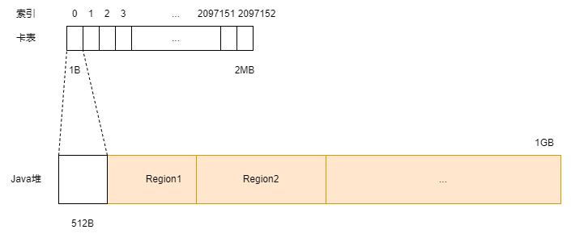

# 转移

通过转移，所选Region内的所有存活对象都会被转移到空闲Region。这样一来，被转移的Region内就只剩下死亡对象。重置之后，该Region就会成为空闲Region，能够再次利用。


## 记忆集

SATB队列集合主要用来记录标记过程中对象之间引用关系的变化，而不同Region之间的引用关系则使用记忆集来记录。记忆集中记录了来自其他Region的引用，因此在转移时即使不扫描所有Region内的对象，也可以查到它被其他Region引用的情况，从而简化单个Region的转移处理。

G1是通过卡表来实现记忆集的。卡表是由元素大小为1B的数组实现的，卡表里的元素称为卡片。一个卡片对应着堆中的一段内存空间，这段内存空间被称作卡页。在当前的JDK中，这个大小被定为512B。因此，当堆的大小是1GB时，可以计算出卡表的大小就是2MB。一个卡页的内存中通常包含不止一个对象，只要卡页内有一个对象的字段存在着跨代指针，那么就将对应卡片称为脏卡片。

堆中的对象所对应的卡片在卡表中的索引值可以通过公式快速计算出来：(对象的地址 － 堆的头部地址) ／ 512。



每个Region中都有一个转移专用的记忆集，它是通过哈希表实现的。哈希表的key是其他Region的地址，value是key指向的Region中的卡片索引集合。

Region间对象的引用关系是由转移专用记忆集合以卡片为单位粗略记录的。因此，在转移时必须扫描被记录的卡片所对应的全部对象的引用。


当对象的字段被修改时，被修改对象所对应的卡片会被写屏障记录到转移专用记忆集中。写屏障的伪代码：

```c++
/**
 * obj 表示field所在的对象
 * field 表示对象中被修改的字段
 * newobj 表示要引用的新对象
 * 如果obj中的字段field引用的其他区域的对象，则obj对应的卡片变脏
 */
void evacuation_write_barrier(obj, field, newobj) {
    // 
    check = obj ^ newobj;
    check = check >> LOG_OF_HEAP_REGION_SIZE;
    if (newobj == NULL) {
        check = 0;
    }
    if (check == 0) {
        return;
    }

    if (is_not_dirty_card(obj)) {
        to_dirty(obj);
        enqueue($current_thread.rs_log, obj);
    }
    *field = newobj;
}

```
