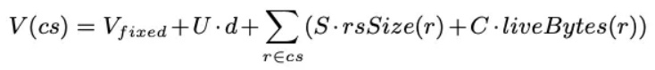

# 软实时性

在G1中，用户可以设置如下3个值：

1. 可用内存上限
2. GC暂停时间上限
3. GC单位时间

设置可用内存上限是为了避免内存被过度占用。就算是为了实现软实时性，也不能让GC完全占用内存。

暂停时间上限指定的是执行GC所导致的用户线程的最大暂停时间。这个最大暂停时间并不包含G1的并发处理时间。在多处理器环境下，G1的并发处理时间可以理解成平均分配给用户线程的负载。有一个权宜之计可以避免GC暂停时间超过指定上限，那就是频繁地执行暂停时间较短的GC。虽然这样做确实可以缩短GC暂停时间，但是用户线程的执行也会频繁地被GC打断，从而导致用户线程几乎无法正常执行。要想避免这个问题，需要指定GC单位时间。

指定GC单位时间后，G1将在每个单位时间内遵守GC的暂停时间上限。如果GC暂停时间上限是1秒，而GC单位时间是3秒，就意味着在任意3秒的时间段内，GC的暂停时间不可以超过1秒。

G1会努力实现软实时性。软实时性的定义是GC单位时间内GC暂停时间超过上限的次数在用户的容忍范围之内。因此，尽管有时GC暂停时间超过了上限，但是只要用户认为可以接受，就算是实现了软实时性。

## 预测转移时间

要想在 GC 暂停时间上限之内完成转移，就需要选择可以在这个时间范围内完成转移的CSet。在往CSet中添加Region时，要先预测一下该Region的转移时间，如果超过了GC暂停时间上限，就不再添加该Region，并终止CSet的选择。

在 G1 中，由 GC 导致的用户线程的暂停时间称为消耗。转移CSet的消耗，等于扫描RSet中的卡片时的消耗与对象转移时的消耗之和。具体公式如下：

- cs：回收集
- V(cs)：某个回收集合的转移时间
- Vfixed：转移过程中的固定消耗，主要是选择和释放CSet时的消耗
- U：扫描脏卡片的平均消耗
- d：转移开始时的脏卡片数
- S：查找卡片内指向CSet的引用的消耗
- rsSize：Region的RSet中的卡片总数
- C：对象转移时(每个字节)的消耗
- liveBytes：Region内存活对象的总字节数，对于在并发标记结束后被分配的对象，即使是死亡对象，也要将其当作存活对象来计数。因此liveBytes并非精确值，只是大概的值
- r：Region

## 预测可信度

