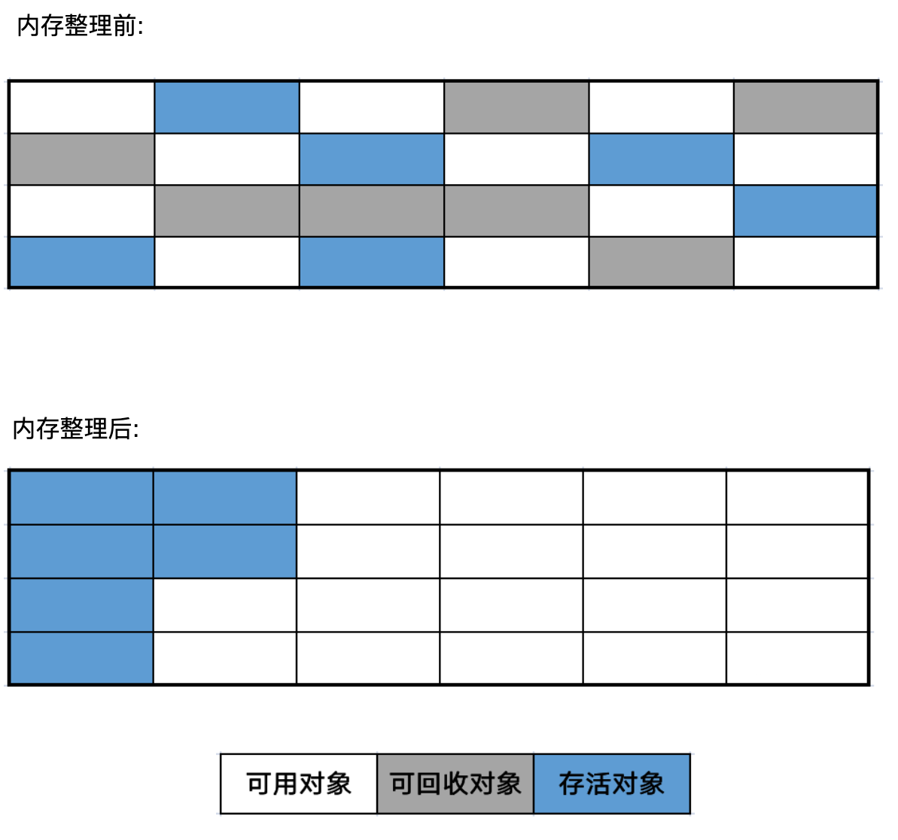

# 标记-整理算法

标记-整理(Mark-Compact)算法: 其中的标记过程仍然与标记-清除算法一样, 但后续步骤不是直接对可回收对象进行清理, 而是让所有存活的对象都向内存空间一端移动, 然后直接清理掉边界以外的内存。

如果移动存活对象, 尤其是在老年代这种每次回收都有大量对象存活区域, 移动存活对象并更新所有引用这些对象的地方将会是一种极为负重的操作, 而且这种对象移动操作必须全程暂停用户应用程序才能进行, 像这样的停顿被称为 Stop The World。
