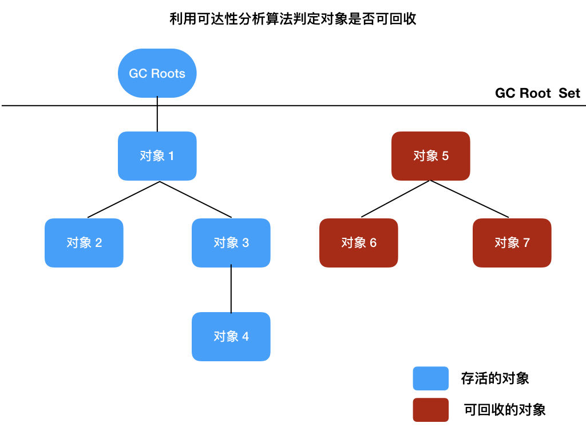

# 可达性分析算法

主流的 Java 虚拟机是通过可达性分析算法来判定对象是否存活的。

可达性分析算法(Reachability Analysis)通过一系列称为 GC Roots 的根对象作为起始节点集，从这些节点开始，根据引用关系向下搜索，搜索过程所走过的路径称为引用链(Reference Chain)，如果某个对象到 GC Roots 间没有任何引用链相连，则证明此对象是不再被使用的。



## GC Roots

固定可作为 GC Roots 的对象包括以下几种：

- 在栈帧中的局部变量表中引用的对象，比如方法中使用到的参数、局部变量、临时变量等
- 在方法区中的类静态变量引用的对象，比如 Java 类的引用类型静态变量
- 在方法区中常量引用的对象，比如字符串常量池里的引用
- 在本地方法栈中 Native 方法引用的对象
- Java 虚拟机内部的引用，如基本数据类型对应的 Class 对象，一些常驻的异常对象(比如 NullPointExcepiton、OutOfMemoryError 等)，还有系统类加载器
- 所有被同步锁(比如 synchronized)持有的对象
- 反映 Java 虚拟机内部情况的 JMXBean、JVMTI 中注册的回调、本地代码缓存等

除了这些固定的 GC Roots 集合以外，根据用户所选用的垃圾收集器以及当前回收的内存区域不同，还可以有其他对象临时性地加入，共同构成完整 GC Roots 集合。

如果只针对 Java 堆中某一块区域发起垃圾收集时，必须考虑到这个区域里的对象可能被位于堆中其他区域的对象所引用，这时候就需要将这些关联区域的对象也一并加入 GC Roots 集合中去，才能保证可达性分析的正确性。比如在回收新生代时，新生代中的对象有可能会被老年代中的对象引用，这时候就需要把老年代中的部分对象加入到 GC Roots 中。

## 两次标记过程

如果对象在进行可达性分析后发现没有与 GC Roots 相连接的引用链，那它将会被第一次标记，随后进行一次筛选，筛选的条件是此对象是否有必要执行 finalize()方法。假如对象没有重写 finalize()方法，或者 finalize()方法已经被虚拟机调用过，那么虚拟机将这两种情况都视为没有必要执行。

如果这个对象被判定为确有必要执行 finalize()方法，那么该对象将会被放置在一个名为 F-Queue 的队列之中，并在稍后由一条由虚拟机自动建立的、低优先级的 Finalizer 线程去执行它们的 finalize()方法。虚拟机会运行队列中的 finalize()方法，但并不一定会等待它运行结束。这样做的原因是，如果某个对象的 finalize()方法执行缓慢，或者发生了死循环，将很可能导致 F-Queue 队列中的其他对象永久处于等待，甚至导致整个内存回收子系统的崩溃。

稍后收集器将对 F-Queue 中的对象进行第二次小规模的标记，如果对象在 finalize()中重新与引用链上的任何一个对象建立关联(比如把 this 赋值给某个类变量或者对象的成员变量)，那在第二次标记时它将被移出即将回收的集合。

```java
public class FinalizeEscapeGC {
    // 类变量
    public static FinalizeEscapeGC SAVE_HOOK = null;

    public void isAlive() {
        System.out.println("yes");
    }

    @Override
    protected void finalize() throws Throwable {
        super.finalize();
        // 在第二次标记时避免被回收
        FinalizeEscapeGC.SAVE_HOOK = this;
    }

    public static void main(String[] args) throws Throwable {
        SAVE_HOOK = new FinalizeEscapeGC();
        // 对象第一次成功拯救自己
        SAVE_HOOK = null;
        System.gc();
        // 因为Finalizer线程优先级很低，暂停0.5秒，以等待它
        Thread.sleep(500);
        if (SAVE_HOOK != null) {
            SAVE_HOOK.isAlive();
        } else {
            System.out.println("no");
        }
        // 下面这段代码与上面的完全相同，但是这次自救却失败了
        SAVE_HOOK = null;
        System.gc();
        Thread.sleep(500);
        if (SAVE_HOOK != null) {
            SAVE_HOOK.isAlive();
        } else {
            System.out.println("no");
        }
    }
}
```

运行结果

```
yes
no
```

代码中有两段完全一样的代码片段，执行结果却是一次逃脱成功，一次失败了。这是因为任何一个对象的 finalize()方法都只会被系统自动调用一次，如果对象面临下一次回收，它的 finalize()方法不会被再次执行，因此第二段代码的自救行动失败了。
