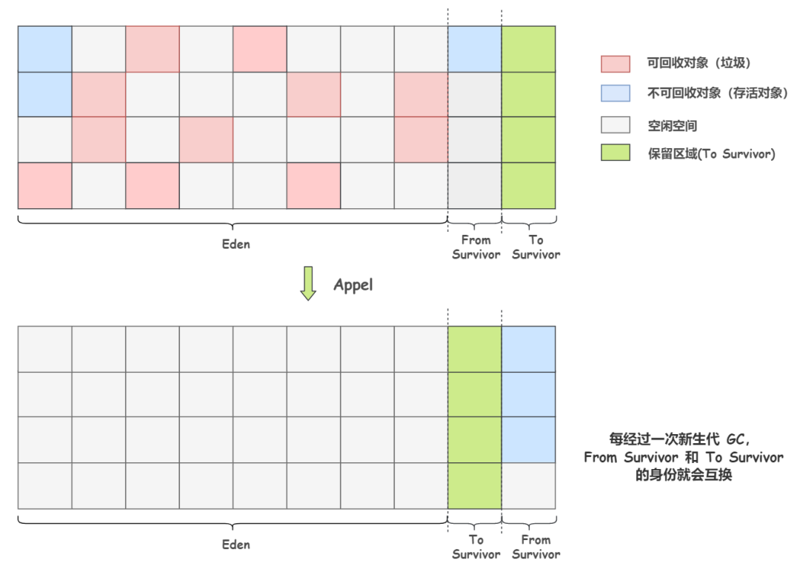

# 标记-复制算法

半区复制(Semispace Copying)算法：为了解决标记-清除算法面对大量可回收对象时执行效率低的问题，将可用内存按容量划分为大小相等的两块，每次只使用其中的一块。当这一块的内存用完了，就将还存活着的对象复制到另外一块上面，然后再把已使用过的内存空间一次清理掉。

如果内存中多数对象都是存活的，这种算法将会产生大量的内存间复制的开销，但对于多数对象都是可回收的情况，算法需要复制的就是占少数的存活对象，而且每次都是针对整个半区进行内存回收，分配内存时也就不用考虑有空间碎片的复杂情况，只要移动堆顶指针，按顺序分配即可。

这样实现简单，运行高效，不过其缺陷也显而易见，这种复制回收算法的代价是将可用内存缩小为了原来的一半，空间浪费太多。

---

Appel式回收：半区复制算法的优化，把新生代分为一块较大的Eden空间和两块较小的
Survivor空间，每次分配内存只使用Eden和其中一块Survivor。发生垃圾搜集时，将Eden和Survivor中仍
然存活的对象一次性复制到另外一块Survivor空间上，然后直接清理掉Eden和已用过的那块Survivor空间。

HotSpot虚拟机默认Eden和Survivor的大小比例是8∶1，也即每次新生代中可用内存空间为整个新生代容量的90%(Eden的80%加上一个Survivor的10%)，只有一个Survivor空间，即10%的新生代是会被浪费的。

由于无法保证每次回收都只有不多于10%的对象存活，因此当Survivor空间不足以容纳一次Minor GC之后存活的对象时，就需要依赖其他内存区域(大多就是老年代)进行分配担保(Handle Promotion)。如果另外一块Survivor空间没有足够空间存放上一次新生代收集下来的存活对象，这些对象便将通过分配担保机制直接进入老年代，这对虚拟机来说就是安全的。
