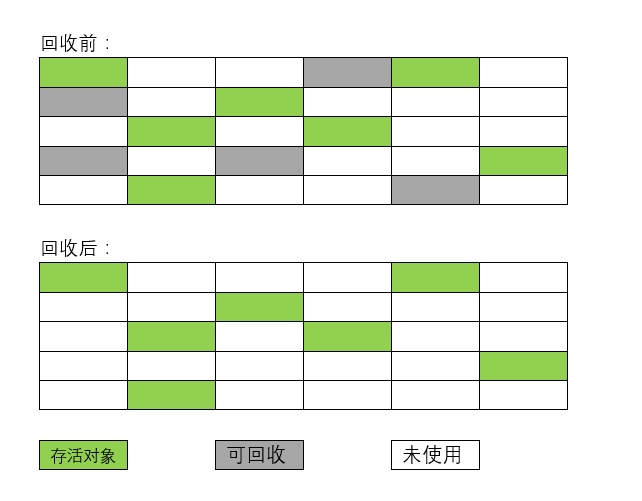

# 标记-清除算法

标记-清除(Mark-Sweep)算法分为标记和清除两个阶段：首先标记出所有需要回收的对象，在标记完成后，统一回收掉所有被标记的对象。也可以反过来，标记存活的对象，统一回收所有未被标记的对象。

它的主要缺点有两个：

1. 执行效率不稳定，如果Java堆中包含大量对象，而且其中大部分是需要被回收的，这时必须进行大量标记和清除的动作，导致标记和清除两个过程的执行效率都随对象数量增长而降低
2. 内存空间的碎片化问题，标记、清除之后会产生大量不连续的内存碎片，空间碎片太多可能会导致当以后在程序运行过程中需要分配较大对象时无法找到足够的连续内存而不得不提前触发另一次垃圾收集动作
