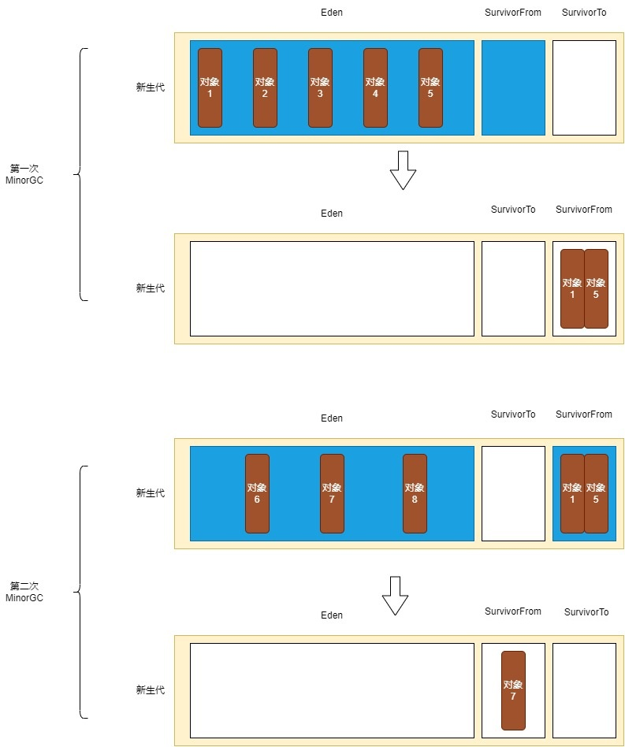

# 对象优先在Eden分配

大多数情况下，对象在新生代Eden区中分配。每当Eden区没有足够空间进行分配时，虚拟机将发起一次Minor GC。

# Minor GC(Young GC)

Minor GC是指清理新生代内存区域的垃圾回收，只涉及到新生代中的对象。

垃圾收集器会检查Eden区+SurvivorFrom区的所有对象，把其中存活的对象复制到SurvivorTo区，然后直接清空Eden区+SurvivorFrom区。最后会把SurvivorFrom区和SurvivorTo区的定义交换位置(原来的SurvivorFrom区变成了SurvivorTo区，原来的SurvivorTo区变成了SurvivorFrom区)。

# 大对象直接进入老年代

大对象就是指需要大量连续内存空间的Java对象，最典型的大对象便是那种很长的字符串，或者元素数量很庞大的数组。

如果一个对象超过了一定大小，会直接被分配在老年代。

# 长期存活的对象将进入老年代

对象通常被分配到Eden区里，如果经过第一次Minor GC后仍然存活，并且能被SurvivorTo容纳的话，该对象会被移动到SurvivorTo中，并且将其对象年龄设为1岁。对象在Survivor区中每熬过一次Minor GC，年龄就增加1岁，当它的年龄增加到一定程度(默认为15)，就会被移动到老年代中。

如果老年代也放不下了，这个时候会触发Major GC。

# Major GC(定义模糊)

Major GC是指清理老年代内存区域的垃圾回收，只涉及到老年代中的对象。

在Major GC过程中，虚拟机会检查老年代中的对象是否存活，并清理老年代中的无用对象。

Major GC执行时，通常会先做一次Minor GC，再紧接着进行Major GC。只有CMS收集器会只收集老年代。

# Full GC

Full GC是针对整个新生代、老年代、元空间的全局范围的垃圾回收。

Full GC是在堆内存不足时触发的，当新生代和老年代内存区域都满了的时候，就会触发Full GC。此外，当永久代内存区域满了，或者系统空闲时间比较长时，也可能会触发Full GC。
