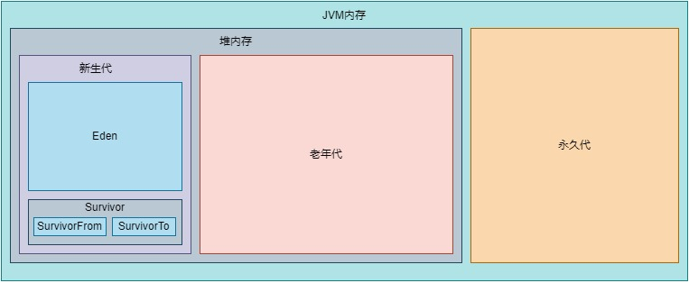

# 堆空间划分

## JDK1.8之前堆空间划分

JVM内存划分为堆内存和非堆内存，堆内存分为新生代(Young Generation)，老年代(Old Generation)。非堆内存为永久代(Permanent Generation)。

新生代与老年代的默认比例是2:1。

新生代又分为Eden和Survivor区。Survivor区由SurvivorFrom和SurvivorTo组成。Eden区占大容量，Survivor两个区占小容量，默认比例是8:1:1。

堆内存用途：存放的是对象，垃圾收集器就是收集这些对象，然后根据GC算法回收。

非堆内存用途：也称为方法区，存储程序运行时长期存活的对象，比如类的元数据、方法、常量、属性等。

## JDK1.8堆空间划分

在JDK1.8版本废弃了永久代，替代的是元空间(MetaSpace)，元空间与永久代上类似，都是方法区的实现，他们最大区别是：元空间并不在JVM中，而是使用本地内存。
