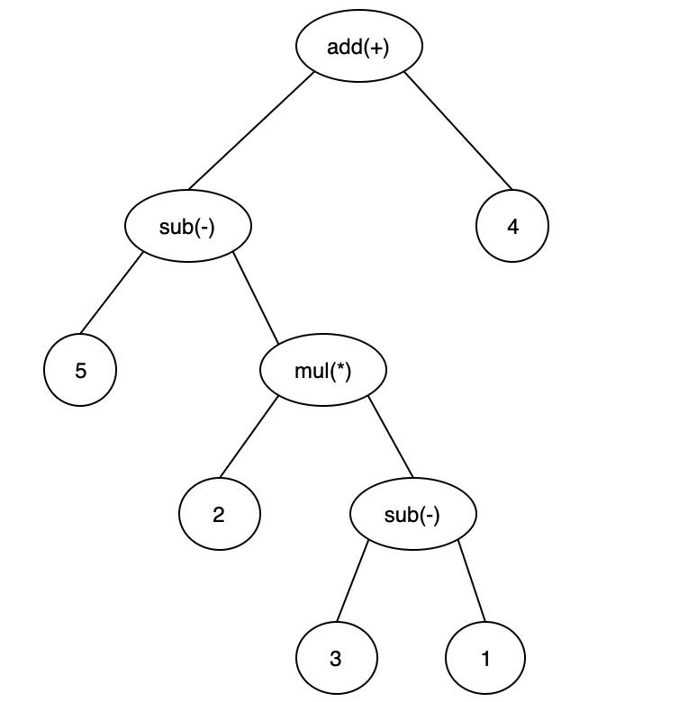

# Javac 编译器

Javac 编译过程大致可以分为 1 个准备过程和 3 个处理过程：

1. 准备过程：初始化插入式注解处理器
2. 解析与填充符号表：
   - 词法、语法分析。将源代码的字符流转变为 Token 集合，构造出抽象语法树
   - 填充符号表。产生符号地址和符号信息
3. 执行插入式注解处理器
4. 分析与字节码生成：
   - 标注检查。对语法的静态信息进行检查
   - 数据流及控制流分析。对程序动态运行过程进行检查
   - 解语法糖。将简化代码编写的语法糖还原为原有的形式
   - 字节码生成。将前面各个步骤所生成的信息转化成字节码

## 解析与填充符号表

### 词法、语法分析

词法分析是将源代码转变为 Token 集合的过程，Token 是编译时的最小元素。关键字、变量名、字面量、运算符都可以作为 Token，如`int a=b+2`这句代码中就包含了 6 个 Token，分别是`int`、`a`、`=`、`b`、`+`、`2`，虽然关键字 int 由 3 个字符构成，但是它只是一个独立的 Token，不可以再拆分。

语法分析是根据 Token 序列构造抽象语法树的过程，抽象语法树(Abstract Syntax Tree，AST)是一种用来描述程序代码语法结构的树形表示方式，比如代码`5-2*(3-1)+4`的 AST：

经过词法和语法分析生成语法树以后，编译器就不会再对源码字符流进行操作了，后续的操作都建立在抽象语法树之上。

### 填充符号表

符号表(Symbol Table)是编译器中的一种数据结构，用于存储程序中的标识符(如变量、函数、类等)及其相关信息。在编译过程中，编译器需要对程序中的标识符进行识别、管理和访问。符号表用于记录程序中所有的标识符及其属性，以便编译器在后续的分析和优化阶段使用。

符号表通常包含以下信息：

1. 标识符名称：记录标识符的名称，如变量名、函数名等
2. 标识符类型：记录标识符的数据类型，如整数、浮点数、字符串等
3. 标识符作用域：记录标识符的作用域范围，如全局作用域、局部作用域等
4. 标识符地址：记录标识符在内存中的地址或偏移量
5. 标识符属性：记录标识符的其他属性，如是否是常量、是否是数组、是否是函数等

编译器在词法分析和语法分析阶段会扫描源代码，识别出其中的标识符，并将其插入符号表中。在后续的语义分析、中间代码生成和优化阶段，编译器会通过符号表来查找和验证标识符的信息，进行类型检查、符号解析等操作。

## 注解处理器

JDK 5 之后，Java 语言提供了对注解(Annotations)的支持，注解原本只会在程序运行期间发挥作用。但在 JDK 6 中又提出了一组被称为插入式注解处理器的标准 API，可以提前至编译期对代码中的特定注解进行处理，从而影响到前端编译器的工作过程。

插入式注解处理器（Annotation Processor）是 Java 编译器提供的一种工具，用于在编译期间处理注解。它可以扫描和解析源代码中的注解，并根据注解的定义执行相应的操作。插入式注解处理器允许读取、修改、添加抽象语法树中的任意元素，如果在处理注解期间对语法树进行过修改，编译器将回到解析及填充符号表的过程重新处理，直到所有插入式注解处理器都没有再对语法树进行修改为止，每一次循环过程称为一个轮次(Round)。

## 语义分析与字节码生成

经过语法分析之后，编译器获得了程序代码的抽象语法树表示，抽象语法树能够表示一个结构正确的源程序，但无法保证源程序的语义是符合逻辑的。而语义分析的主要任务则是对结构上正确的源程序进行上下文相关性质的检查。

语义分析过程可分为标注检查和数据及控制流分析两个步骤。

### 标注检查

标注检查步骤要检查的内容包括诸如变量使用前是否已被声明、变量与赋值之间的数据类型是否能够匹配等。在标注检查中，还会顺便进行一个称为常量折叠(Constant Folding)的代码优化。如`int result = 2 + 3 * 4;`在经过常量折叠优化之后，会被简化为`int result = 14;`。

### 数据及控制流分析

数据流分析和控制流分析是对程序上下文逻辑更进一步的验证，它可以检查出诸如程序局部变量在使用前是否有赋值、方法的每条路径是否都有返回值、是否所有的受查异常都被正确处理了等问题。

### 解语法糖

语法糖(Syntactic Sugar)，指的是在计算机语言中添加的某种语法，这种语法对语言的编译结果和功能并没有实际影响，但是却能更方便程序员使用该语言。使用语法糖能够减少代码量、增加程序的可读性，从而减少程序代码出错的机会。

Java 中的语法糖包括泛型、变长参数、自动装箱拆箱等，JVM 运行时并不直接支持这些语法，它们在编译阶段被还原回原始的基础语法结构，这个过程就称为解语法糖。

### 字节码生成

字节码生成是 Javac 编译过程的最后一个阶段，字节码生成阶段不仅仅是把前面各个步骤所生成的信息(语法树、符号表)转化成字节码指令写到磁盘中，编译器还进行了少量的代码添加和转换工作。

实例构造器`<init>()`方法和类构造器`<clinit>()`方法就是在这个阶段被添加到语法树之中的。`<init>()`和`<clinit>()`这两个构造器的产生实际上是一种代码收敛的过程，编译器会把语句块、变量初始化、调用父类的实例构造器等操作收敛到`<init>()`和`<clinit>()`方法之中，并且保证无论源码中出现的顺序如何，都一定是按先执行父类的实例构造器，然后初始化变量，最后执行语句块的顺序进行。

除了生成构造器以外，还有其他的一些代码替换工作用于优化程序某些逻辑的实现方式，如把字符串的相加操作替换为 StringBuffer 或 StringBuilder 的 append()操作等。

完成了对语法树的遍历和调整之后，就会生成最终的 .class 文件，到此，整个编译过程宣告结束。
