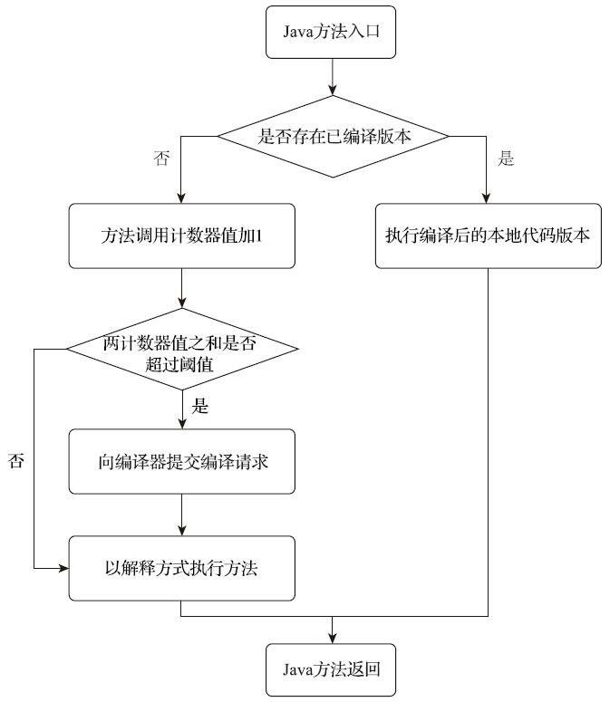
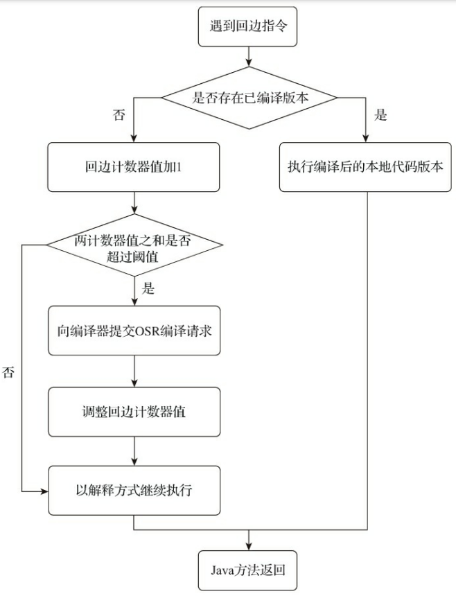

# 即时编译器

目前主流的商用Java虚拟机，内部都同时包含解释器与编译器。

当程序需要迅速启动和执行的时候，解释器可以省去编译的时间，立即运行。当程序启动后，随着时间的推移，编译器可以把越来越多的代码编译成本地代码，以减少解释器的中间损耗，获得更高的执行效率。

当程序运行环境中内存资源限制较大，可以使用解释执行节约内存，反之可以使用编译执行来提升效率。同时，可以让编译器根据概率选择一些不能保证所有情况都正确，但大多数时候都能提升运行速度的优化手段，当激进优化的假设不成立时可以通过逆优化退回到解释状态继续执行，因此在整个Java虚拟机执行架构里，解释器与编译器经常是相辅相成地配合工作。

HotSpot虚拟机中内置了两个即时编译器，分别被称为客户端编译器(Client Compiler)和服务端编译器(Server Compiler)，简称为C1编译器和C2编译器。

在分层编译出现以前，HotSpot虚拟机通常是采用解释器与其中一个编译器直接搭配的方式工作，程序使用哪个编译器，只取决于虚拟机运行的模式，HotSpot虚拟机会根据自身版本与宿主机器的硬件性能自动选择运行模式，用户也可以使用`-client`或`-server`参数指定虚拟机运行在客户端模式还是服务端模式。

解释器与编译器搭配使用的方式在虚拟机中被称为混合模式(Mixed Mode)，用户可以使用参数`-Xint`强制虚拟机运行于解释模式(Interpreted Mode)，全部代码都使用解释方式执行。也可以使用参数`-Xcomp`强制虚拟机运行于编译模式(Compiled Mode)，这时候将优先采用编译方式执行程序，但是解释器仍然要在编译无法进行的情况下介入执行过程。

## 分层编译

为了在程序启动响应速度与运行效率之间达到最佳平衡，HotSpot虚拟机在编译子系统中加入了分层编译(Tiered Compilation)功能，分层编译在JDK 7的服务端模式虚拟机中作为默认编译策略被开启。

分层编译将编译过程分为多个层次，每个层次使用不同的编译策略和优化级别。初始层次会进行快速编译，以尽快提供可执行的机器码。随着代码的热度增加，逐渐切换到更高层次，进行更深入的优化和编译：

- 第0层。程序纯解释执行，并且解释器不开启性能监控功能
- 第1层。使用客户端编译器将字节码编译为本地代码来运行，进行简单可靠的稳定优化，不开启性能监控功能
- 第2层。使用客户端编译器执行，仅开启方法及回边次数统计(用于热点探测)等有限的性能监控功能
- 第3层。使用客户端编译器执行，开启全部性能监控，除了第2层的统计信息外，还会收集如分支跳转、虚方法调用版本等全部的统计信息
- 第4层。使用服务端编译器将字节码编译为本地代码，相比起客户端编译器，服务端编译器会启用更多编译耗时更长的优化，还会根据性能监控信息进行一些不可靠的激进优化

# 热点代码

在运行过程中会被即时编译器编译的目标是热点代码，热点代码主要有两类：

- 被多次调用的方法
- 被多次执行的循环体

对于这两种情况，编译的目标对象都是整个方法体，而不会是单独的循环体。

第一种情况，是依靠方法调用触发的编译，编译器自然会以整个方法作为编译对象，这种编译也是虚拟机中标准的即时编译方式。

第二种情况，编译器依然会以整个方法作为编译对象。但是在函数入口时并不进行检查，而是在执行到循环体的入口时再检查代码是否有编译好的代码可用，称为栈上替换。

栈上替换(On-Stack Replacement，OSR)是一种编译器技术，用于在程序执行期间将正在执行的方法从解释模式切换到编译模式。OSR的关键在于它允许在方法执行过程中进行切换，而不是等待方法执行完毕后再进行编译和优化。当程序执行到一个OSR点时，编译器会生成一个特殊的过渡代码，用于将控制流从解释器切换到编译后的机器码。这样可以避免重新执行整个方法，从而减少性能损失。

# 热点探测判定方式

- 基于采样的热点探测(Sample Based Hot Spot Code Detection)。采用这种方法的虚拟机会周期性地检查各个线程的调用栈顶，如果发现某个(或某些)方法经常出现在栈顶，那这个方法就是热点方法。这种方法的好处是实现简单高效，还可以很容易地获取方法调用关系(将调用堆栈展开即可)，缺点是很难精确地确认一个方法的热度，容易因为受到线程阻塞或别的外界因素的影响而扰乱热点探测。
- 基于计数器的热点探测(Counter Based Hot Spot Code Detection)。采用这种方法的虚拟机会为每个方法(或代码块)建立计数器，统计方法的执行次数，如果执行次数超过一定的阈值就认为它是热点方法。这种方法实现复杂，需要为每个方法建立并维护计数器，而且不能直接获取到方法的调用关系。但是它的统计结果更加精确。

这两种探测手段在商用Java虚拟机中都有使用到。HotSpot使用的是第二种基于计数器的热点探测方法。

为了实现热点计数，HotSpot为每个方法准备了两类计数器：方法调用计数器(Invocation Counter)和回边计数器(Back Edge Counter)，回边是指在循环边界往回跳转。计数器阈值一旦溢出，就会触发即时编译。

## 方法调用计数器

方法调用计数器用于统计方法被调用的次数，它的默认阈值在客户端模式下是1500次，在服务端模式下是10000次，可以通过虚拟机参数`-XX:CompileThreshold`设定阈值。

当一个方法被调用时，虚拟机会先检查该方法是否存在被即时编译过的版本，如果存在，则优先使用编译后的本地代码来执行。如果不存在已被编译过的版本，则将该方法的调用计数器值加一，然后判断方法调用计数器与回边计数器值之和是否超过方法调用计数器的阈值。一旦超过阈值，将会向即时编译器提交一个该方法的代码编译请求(标准编译请求)。

执行引擎默认不会同步等待编译请求完成，而是继续进入解释器按照解释方式执行字节码，直到提交的请求被即时编译器编译完成。当编译工作完成后，这个方法的调用入口地址就会被系统自动改写成新值，下一次调用该方法时就会使用已编译的版本。

方法调用计数器统计的是一段时间之内方法被调用的次数。当超过一定的时间限度，如果方法的调用次数没有达到阈值，那该方法的调用计数器就会被减少一半，这个过程被称为方法调用计数器热度的衰减(Counter Decay)，这段时间称为此方法统计的半衰周期(Counter Half Life Time)，进行热度衰减的动作是在虚拟机进行垃圾收集时顺便进行的。可以使用虚拟机参数`-XX:-UseCounterDecay`关闭热度衰减，让方法计数器统计方法调用的绝对次数，这样只要系统运行时间足够长，程序中绝大部分方法都会被编译成本地代码。还可以使用`-XX:CounterHalfLifeTime`参数设置半衰周期的时间，单位是秒。

## 回边计数器

回边计数器的作用是统计一个方法中循环体代码执行的次数，在字节码中遇到往回跳转的指令就称为回边(Back Edge)。

回边计数器的阈值只能通过OSR比率参数`-XX：OnStackReplacePercentage`来间接调整：

- 虚拟机运行在客户端模式下，回边计数器阈值计算公式为：方法调用计数器阈值 * OSR比率 / 100。`-XX:OnStackReplacePercentage`默认值为933，回边计数器的阈值为
13995
- 虚拟机运行在服务端模式下，回边计数器阈值的计算公式为：方法调用计数器阈值 * (OSR比率 - 解释器监控比率)  /100。`-XX:OnStackReplacePercentage`默认值为140，解释器监控比率`-XX:InterpreterProfilePercentage`默认值为33，回边计数器的阈
值为10700

当解释器遇到一条回边指令时，会先查找将要执行的代码片段是否有已经编译好的版本，如果有的话，它将会优先执行已编译的代码，否则就把回边计数器的值加一，然后判断方法调用计数器与回边计数器值之和是否超过回边计数器的阈值。当超过阈值的时候，将会提交一个栈上替换编译请求，并且把回边计数器的值稍微降低一些，以便继续在解释器中执行循环，等待编译器输出编译结果。

回边计数器没有计数热度衰减的过程，因此这个计数器统计的就是该方法循环执行的绝对次数。当计数器溢出的时候，它还会把方法计数器的值也调整到溢出状态，这样下次再进入该方法的时候就会执行标准编译过程。

## 后台编译

无论是方法调用产生的标准编译请求，还是栈上替换编译请求，虚拟机在编译器
还未完成编译之前，都仍然将按照解释方式继续执行代码，而编译动作则在后台的编译线程中进行。

可以通过参数`-XX:-BackgroundCompilation`禁止后台编译，执行线程向虚拟机提交编译请求以后将会一直阻塞等待，直到编译过程完成再开始执行编译器输出的本地代码。

客户端编译器后台编译过程：

- 在第一个阶段，一个平台独立的前端将字节码构造成一种高级中间代码表示(High-Level Intermediate Representation，HIR，即与目标机器指令集无关的中间表示)。HIR使用静态单分配(Static Single Assignment，SSA)的形式来代表代码值，这可以使得一些在HIR的构造过程之中和之后进行的优化动作更容易实现。在此之前编译器已经会在字节码上完成一部分基础优化，如方法内联、常量传播等优化将会在字节码被构造成HIR之前完成
- 在第二个阶段，一个平台相关的后端从HIR中产生低级中间代码表示(Low-Level Intermediate Representation，LIR，即与目标机器指令集相关的中间表示)，而在此之前会在HIR上完成另外一些优化，如空值检查消除、范围检查消除等，以便让HIR达到更高效的代码表示形式
- 最后的阶段是在平台相关的后端使用线性扫描算法(Linear Scan Register Allocation)在LIR上分配寄存器，并在LIR上做窥孔(Peephole)优化，然后产生机器代码

服务端编译器比客户端编译器执行更慢，但它相对于客户端编译器编译输出的代码质量有很大提高，可以大幅减少本地代码的执行时间，从而抵消掉额外的编译时间开销。
