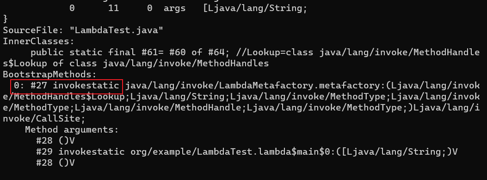

# 动态类型语言

动态类型语言的关键特征是它的类型检查是在运行期进行的, 在编译期就进行类型检查过程的语言是静态类型语言。

## 方法句柄

JDK 7 时新加入了一种动态确定目标方法的机制, 称为方法句柄(Method Handle)。

```java
import java.lang.invoke.MethodHandle;
import java.lang.invoke.MethodHandles;
import java.lang.invoke.MethodType;

public class MethodHandleTest {
    static class ClassA {
        public void println(String s) {
            System.out.println("ClassA " + s);
        }
    }

    private static MethodHandle getPrintlnMH(Object obj) throws Throwable {
        // MethodType: 方法类型, 第一个参数是方法的返回值, 第二个及以后的参数是方法的具体参数
        MethodType methodType = MethodType.methodType(void.class, String.class);
        // lookup().findVirtual()方法在指定类中查找符合给定的方法名称、方法类型, 并且符合调用权限的方法句柄
        // findVirtual()方法模拟了invokevirtual指令的执行过程
        // bindTo()方法绑定this指向的对象
        return MethodHandles.lookup().findVirtual(obj.getClass(), "println", methodType).bindTo(obj);
    }

    public static void main(String[] args) throws Throwable {
        // 无法确定obj是哪个类的实例
        Object obj = System.currentTimeMillis() % 2 == 0 ? System.out : new ClassA();
        getPrintlnMH(obj).invokeExact("invoke");
    }
}
```

方法句柄与反射的区别: 

- 反射和方法句柄机制本质上都是在模拟方法调用, 但是反射是在模拟 Java 代码层次的方法调用, 而方法句柄是在模拟字节码层次的方法调用。
- MethodHandles.Lookup 上的 3 个方法 findStatic()、findVirtual()、findSpecial()分别对应了 invokestatic、invokevirtual/invokeinterface 和 invokespecial 指令的执行权限校验, 而这些底层细节在使用反射时是不需要关心的
- 反射包含了方法的签名、描述符以及方法属性表中各种属性的 Java 端表示方式, 还包含执行权限等的运行期信息。而方法句柄更轻量, 仅包含执行该方法的相关信息

## invokedynamic 指令

invokedynamic 指令在 JDK 7 中被引入, 用于支持动态类型语言的运行时动态绑定。

JDK 7 以前的字节码指令集中, 4 条方法调用指令(invokevirtual、invokespecial、invokestatic、invokeinterface)的第一个参数都是被调用的方法的符号引用。

invokedynamic 指令的第一个参数不再是代表方法符号引用的 CONSTANT_Methodref_info 常量, 而是变为 JDK 7 新加入的 CONSTANT_InvokeDynamic_info 常量, 从这个新常量中可以得到 3 项信息: 引导方法、方法描述符和方法名称。

引导方法有固定的参数, 并且返回值是 java.lang.invoke.CallSite 对象, 这个对象代表了真正要执行的目标方法调用。根据 CONSTANT_InvokeDynamic_info 提供的信息, JVM 可以找到引导方法并传入描述符和方法名称, 从而获得一个 CallSite 对象, 最终调用到要执行的目标方法上。

## lambda 表达式的执行过程

```java
public class LambdaTest {
    public static void main(String[] args) {
        Runnable r = () -> System.out.println(Arrays.toString(args));
        r.run();
    }
}
```

用 javap -v -p LambdaTest.class 查看字节码, 可以看到 main 方法中 lambda 表达式的位置被换成了 invokedynamic 指令: 


invokedynamic 指向一个类型为 CONSTANT_InvokeDynamic_info 的常量项#2, 0 是预留参数, 暂时没有作用。


CONSTANT_InvokeDynamic_info 常量的结构: 

| 常量                        | 项目                        | 类型 | 描述                                                                                                              |
| --------------------------- | --------------------------- | ---- | ----------------------------------------------------------------------------------------------------------------- |
| CONSTANT_InvokeDynamic_info | tag                         | u1   | 值为 18                                                                                                           |
| -                           | bootstrap_method_attr_index | u2   | 值必须是对当前 Class 文件中引导方法表的 bootstrap_methods[]数组的有效索引                                         |
| -                           | name_and_type_index         | u2   | 值必须是对当前常量池的有效索引, 常量池在该索引处的项必须是 CONSTANT_NameAndType_info 结构, 表示方法名和方法描述符 |

name_and_type_index 的值为#30, 指向常量池的 CONSTANT_NameAndType_info 常量, 表示目标方法的方法名和方法描述符: 


bootstrap_method_attr_index 的值为#0, 指向引导方法表中索引为 0 的元素: 



#27 是一个 CONSTANT_MethodHandle_info 常量, 实际上是个方法句柄对象, 这个句柄指向的就是引导方法, 此处是 java.lang.invoke.LambdaMetafactory 类的 metafactory()方法: 

```java
// caller: 调用者, 这里是LambdaTest这个类
// invokedName: 目标方法的方法名, 这里是常量池中#30的run
// invokedType: 目标方法的方法描述符, 
//     这里是常量池中#30的(String[])Runnable
// 后面三个参数则是对应上面引导方法表中的Method arguments
public static CallSite metafactory(MethodHandles.Lookup caller,
                                   String invokedName,
                                   MethodType invokedType,
                                   MethodType samMethodType,
                                   MethodHandle implMethod,
                                   MethodType instantiatedMethodType)
        throws LambdaConversionException {
    AbstractValidatingLambdaMetafactory mf;
    mf = new InnerClassLambdaMetafactory(caller, invokedType,
            invokedName, samMethodType,
            implMethod, instantiatedMethodType,
            false, EMPTY_CLASS_ARRAY, EMPTY_MT_ARRAY);
    mf.validateMetafactoryArgs();
    return mf.buildCallSite();
}
```

引导方法表中#29 的 org/example/LambdaTest.lambda$main$0 方法是编译器自动生成的, 编译器会把lambda表达式转换成传统的Java方法, lambda$main$0 表示是 main()方法中的第一个 Lambda 表达式: 


引导方法 metafactory()执行时, 会通过 ASM 动态生成一个类, 可以通过 JVM 参数 -Djdk.internal.lambda.dumpProxyClasses=输出路径 让它运行的时候输出到文件: 

```java
// 通过ASM动态生成的类
// 实现了Runnable接口, 并在run方法中调用lambda表达式中的代码
import java.lang.invoke.LambdaForm.Hidden;
// $FF: synthetic class
final class LambdaTest$$Lambda$1 implements Runnable {
    private final String[] arg$1;
    private LambdaTest$$Lambda$1(String[] var1) {
        this.arg$1 = var1;
    }
    private static Runnable get$Lambda(String[] var0) {
        return new LambdaTest$$Lambda$1(var0);
    }
    @Hidden
    public void run() {
        // 指向LambdaTest中编译器生成的lambda表达式解语法糖方法
        LambdaTest.lambda$main$0(this.arg$1);
    }
}
```

然后就是创建一个 CallSite, 绑定一个 MethodHandle, 指向的方法其实就是生成的类中的静态方法 get$Lambda, 然后把 CallSite 对象返回。到这里, 引导方法 metafactory 执行完毕。

### invokedynamic 最终实现的效果

```java
/**
 * lambda的写法
 */
public class LambdaTest {
    public static void main(String[] args) {
        Runnable r = () -> System.out.println(Arrays.toString(args));
        r.run();
    }
}

/**
 * 经过invokedynamic的转换的lambda
 */
public final class MyThread implements Runnable {

    private final String[] args;

    public MyThread(String[] args) {
        this.args = args;
    }

    public static getMyThread(String[] args) {
        return new MyThread(args);
    }

    @Override
    public void run() {
        LambdaTest.doRun(this.args);
    }
}

public class LambdaTest {

    public static void doRun(String[] args) {
        System.out.println(Arrays.toString(args));
    }

    public static void main(String[] args) {
        Runnable r = MyThread.getMyThread(args);
        r.run();
    }
}
```
