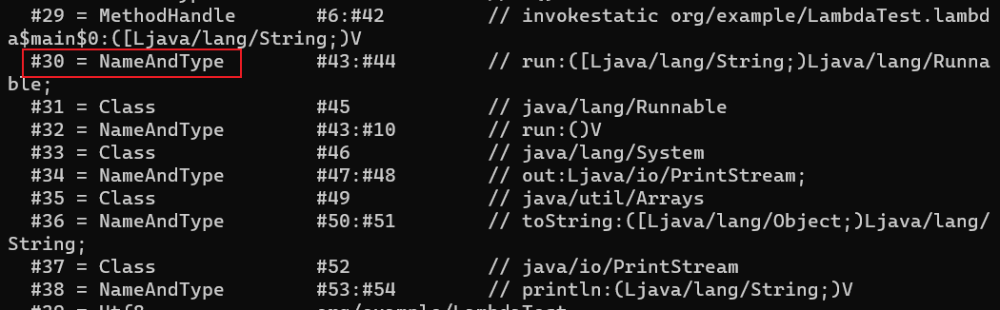

# 动态类型语言

动态类型语言的关键特征是它的类型检查的主体过程是在运行期而不是编译期进行的，在编译期就进行类型检查过程的语言是静态类型语言。

JDK 7以前的字节码指令集中，4条方法调用指令(invokevirtual、invokespecial、invokestatic、invokeinterface)的第一个参数都是被调用的方法的符号引用，方法的符号引用在编译时产生，而动态类型语言只有在运行期才能确定方法的接收者。

## 方法句柄

JDK 7时新加入的java.lang.invoke包提供了一种新的动态确定目标方法的机制，称为方法句柄(Method Handle)。

```java
import java.lang.invoke.MethodHandle;
import java.lang.invoke.MethodHandles;
import java.lang.invoke.MethodType;

public class MethodHandleTest {
    static class ClassA {
        public void println(String s) {
            System.out.println("ClassA " + s);
        }
    }

    private static MethodHandle getPrintlnMH(Object obj) throws Throwable {
        // MethodType：方法类型，第一个参数是方法的返回值，第二个及以后的参数是方法的具体参数
        MethodType methodType = MethodType.methodType(void.class, String.class);
        // lookup()方法在指定类中查找符合给定的方法名称、方法类型，并且符合调用权限的方法句柄
        // bindTo()方法绑定this指向的对象
        // findVirtual方法模拟了invokevirtual指令的执行过程
        return MethodHandles.lookup().findVirtual(obj.getClass(), "println", methodType).bindTo(obj);
    }

    public static void main(String[] args) throws Throwable {
        Object obj = System.currentTimeMillis() % 2 == 0 ? System.out : new ClassA();
        getPrintlnMH(obj).invokeExact("icyfenix");
    }
}
```

方法句柄与反射的区别：

- 反射和方法句柄机制本质上都是在模拟方法调用，但是反射是在模拟Java代码层次的方法调用，而方法句柄是在模拟字节码层次的方法调用。
- MethodHandles.Lookup上的3个方法findStatic()、findVirtual()、findSpecial()分别对应了invokestatic、invokevirtual/invokeinterface和invokespecial指令的执行权限校验，而这些底层细节在使用反射时是不需要关心的
- 反射包含了方法的签名、描述符以及方法属性表中各种属性的Java端表示方式，还包含执行权限等的运行期信息。而方法句柄更轻量，仅包含执行该方法的相关信息

## invokedynamic指令

invokedynamic指令在JDK 7中被引入，用于支持动态类型语言的运行时动态绑定。invokedynamic指令允许开发人员在运行时动态地选择方法的实现。

每一处含有invokedynamic指令的位置都被称作动态调用点(Dynamically-Computed Call Site)，这条指令的第一个参数不再是代表方法符号引用的CONSTANT_Methodref_info常量，而是变为JDK 7新加入的CONSTANT_InvokeDynamic_info常量，从这个新常量中可以得到3项信息：引导方法、方法类型和方法名称。

引导方法有固定的参数，并且返回值是java.lang.invoke.CallSite对象，这个对象代表了真正要执行的目标方法调用。根据CONSTANT_InvokeDynamic_info常量中提供的信息，虚拟机可以找到并且执行引导方法，从而获得一个CallSite对象，最终调用到要执行的目标方法上。

## lambda表达式的执行过程

```java
public class LambdaTest {
    public static void main(String[] args) {
        Runnable r = () -> System.out.println(Arrays.toString(args));
        r.run();
    }
}
```

用`javap -v -p LambdaTest.class`查看字节码，可以看到main方法中lambda表达式的位置被换成了invokedynamic指令：


invokedynamic指向一个类型为CONSTANT_InvokeDynamic_info的常量项#2，0是预留参数，暂时没有作用。


CONSTANT_InvokeDynamic_info常量的结构：


name_and_type_index的值为#30，指向常量池的CONSTANT_NameAndType_info常量，表示方法名和方法描述符：



bootstrap_method_attr_index的值为#0，指向引导方法表中索引为0的元素：


#27 是一个CONSTANT_MethodHandle_info常量，实际上是个MethodHandle方法句柄对象，这个句柄指向的就是引导方法，此处是java.lang.invoke.LambdaMetafactory类的metafactory()方法：

```java
// caller: 调用者，这里是LambdaTest这个类
// invokedName: CallSite的调用名，这里是#30常量中的run
// invokedType: CallSite的函数签名，这里是#30常量中的(String[])Runnable
// 后面三个参数则是对应上面引导方法表中的Method arguments
public static CallSite metafactory(MethodHandles.Lookup caller,
                                   String invokedName,
                                   MethodType invokedType,
                                   MethodType samMethodType,
                                   MethodHandle implMethod,
                                   MethodType instantiatedMethodType)
        throws LambdaConversionException {
    AbstractValidatingLambdaMetafactory mf;
    mf = new InnerClassLambdaMetafactory(caller, invokedType,
            invokedName, samMethodType,
            implMethod, instantiatedMethodType,
            false, EMPTY_CLASS_ARRAY, EMPTY_MT_ARRAY);
    mf.validateMetafactoryArgs();
    return mf.buildCallSite();
}
```

#29中的`org/example/LambdaTest.lambda$main$0`方法是编译器自动生成的，编译器会把lambda表达式转换成传统的Java方法，lambda$main$0表示是main()方法中的第一个Lambda表达式：


引导方法metafactory()执行时，会通过ASM动态生成一个类，可以通过虚拟机参数`-Djdk.internal.lambda.dumpProxyClasses=<path>`让它运行的时候输出到文件：

```java
// 通过ASM动态生成的类
// 实现了Runnable接口，并在run方法中调用lambda表达式中的代码
import java.lang.invoke.LambdaForm.Hidden;
// $FF: synthetic class
final class LambdaTest$$Lambda$1 implements Runnable {
    private final String[] arg$1;
    private LambdaTest$$Lambda$1(String[] var1) {
        this.arg$1 = var1;
    }
    private static Runnable get$Lambda(String[] var0) {
        return new LambdaTest$$Lambda$1(var0);
    }
    @Hidden
    public void run() {
        // 指向LambdaTest中编译器生成的lambda表达式解语法糖方法
        LambdaTest.lambda$main$0(this.arg$1);
    }
}
```

然后就是创建一个CallSite，绑定一个MethodHandle，指向的方法其实就是生成的类中的静态方法get$Lambda，然后把CallSite对象返回。到这里，引导方法metafactory执行完毕。
