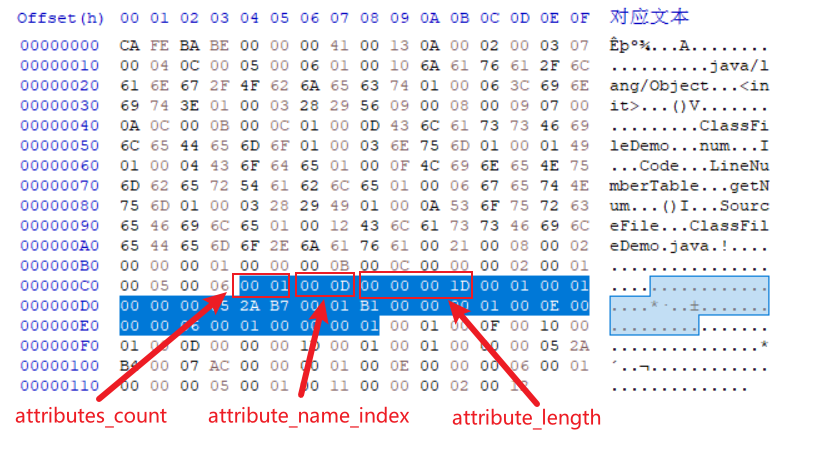
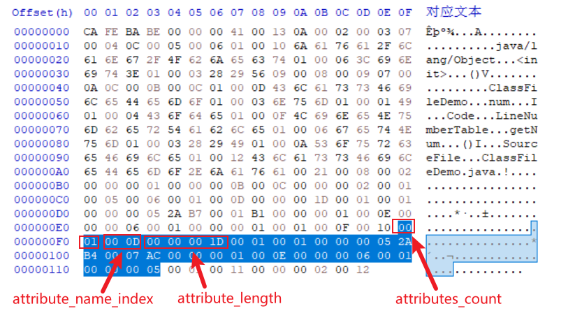
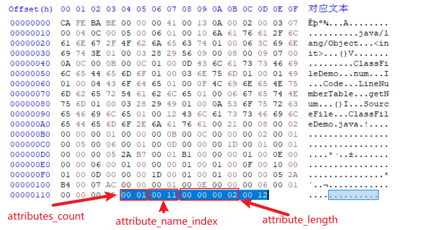

# 属性表

class 文件、字段表、方法表都可以携带自己的属性表集合(attributes), 用来存储它们自己的信息。虚拟机将属性表设计成一个具有良好可扩展性的逻辑结构，它可以为 Java 版本升级提供良好的支持。当 Java 需要实现新的特性时，可以补充相应的属性，通过编译器传递给虚拟机。

对于每一个属性, 它的名称都要从常量池中引用一个 CONSTANT_Utf8 类型的常量来表示, 而属性值的结构则是完全自定义的, 只需要通过一个 u4 的 attribute_length 去说明属性值所占用的位数即可。

属性表的通用结构如下:

| 类型 | 名称                 | 数量             |
| ---- | -------------------- | ---------------- |
| u2   | attribute_name_index | 1                |
| u4   | attribute_length     | 1                |
| u1   | 各属性自定义         | attribute_length |

我们看一下 ClassFileDemo.class 中的各个属性。

首先是 `<init>()` 方法, 它有一个属性, 属性名是常量池中索引为 13(0x000D)的"Code", Code 属性的长度是 29 个字节(0x0000001D):

第二个方法是 getNum(), 它同样只有一个 Code 属性, 它的 Code 属性的长度也是 29 个字节(0x0000001D):

方法部分结束以后, 就是 class 文件自己的附加属性了, ClassFileDemo.class 有 1 个属性, 属性名是常量池中索引为 17(0x0011)的"SourceFile", SourceFile 属性用来标识这个 class 文件的源代码是哪个文件, 它的长度是 2 个字节(0x00000002), 最后的两字节 0x0012 就是源代码的文件名, 它指向常量池中索引为 18 的字符串"ClassFileDemo.java":

