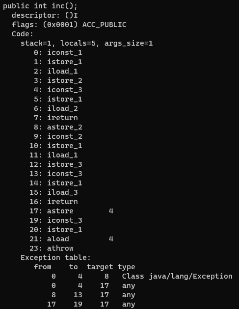

# Code 属性表

Code 属性表是一种用来存储方法体的属性表。它包含了方法的指令、局部变量表、操作数栈、异常处理器等信息。

| 类型           | 名称                   | 数量                   |
| -------------- | ---------------------- | ---------------------- |
| u2             | attribute_name_index   | 1                      |
| u4             | attribute_length       | 1                      |
| u2             | max_stack              | 1                      |
| u2             | max_locals             | 1                      |
| u4             | code_length            | 1                      |
| u1             | code                   | code_length            |
| u2             | exception_table_length | 1                      |
| exception_info | exception_table        | exception_table_length |
| u2             | attributes_count       | 1                      |
| attribute_info | attributes             | attributes_count       |

- attribute_name_index 是一项指向常量池中 CONSTANT_Utf8_info 型常量的索引, 此常量值固定为`Code`
- attribute_length 表示属性值的长度, 由于 attribute_name_index 与 attribute_length 一共为 6 个字节, 所以属性值的长度固定为整个属性表长度减去 6 个字节
- max_stack 代表了栈帧中操作数栈的最大深度。在方法执行的任意时刻, 操作数栈都不会超过这个深度。JVM 运行的时候需要根据这个值来分配栈帧中的操作数栈深度
- max_locals 代表了局部变量表所需的存储空间
- code_length 代表字节码指令的长度
- code 用于存储字节码指令。每个指令是一个 u1 类型的单字节, 当虚拟机读取到 code 中的一个字节码时, 就可以找出这个字节码代表的是什么指令, 并且可以知道这条指令后面是否需要跟随参数, 以及后续的参数应当如何解析。一个 u1 类型一共可以表达 256 条指令, 目前已经定义了大约 200 条指令
- exception_table_length: 显式异常处理表的长度
- exception_table: 显式异常处理表, 用来实现 try-catch-finally, 显式异常处理表对于 Code 属性来说并不是必须存在的
- attributes_count 和 attribute_info 用来存储 Code 属性的附加属性

---

```java
public class ClassFileDemo {
    int num;

    public int getNum() {
        return this.num;
    }
}
```

字节码文件内容:

attribute_name_index 为`0x0009`, 指向常量池中索引为 9 的值`Code`, 说明此属性是方法的字节码描述。attribute_length 为`0x0000002F`, 即十进制的 47。

max_stack 的值为`0x0001`, max_locals 的值也是`0x0001`。code_length 为`0x00000005`, 所以接下来的 5 个字节`0x2AB70001B1`就是方法的字节码指令:

- `0x2A`表示指令`aload_0`
- `0xB7`表示指令`invokespecial`
- `0x0001`是指令`invokespecial`的操作数, 指向常量池中的一个 CONSTANT_Methodref_info 类型的常量, 即此方法的符号引用
- `0xB1`表示指令`return`

exception_table_length 为`0x0000`, 异常表为空。

接着是 attributes_count`0x0002`, 表示 Code 属性表中又包含了两个属性。

使用 javap -verbose ClassFileDemo.class 命令解析 class 文件:

## 显式异常处理表

Code 属性表中, 在字节码指令之后的是这个方法的显式异常处理表 exception_table, 异常表对于 Code 属性来说并不是必须存在的。

显式异常处理表结构:

| 类型 | 名称       | 数量 |
| ---- | ---------- | ---- |
| u2   | start_pc   | 1    |
| u2   | end_pc     | 1    |
| u2   | handler_pc | 1    |
| u2   | catch_type | 1    |

catch_type 为指向一个 CONSTANT_Class_info 型常量的索引。

如果当字节码从第 start_pc 行到第 end_pc 行之间(不含第 end_pc 行)出现了类型为 catch_type 或者其子类的异常, 则转到第 handler_pc 行继续处理。当 catch_type 的值为 0 时, 代表任意异常情况都需要转到 handler_pc 处进行处理。

```java
public class ExceptionTableDemo {
    public int inc() {
        int x;
        try {
            x = 1;
            return x;
        } catch (Exception e) {
            x = 2;
            return x;
        } finally {
            x = 3;
        }
    }
}
```

如果没有出现异常, 返回值是 1。如果出现了 Exception 异常, 返回值是 2。如果出现了 Exception 以外的异常, 方法非正常退出, 没有返回值。

使用`javap -verbose ExceptionTableDemo.class`命令解析 class 文件:



字节码中第 0 到 3 行所做的操作就是将整数 1 赋值给变量 x, 并且将此时 x 的值复制一份副本到本地变量表的变量槽中, 这个变量槽里面的值在 ireturn 指令执行前将会被重新读到操作栈顶, 作为方法返回值使用。

如果这时候没有出现异常, 则会继续执行第 4 到 7 行, 将变量 x 赋值为 3, 然后将之前保存的返回值 1 读入到操作栈顶, 最后 ireturn 指令会以 int 形式返回操作栈顶中的值, 方法结束。

如果出现了 Exception 异常, 程序计数器指针转到第 8 行, 第 8 到 16 行所做的事情是将 2 赋值给变量 x, 然后将变量 x 此时的值存储为返回值, 最后再将变量 x 的值改为 3。方法返回前同样将返回值 2 读到了操作栈顶。

如果出现了 Exception 以外的异常, 程序计数器指针转到第 17 行代码, 将变量 x 的值赋为 3, 并将栈顶的异常抛出, 方法结束。
