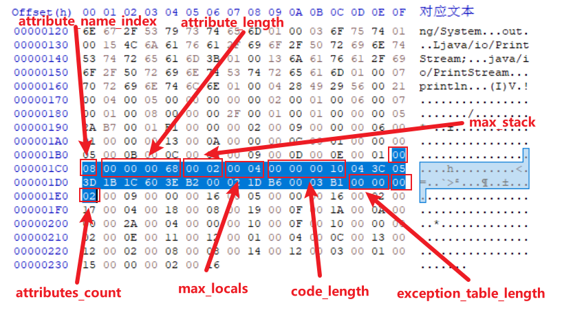
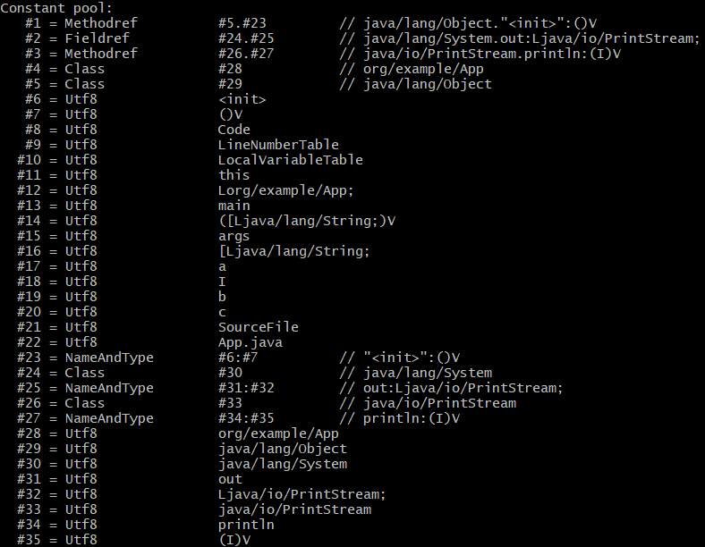
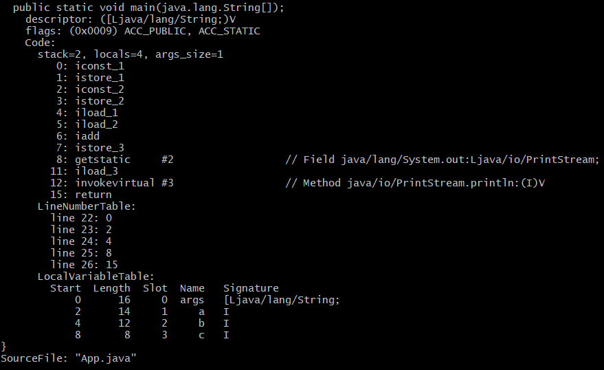

# Code 属性表

Code 属性表是一种用来存储方法体的属性表。它包含了方法的指令、局部变量表、操作数栈、异常处理器等信息。

Code 属性表的结构如下:

| 类型           | 名称                   | 数量                   |
| -------------- | ---------------------- | ---------------------- |
| u2             | attribute_name_index   | 1                      |
| u4             | attribute_length       | 1                      |
| u2             | max_stack              | 1                      |
| u2             | max_locals             | 1                      |
| u4             | code_length            | 1                      |
| u1             | code                   | code_length            |
| u2             | exception_table_length | 1                      |
| exception_info | exception_table        | exception_table_length |
| u2             | attributes_count       | 1                      |
| attribute_info | attributes             | attributes_count       |

说明:

- attribute_name_index: 指向常量池中 CONSTANT_Utf8 类型的常量, 固定为"Code"
- attribute_length: 属性值的长度
- max_stack: 栈帧中操作数栈的最大深度。在方法执行的任意时刻, 操作数栈都不会超过这个深度。JVM 运行的时候需要根据这个值来分配栈帧中的操作数栈深度
- max_locals: 局部变量表所需的存储空间
- code_length: 字节码指令的长度
- code: 用于存储字节码指令。每个指令是一个 u1 类型的单字节, 当 JVM 读取到 code 中的一个字节码时, 就可以找出这个字节码代表的是什么指令, 并且可以知道这条指令后面是否需要跟随参数, 以及后续的参数应当如何解析。一个 u1 类型一共可以表达 256 条指令, 目前已经定义了大约 200 条指令
- exception_table_length: 显式异常处理表的长度
- exception_table: 显式异常处理表, 用来实现 try-catch-finally, 显式异常处理表对于 Code 属性来说并不是必须存在的
- attributes_count 和 attribute_info 用来存储 Code 属性的附加属性

以下面代码为例:

```java
public class App {

    public static void main(String[] args) {
        int a = 1;
        int b = 2;
        int c = a + b;
        System.out.println(c);
    }
}
```

看一下字节码文件中 main 方法的 Code 属性表的内容:



常量池如下:



attribute_name_index 为 0x0008, 指向常量池中索引为 8 的值"Code"。attribute_length 为 0x00000068, 转换成十进制是 104。

max_stack 的值为 0x0002, max_locals 的值是 0x0004。这里简单介绍一下 Java 的栈帧: 每个方法被执行的时候, JVM 都会在 Java 栈中创建一个栈帧用于存储局部变量表、操作数栈等方法需要用到的信息。局部变量表是一个数组, 用于存放方法的参数和方法内部定义的局部变量, JVM 通过索引访问局部变量表中的数据。操作数栈主要用于保存计算过程的中间结果。例如上面代码中的 int c = a + b 的加法运算就会用到操作数栈。max_stack 是这个方法执行过程中操作数栈的最大深度, max_locals 是这个方法的局部变量表的最大容量。

code_length 为 0x000000010, 所以接下来的 16 个字节就是 main 方法的字节码指令:

- 0x04 是字节码指令 iconst_1, 它的作用是把一个 int 类型值 1 入栈(操作数栈)
- 0x3C 是字节码指令 istore_1, 它的作用是把栈顶的 int 值存入局部变量表中索引为 1 的位置, 对应 Java 代码的 int a = 1
- 0x05 是字节码指令 istore_2, 它的作用是把一个 int 类型值 2 入栈
- 0x3D 是字节码指令 istore_2, 它的作用是把栈顶的 int 值存入局部变量表中索引为 2 的位置, 对应 Java 代码的 int b = 2
- 0x1B 是字节码指令 iload_1, 它的作用是把局部变量表中索引为 1 的 int 变量入栈
- 0x1C 是字节码指令 iload_2, 它的作用是把局部变量表中索引为 2 的 int 变量入栈, iload_1, iload_2 两条指令都是为了下面的加法指令做准备工作
- 0x60 是字节码指令 iadd, 它的作用是把栈顶的两个 int 值取出并相加, 然后把计算结果入栈
- 0x3E 是字节码指令 istore_3, 它的作用是把栈顶的 int 值存入局部变量表中索引为 3 的位置, iadd 和 istore_3 两条指令共同实现了 Java 代码的 int c = a + b
- 0xB2 是字节码指令 getstatic, 它的作用是获取指定类的静态字段, 并把它入栈。后面的 0x0002 是它的参数, 指向常量池中索引为 2 的常量: java.lang.System 类的 out 字段, 它是一个 PrintStream 类型的对象
- 0x1D 是字节码指令 iload_3, 它的作用是把局部变量表中索引为 3 的 int 变量入栈, getstatic, iload_3 两条指令都是为了下面的方法调用指令做准备工作
- 0xB6 是字节码指令 invokevirtual, 它的作用是调用某个对象的方法。后面的 0x0003 是它的参数, 指向常量池中索引为 3 的常量: java.io.PrintStream 类的 println 方法。println 方法的调用者是 getstatic 入栈的 System.out 对象, 方法的参数是 iload_3 入栈的 int 值 3
- 0xB1 是字节码指令 return, 它的作用是从当前方法返回 void

exception_table_length 为 0x0000, main 方法没有手动抛出异常, 所以显式异常处理表为空。

attributes_count 为 0x0002, 表示 Code 属性表包含了两个附加属性(LineNumberTable 和 LocalVariableTable 两个属性)。

使用 javap -verbose App.class 命令可以更直观地看到 main 方法的内容:



## 显式异常处理表

Code 属性表中, 在字节码指令之后的是这个方法的显式异常处理表 exception_table, 异常表对于 Code 属性来说并不是必须存在的。

显式异常处理表结构:

| 类型 | 名称       | 数量 |
| ---- | ---------- | ---- |
| u2   | start_pc   | 1    |
| u2   | end_pc     | 1    |
| u2   | handler_pc | 1    |
| u2   | catch_type | 1    |

catch_type 为指向一个 CONSTANT_Class_info 型常量的索引。

如果当字节码从第 start_pc 行到第 end_pc 行之间(不含第 end_pc 行)出现了类型为 catch_type 或者其子类的异常, 则转到第 handler_pc 行继续处理。当 catch_type 的值为 0 时, 代表任意异常情况都需要转到 handler_pc 处进行处理。

```java
public class ExceptionTableDemo {
    public int inc() {
        int x;
        try {
            x = 1;
            return x;
        } catch (Exception e) {
            x = 2;
            return x;
        } finally {
            x = 3;
        }
    }
}
```

如果没有出现异常, 返回值是 1。如果出现了 Exception 异常, 返回值是 2。如果出现了 Exception 以外的异常, 方法非正常退出, 没有返回值。

使用`javap -verbose ExceptionTableDemo.class`命令解析 class 文件:


字节码中第 0 到 3 行所做的操作就是将整数 1 赋值给变量 x, 并且将此时 x 的值复制一份副本到本地变量表的变量槽中, 这个变量槽里面的值在 ireturn 指令执行前将会被重新读到操作栈顶, 作为方法返回值使用。

如果这时候没有出现异常, 则会继续执行第 4 到 7 行, 将变量 x 赋值为 3, 然后将之前保存的返回值 1 读入到操作栈顶, 最后 ireturn 指令会以 int 形式返回操作栈顶中的值, 方法结束。

如果出现了 Exception 异常, 程序计数器指针转到第 8 行, 第 8 到 16 行所做的事情是将 2 赋值给变量 x, 然后将变量 x 此时的值存储为返回值, 最后再将变量 x 的值改为 3。方法返回前同样将返回值 2 读到了操作栈顶。

如果出现了 Exception 以外的异常, 程序计数器指针转到第 17 行代码, 将变量 x 的值赋为 3, 并将栈顶的异常抛出, 方法结束。
